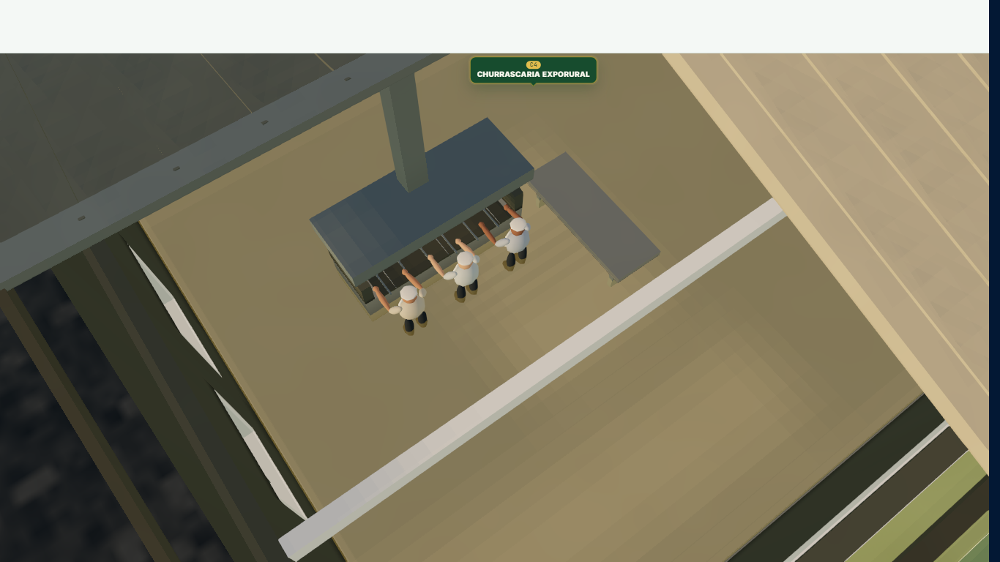

# C4, turbina e E-06 — arquitetura e atividade contextual

Implementação sobre a árvore aprovada de `87ba6564`. As referências fotográficas originais foram recuperadas do commit `93636d16`, sem alteração dos arquivos: [vista aérea](refs-churrascaria-satelite.jpeg) e [turbina vista dos fundos](refs-catavento-fundos.jpg). A foto dos fundos contém orientação EXIF; alguns visualizadores a mostram invertida.

## Identificação e preservação

| Elemento | Identidade e vínculo | Implantação preservada, em unidades de cena |
|---|---|---|
| Churrascaria Exporural | `reference:2026:c4`, C4, pai `reference:2026:quadra-r` | Centro cadastral `(36,872727; -12,000000)`, envelope `2,618182 × 2,400000`, rotação `0`, elevação `0`. Corpo visual `2,199273 × 2,160000`; deslocamento local X `0,130909`. |
| Banheiro | `reference:2026:e-06`, âncora oficial da planta `(4931,2427)` | Centro `(34,494545; -11,956364)`, corpo visual aprovado `1,047273 × 0,936000`, rotação `0`. |
| Turbina | Apresentação associada a C4 sobre Q-R-27; sem cadastro comercial inventado | Torre em `(33,364364; -12,432000)`, altura de torre `3,560727`, raio do rotor `0,746182`, base `0,16`. |

O [inventário anterior](screenshots/exporural-upgrade/before-desktop.json) guarda cadastros, polígonos, dimensões e layout. O teste de regressão compara integralmente o SHA-256 das **1.733 entidades oficiais**, incluindo vias, arena F e quadra, com `5abf0ed204b10d98e17d1a6f171add3a6c3b6b37e51f36311c9fed3b57548444`. Nenhum arquivo de dados cadastrais, vias ou modelos vizinhos foi modificado.

**Situação de E-06:** a referência histórica existe, mas `NON_PERMANENT_REMOVED_IDENTIFIERS_2026` exclui os sanitários da lista ativa. Esta regra continua intacta. O edifício visual existente recebe identificação E-06. Seu clique não aciona a cozinha de C4: seleciona o ID próprio quando disponível nos dados carregados, ou limpa a seleção quando o registro permanece excluído. Não há recriação de cadastro, lote ou operação comercial.

## Arquitetura e materiais

- Paredes compostas por trechos em torno de aberturas reais, com espessura, ombreiras, vergas e soleiras. A antiga porta sobreposta à primeira janela dá lugar a uma abertura coerente na mesma posição da porta.
- Duas seções de cobertura preservadas: metal escuro ao norte, acabamento claro ao sul; telhado do anexo mantido. Espessura, inclinação, cumeeiras, rufos, calhas, descidas, pilares e vigas. As duas seções se encontram sem planos coplanares sobrepostos.
- Alvenaria fosca, concreto áspero, chapa e esquadrias com resposta metálica moderada; vidro restrito às janelas. Reuso dos materiais e do shader de detalhe do parque. Sinalização em um atlas local de 512 × 128, com mipmaps e anisotropia 2. Sem alteração global de luz, exposição, neblina ou câmera.
- Banheiro com entrada sul preservada, marcos, ventilação externa e identificação discreta. Nenhuma divisão sanitária interna foi inventada.
- A cozinha é uma interpretação discreta: churrasqueira, coifa, duto até a saída acima da cobertura, bancada e espetos. As fotos não documentam a planta interna; não se apresenta o equipamento como levantamento fiel.

## Orientação e movimento

O antigo yaw de apresentação era `-126°`. A vista aérea permite estimar o vetor entre o centro posterior da nacele `(508,670)` e o cubo `(449,663)`, em pixels. O vetor para a frente é `(-59,-7)` em X/Z; a rotação resultante é **83,23°**, calculada por `atan2(59,7)`. É uma leitura aproximada da fotografia, sujeita a perspectiva e resolução; não é azimute topográfico, direção predominante do vento ou orientação permanente de uma turbina real.

A nacele tem um grupo de yaw; o rotor possui outro grupo, girando apenas em Z local, perpendicular ao plano XY das três pás. Torre cônica, flanges, plataforma de serviço, nacele com chanfros, eixo, cubo e pás afiladas têm conexões explícitas. Velocidade de aproximadamente `0,34 rad/s` (3,25 rpm), com pequena variação gradual e integração independente da taxa de quadros. O processamento para quando o conjunto sai do enquadramento ou fica pequeno demais na tela. A preferência por movimento reduzido pausa a rotação.

## Atividade ao selecionar C4

Três churrasqueiros, em escala de `0,15 unidade/metro`, usam aventais e roupas discretas. Movimentos de braços e espetos têm fases distintas. Um setor noroeste da cobertura desvanece até ficar oculto; o restante do prédio permanece opaco. A geometria do setor é restaurada ao encerrar a seleção.

A fumaça começa na saída da coifa acima do telhado. São **oito partículas** em um único emissor instanciado, quatro na qualidade reduzida, com vida curta, opacidade máxima individual de 0,075, subida de 0,28 unidade e pequena dispersão. Não há fogo, coluna escura ou névoa global. Movimento reduzido mantém a equipe visível e estática e desliga a fumaça.

Personagens e emissor são criados uma única vez. A desativação converge a zero, oculta os dois lotes de instâncias e interrompe suas atualizações. Os efeitos não fazem raycasting comercial. O material do recorte compartilha as cores do telhado para acompanhar os filtros sem reconstrução.

## Evidências visuais

| Vista equivalente | Antes | Depois |
|---|---|---|
| Conjunto e vizinhança | [antes](screenshots/exporural-upgrade/before-context.png) | [depois](screenshots/exporural-upgrade/after-context.png) |
| Churrascaria | [antes](screenshots/exporural-upgrade/before-restaurant.png) | [depois](screenshots/exporural-upgrade/after-restaurant.png) |
| Banheiro | [antes](screenshots/exporural-upgrade/before-restroom.png) | [depois](screenshots/exporural-upgrade/after-restroom.png) |
| Turbina | [antes](screenshots/exporural-upgrade/before-turbine.png) | [depois](screenshots/exporural-upgrade/after-turbine.png) |
| Superior | [antes](screenshots/exporural-upgrade/before-top.png) | [depois](screenshots/exporural-upgrade/after-top.png) |
| Parque geral | [antes](screenshots/exporural-upgrade/before-overview.png) | [depois](screenshots/exporural-upgrade/after-overview.png) |



[Vídeo desktop](screenshots/exporural-upgrade/activity-desktop.webm) · [Vídeo em viewport mobile](screenshots/exporural-upgrade/activity-mobile.webm) · [Aproximação mobile](screenshots/exporural-upgrade/active-mobile.png)

As versões de capturas com `mobile-` repetem as mesmas câmeras em 390 × 844. As posições exatas, resolução interna, DPR, qualidade, GPU e tempos constam nos JSON de cada execução. Capturas e vídeos usam a rota de diagnóstico local; as verificações de interface usam `/mapa-comercial` com sessão sintética, dados oficiais e requisições de backend interceptadas, sem gravações externas.

## Validação

Os testes automatizados cobrem conservação dos polígonos e dimensões, área das paredes vazadas, encontros do telhado, direção do rotor, equivalência da animação em 30/60/120 Hz e convergência da desativação. A suíte focada de mapa passou em **120 testes / 11 arquivos** ([resultado automatizado](screenshots/exporural-upgrade/tests.json)). TypeScript da aplicação, ESLint dos arquivos tocados e build de produção foram executados; os avisos de Browserslist antigo e tamanho dos chunks já pertencem à configuração existente.

No navegador, foram verificados clique/toque em C4, clique no banheiro, seleção de outra estrutura, limpeza, cliques repetidos, movimento reduzido, pan/rotação/zoom, filtros, seleção comercial, entrada e retorno do interior de B10, viewport mobile horizontal, ausência de overflow e um único Canvas. Os relatórios `activity-*` comprovam 20 ciclos por viewport sem duplicações, atualização nula após desativação e estabilidade dos recursos aquecidos.

A alternância de hidrologia e qualidade completou **40 ciclos / 80 transições**, com zero crescimento de geometrias, texturas ou programas nos quatro grupos aquecidos, zero perda de contexto e nenhum erro de renderização. [Relatório completo](screenshots/exporural-upgrade/stress.json).

O modelo completo detalhado custa **21 draw calls e 3.168 triângulos** em repouso; selecionado, **22 draw calls e 7.168 triângulos**, incluindo a equipe e a fumaça e descontando o setor recortado. Há oito chamadas de sombra para partes estáticas; pás e efeitos não exigem atualização de sombras a cada frame.

As medições foram feitas em Windows, Chrome com aceleração ANGLE/D3D11, **Intel UHD Graphics**. Mobile significa emulação de viewport/toque no mesmo computador. Não houve teste em aparelho físico, Safari/iOS ou GPU mobile; os números não certificam desempenho nesses dispositivos. Contagens de geometria/textura/programa e heap JavaScript não equivalem a bytes de VRAM.

### Comparação final, mesma câmera e qualidade

Capturas e ensaios executados sequencialmente no mesmo Chrome, sem outra medição gráfica concorrente. Todos os pontos abaixo terminaram em qualidade **HIGH**, DPR **0,72** e renderização direta: buffer desktop **972 × 500**, mobile **280 × 490**. Cada amostra inclui aproximadamente seis segundos de navegação após aquecimento. O modo adaptativo permaneceu habilitado, com o mesmo nível efetivo nos pares comparados.

| Enquadramento | Frame médio antes → depois (ms) | p95 antes → depois (ms) | Draw calls da cena antes → depois | Triângulos da cena antes → depois |
|---|---:|---:|---:|---:|
| Desktop, conjunto | 16.67 → 16.67 | 16.90 → 17.00 | 213 → 217 | 521,611 → 523,447 |
| Desktop, parque geral | 18.87 → 20.34 | 31.20 → 22.10 | 857 → 863 | 695,059 → 696,667 |
| Mobile emulado, conjunto | 16.67 → 16.67 | 16.80 → 16.80 | 115 → 119 | 465,806 → 467,642 |
| Mobile emulado, parque geral | 16.67 → 16.67 | 16.80 → 16.80 | 740 → 746 | 616,674 → 618,282 |

Na vista geral desktop, o tempo médio aumentou **1,47 ms (7,8%)**, enquanto o p95 caiu de 31,20 para 22,10 ms. O ganho arquitetônico acrescentou seis draw calls e 1.608 triângulos nessa vista. As amostras do conjunto e ambas as vistas mobile permaneceram próximas de 16,67 ms. São amostras locais; não uma garantia de 60 FPS contínuos.

Recursos da vista geral: desktop `610/145/175 → 614/146/179` e mobile `604/145/175 → 608/146/179` (geometrias/texturas/programas). O heap pontual do JavaScript variou entre execuções e inclui código de desenvolvimento e memória ainda não coletada; os valores brutos estão nos JSON. A verificação de crescimento usa ciclos aquecidos e, separadamente, medições de heap após coleta explícita fora do ensaio de frame. Nas duas últimas rodadas de navegação/zoom, o heap retido foi de **70,48 MB para 70,68 MB**, com geometrias/texturas/programas estáveis em `627/146/179`. O [relatório de navegação](screenshots/exporural-upgrade/navigation-stress.json) registra as três rodadas e as coletas.

[Antes desktop](screenshots/exporural-upgrade/before-desktop.json) · [Depois desktop](screenshots/exporural-upgrade/after-desktop.json) · [Antes mobile](screenshots/exporural-upgrade/before-mobile.json) · [Depois mobile](screenshots/exporural-upgrade/after-mobile.json)


## Reprodução

Com dependências instaladas e Vite local ativo:

```powershell
$env:PLAYWRIGHT_MODULE = '<caminho local do módulo playwright>'
$env:QA_URL = 'http://127.0.0.1:4188'
node scripts/exporural/capture.cjs after
node scripts/exporural/capture.cjs after --mobile
node scripts/exporural/activity.cjs
node scripts/exporural/activity.cjs --mobile
node scripts/exporural/functional.cjs run http://127.0.0.1:4188/mapa-comercial
node scripts/exporural/functional.cjs run http://127.0.0.1:4188/mapa-comercial --mobile
node scripts/exporural/navigation-stress.cjs
node scripts/exporural/stress.cjs
```

Para comparar antes/depois, use checkouts com `node_modules/.vite` independentes e execute as medições sequencialmente no mesmo computador, sem outro ensaio gráfico concorrente. Vídeos brutos permanecem locais em `video/`; os trechos selecionados acompanham a PR.
