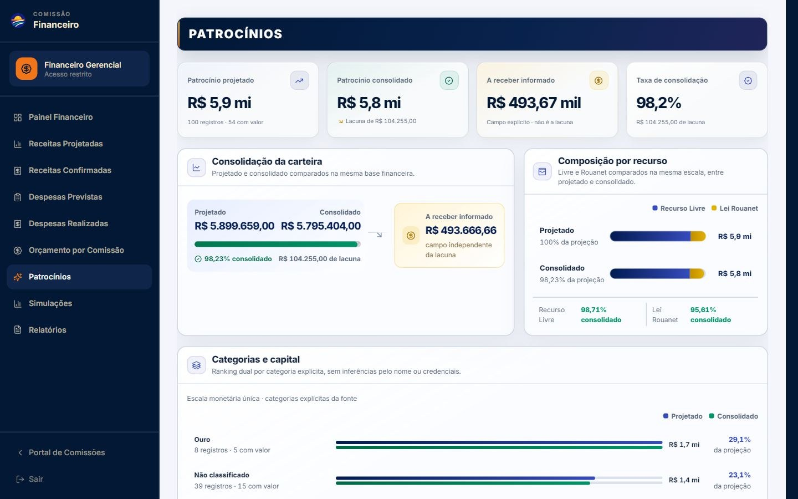
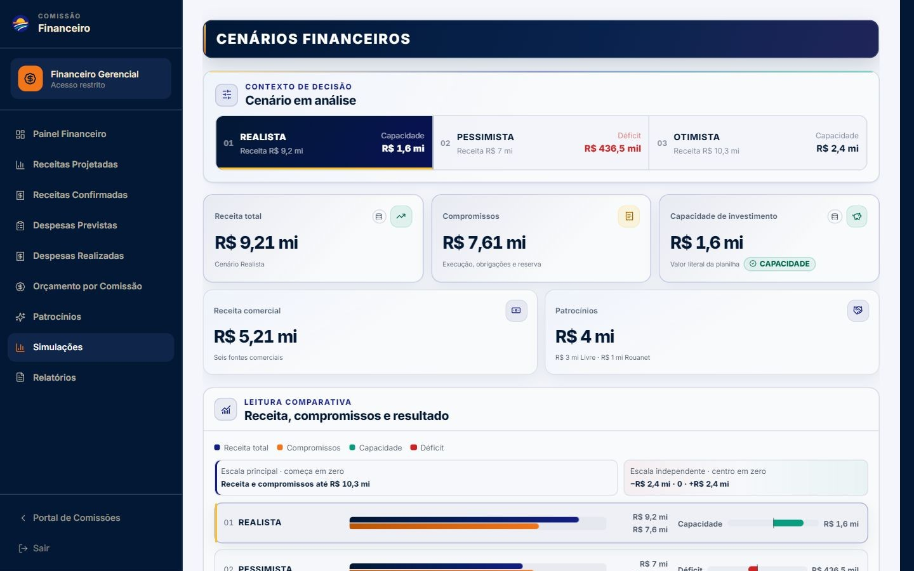
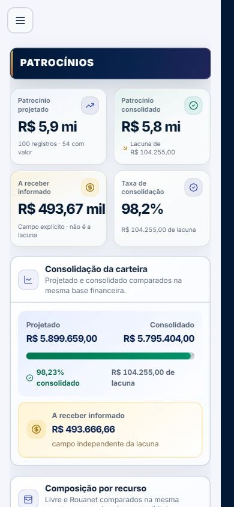
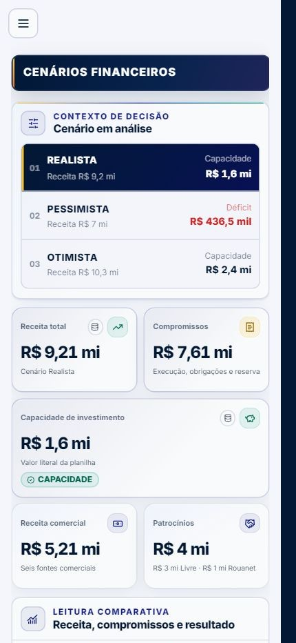

# Flagship Finance — Patrocínios e Cenários

## Escopo e contratos preservados

O refinamento cobre exclusivamente:

- `/comissoes/financeiro-gerencial/patrocinios`;
- `/comissoes/financeiro-gerencial/simulacoes`.

Continuam inalterados os nove caminhos do módulo, a cadeia `AuthGuard → OrgGuard → ModuleAccessGuard → CommissionLayout`, a capability `financial_access`, a integração Supabase, a persistência e a fixture financeira de referência. Não foram adicionadas dependências, migrations, tabelas, RPCs ou mutations.

## Âncoras financeiras verificadas

- Patrocínio projetado: **R$ 5.899.659,00**;
- patrocínio consolidado: **R$ 5.795.404,00**;
- lacuna de consolidação: **R$ 104.255,00**;
- A Receber informado, mantido como medida independente: **R$ 493.666,66**;
- carteira completa: **100 patrocinadores**, dos quais **54** possuem valor financeiro;
- composição projetada: Livre **R$ 4.988.159,00** e Rouanet **R$ 911.500,00**;
- composição consolidada: Livre **R$ 4.923.904,00** e Rouanet **R$ 871.500,00**;
- reconciliações literais dos cenários: Realista **−R$ 0,06**, Pessimista **R$ 0,00** e Otimista **+R$ 0,04**;
- déficit pessimista: **R$ 436.533,40**;
- textos “pago”, categorias explícitas e ocorrência `Q75` preservados sem inferência ou correção silenciosa.

## Passes formais de revisão

1. **Information Pruning**: removeu cabeçalhos internos duplicados, ações repetidas de limpeza, prosa genérica da toolbar e jargão técnico do disclosure; reforçou a precedência do `h1`.
2. **Financial Chart Design**: corrigiu a área monetária do waterfall, separou escalas na comparação, distinguiu capacidade e déficit, neutralizou o delta zero e alinhou grid, curva e cursor do Pareto.
3. **Financial UX Flow**: sincronizou categoria, Pareto e carteira; preservou rolagem vertical durante o scrub móvel; tornou linhas desktop selecionáveis e cards mobile expansíveis; limitou a navegação contextual aos números investigáveis.

## Matriz de QA autenticado

| Viewport | Patrocínios | Cenários | Resultado |
| --- | --- | --- | --- |
| 1440 × 900 | quatro KPIs, rail, recursos, ranking, Pareto, filtros, tabela sticky e drawer | seletor, grade 3+2, comparação dual-scale, waterfall e composição | Aprovado |
| 1600 × 900 | quatro KPIs na mesma linha, sem overflow | três KPIs primários + dois secundários, sem overflow | Aprovado |
| 1920 × 1080 | escala e densidade executiva preservadas | comparação e composição expandidas sem distorção | Aprovado |
| 390 × 844 | menu, KPIs 2×2, Pareto com `pan-y`, 20 cards iniciais, expansão e “Mostrar mais” | seletor sempre visível e navegação preservada | Aprovado |
| 430 × 932 | filtros e carteira sem rolagem horizontal de página | três cenários em linhas, KPIs 2+1+2 e waterfall vertical com 9 passos | Aprovado |

Cobertura manual adicional:

- reset de rolagem ao alternar entre as duas rotas;
- seleção de cenário por mouse, gráfico e setas, com atualização de KPIs, comparação, waterfall, contribuições e `aria-live`;
- déficit pessimista sem mudança de altura;
- tooltips por foco e toque, contidos no viewport e fechados por `Escape`/ação externa;
- categoria selecionada realinhando o Pareto ao primeiro patrocinador correspondente;
- busca, filtros, ordenação, estado vazio com uma única ação de limpeza e restauração;
- abertura do mesmo drawer por Pareto, linha desktop e card mobile;
- clique, Enter e Espaço nas linhas da carteira;
- cabeçalho sticky, numerais tabulares, alvos de detalhe de 44 px e ausência de overflow de página;
- console sem erros; permanecem apenas os avisos preexistentes de future flags do React Router.

## Evidências visuais

### Patrocínios — 1440 × 900

### Cenários — 1440 × 900

### Patrocínios — 390 × 844

### Cenários — 430 × 932

## Gates técnicos finais

- TypeScript (`tsc --noEmit`): aprovado;
- ESLint dos 11 arquivos TypeScript/TSX tocados: aprovado;
- testes financeiros, portal e acesso: **9 arquivos e 99 testes aprovados**;
- build de produção: aprovado, com **4.802 módulos transformados**;
- `git diff --check`: aprovado;
- suíte global: **567 testes aprovados e 30 falhas herdadas**, distribuídas por cinco arquivos não alterados;
- lint global: **972 erros e 38 avisos herdados** em arquivos fora do escopo.

As 30 falhas globais permanecem concentradas em `cronogramaMobileOverlays`, `cronogramaMobilePresentation`, `cronogramaTimeline`, `eventHarvestCompletion` e `venueEventsPresentation`. O build mantém somente os avisos preexistentes de base Browserslist desatualizada e chunks acima de 500 kB.

## Débitos herdados fora do escopo

A suíte global e o lint global já possuíam falhas em áreas não alteradas. Elas são registradas separadamente nos gates da PR e não foram mascaradas nem atribuídas a este trabalho. A fonte financeira permanece uma fixture frontend somente leitura; uma futura persistência deverá aplicar autorização e RLS no backend antes de substituir essa referência.
