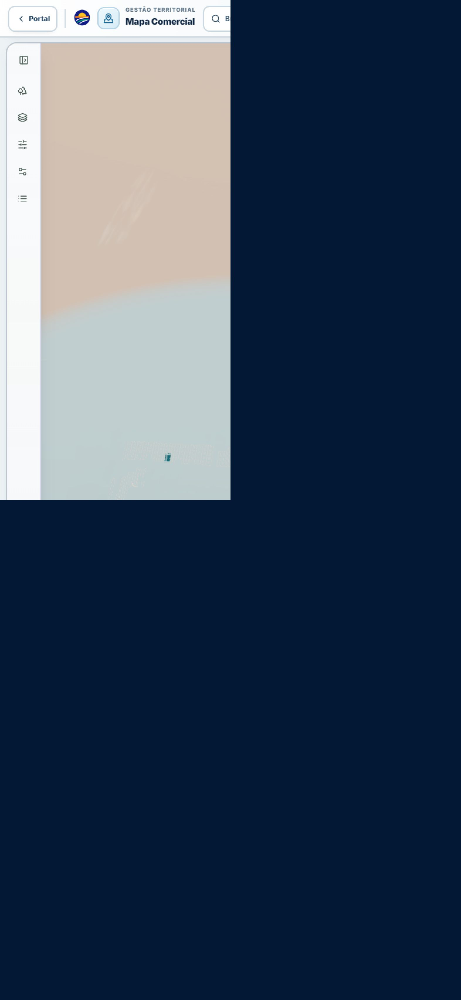
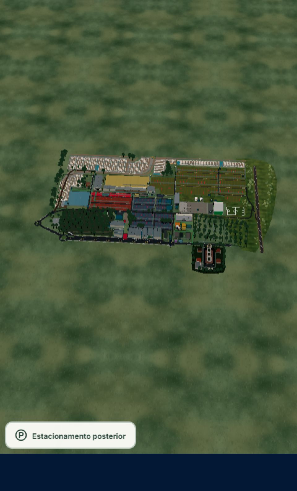
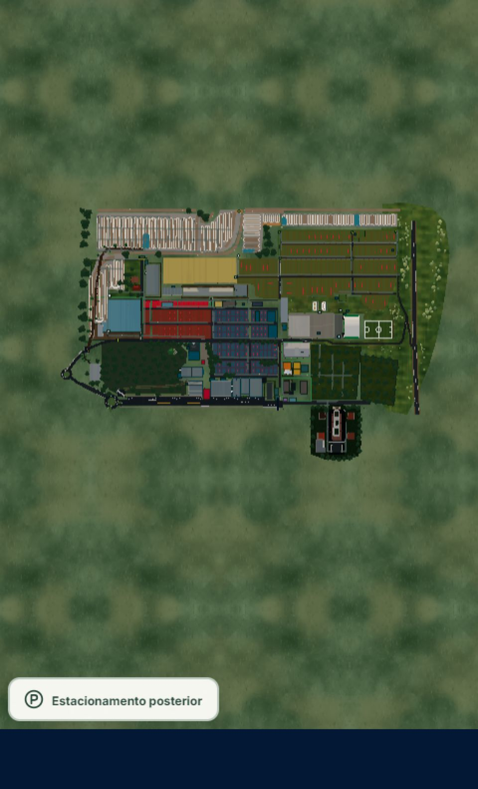
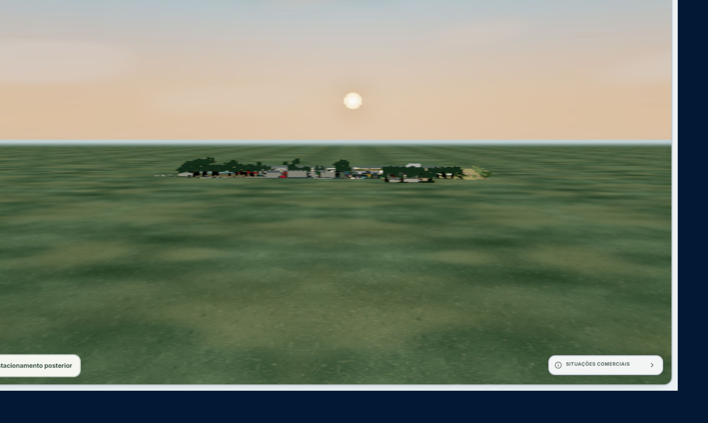
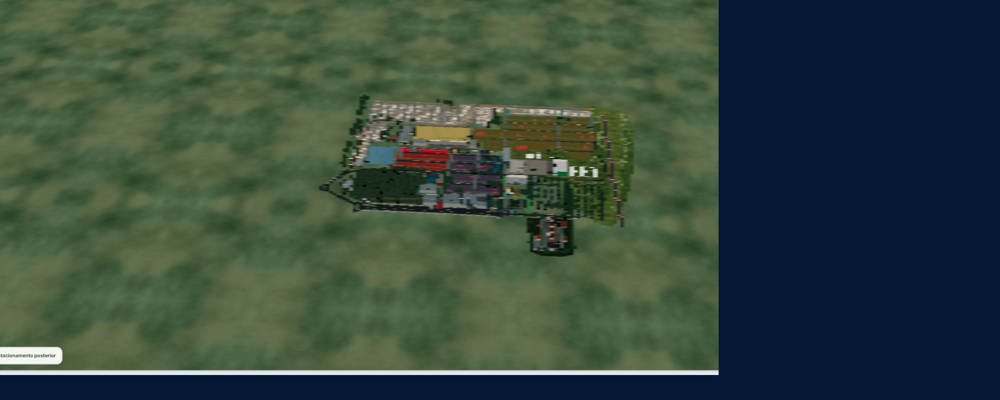

# Correção da atmosfera e dos limites de câmera do Mapa Comercial

## Resultado

A atmosfera do nascer do sol continua com horizonte azul-dourado, luz solar, reflexos e bloom no núcleo solar, mas não renderiza mais uma camada translúcida sobre o parque. O afastamento máximo agora é calculado a partir dos limites reais do mapa e do frustum da câmera, e todas as rotas de navegação convergem suavemente para esse limite.

## Causa raiz confirmada

O defeito não era apenas uma cor ou exposição incorreta. Três componentes se combinavam nas vistas distantes:

1. O `Fog` linear começava em aproximadamente `1.12 × diagonal` e terminava em `3.8 × diagonal`, enquanto a câmera ainda podia se afastar até aproximadamente `4.5 × diagonal`. Assim, o parque inteiro acabava interpolado para a cor clara da neblina.
2. A grande forma circular pálida era o limite da textura radial aplicada a um plano de terreno externo transparente (`transparent`, `depthWrite={false}`). Em ângulos altos e distâncias longas, o plano era visto como uma camada circular sobre o mapa.
3. Os riscos brancos eram planos de nuvens transparentes, dupla face e sem escrita de profundidade. A sobreposição e o ângulo rasante aumentavam o overdraw e tornavam suas bordas visíveis.

A esfera de céu não era atravessada: sua escala é muito maior que o alcance da câmera. Também não foram encontrados `FogExp2`, uma segunda instância da atmosfera, god rays volumétricos ou um segundo pipeline de pós-processamento causando o defeito. O ACES e o bloom já estavam isolados do mapa pelo limiar alto; foram preservados e calibrados.

## Correção de renderização

- As nuvens planas e o plano radial transparente foram removidos.
- A faixa de nuvens passou a ser procedural e angular dentro do shader opaco do céu, sem geometria atmosférica entre a câmera e o mapa.
- O céu continua em espaço de mundo e o sol não segue a câmera.
- O horizonte inferior agora faz a transição entre o terreno distante e o gradiente do céu sem linha circular, costura ou alpha acumulado.
- O terreno externo passou a ser um único plano opaco PBR, com repetição espelhada e escala suficiente para todos os limites válidos.
- A neblina linear foi mantida apenas além do mapa útil. Seu início é o maior valor entre a distância atmosférica do cenário e `maxDistance + boundingSphereRadius × 1.15`.
- O bloom continua aplicado ao núcleo e halo solar (`luminanceThreshold=3.2`), com `ACESFilmicToneMapping` e exposição `0.93`.
- A implementação elimina duas geometrias atmosféricas, sete programas de shader no tier balanceado e duas texturas no cenário móvel observado.

## Cálculo dos limites da câmera

Para a câmera perspectiva, o volume do mapa é convertido em uma esfera de enquadramento:

```text
R = sqrt((width/2)^2 + (height/2)^2 + (depth/2)^2)
verticalHalfFov = radians(fov) / 2
horizontalHalfFov = atan(tan(verticalHalfFov) × aspect)
limitingHalfFov = min(verticalHalfFov, horizontalHalfFov)
fittedDistance = R / sin(limitingHalfFov)
maxDistance = fittedDistance × 1.08
minDistance = clamp(max(8, R × 0.11), maxDistance)
far = max(1200, (maxDistance + R) × 3)
```

O aspect ratio mais restritivo determina a distância. Por isso, retrato recebe mais alcance que paisagem, desktop e ultrawide, sem valor arbitrário por dispositivo. O `OrbitControls` mantém um limite desejado e um aplicado: o aplicado converge com damping, evitando salto, bounce ou interrupção do gesto.

Uma única instância de `OrbitControls` é autoritativa. Wheel, trackpad, dois dedos, presets, seleção, busca, estacionamento, segmentos, reset, resize, retorno de interior e a sequência lunar usam o mesmo clamp antes de iniciar a transição.

## Arquivos modificados

- `src/features/commercial-map/components/canvas/CommercialMapCanvas.tsx`
- `src/features/commercial-map/components/canvas/CommercialMapEnvironment.tsx`
- `src/features/commercial-map/data/commercialMapEnvironment.ts`
- `src/features/commercial-map/utils/viewport.ts`
- `src/test/commercialMapEnvironment.test.ts`
- `src/test/commercialMapViewport.test.ts`
- `docs/commercial-map-atmosphere-camera-fix.md`
- `docs/screenshots/commercial-map-atmosphere-camera-fix/*`

## Validação automatizada

- Foco ampliado do Mapa Comercial, incluindo atmosfera, viewport, mobile, interação, segmentos, sequência lunar e quatro suítes de estacionamento: `130/130` testes aprovados em 10 arquivos.
- TypeScript: `npm.cmd exec tsc -- -p tsconfig.app.json --noEmit` aprovado.
- ESLint direcionado aos seis arquivos TypeScript/TSX modificados: aprovado sem ocorrências.
- Build de produção: aprovado, 5.101 módulos transformados em 35,30 s. Os únicos avisos foram o banco `caniuse-lite` desatualizado e chunks acima de 500 kB já existentes.
- `git diff --check`: aprovado, sem erro de whitespace.
- Suíte global: `1.242/1.279` testes aprovados; 37 falhas em 13 suítes fora do Commercial Map e fora do diff desta correção. Entre os arquivos confirmados no log estão `agendaMeetingWorkspace.test.tsx`, `cronogramaMobilePresentation.test.tsx` e `venueEventsPresentation.test.ts`. Como o log completo foi truncado, os outros dez nomes não são inferidos neste relatório.
- Lint global: 972 erros e 48 avisos em arquivos fora do escopo, principalmente `no-explicit-any`; o resultado global não é apresentado como aprovado.

## Validação visual

Os tamanhos abaixo são os viewports/canvases efetivamente medidos no navegador embutido. São testes responsivos por emulação, não dispositivos físicos.

| Perfil | Viewport efetivo | Canvas efetivo | Distância máxima observada | Resultado |
| --- | ---: | ---: | ---: | --- |
| Mobile retrato | 480 × 852 | 480 × 791.63 | 424.8019 | parque completo e legível |
| Mobile paisagem | 852 × 392 | 769.25 × 314.84 | 266.6694 | limite estável |
| Tablet retrato | 768 × 1024 | 685.25 × 936.84 | 355.4808 | parque completo e legível |
| Desktop | 1440 × 900 | 1357.25 × 812.84 | 266.6694 | limite estável |
| Ultrawide | 2560 × 1080 | 2477.25 × 992.84 | 266.6694 | parque completo e legível |

Cobertura manual executada:

- mínimo, médio e máximo afastamento;
- top-down e oblíquo distante;
- quatro quadrantes de azimute no limite e ângulos polares permitidos;
- seis ciclos rápidos de zoom, sem overshoot;
- orbit e pan no limite máximo;
- sol frontal, parcialmente no quadro e fora do quadro;
- seleção e busca por “Pista Campeira” iniciadas no máximo, ambas focando dentro dos limites;
- reset e foco do estacionamento dentro dos limites;
- carregamento frio após HMR, sem erro WebGL, shader ou perda de contexto.

### Evidências

Antes, na posição inválida disponível no baseline:



Depois, no maior afastamento válido em mobile retrato:



Depois, top-down no limite:



Depois, horizonte e sol:



Depois, ultrawide no limite:



As demais capturas desta pasta registram paisagem móvel, tablet retrato, distância mínima, sol parcial e vista oblíqua. As imagens originais não contêm telemetria da câmera; portanto, a posição exata das fotografias anexadas não pode ser reconstruída numericamente. O “depois” usa o limite derivado mais próximo, pois a posição inválida anterior deixa de ser alcançável por definição.

## Estabilidade e desempenho

- Recursos no tier balanceado, antes → depois: geometrias `474 → 472`, programas `163 → 156`, texturas `119 → 117`.
- Após seis ciclos rápidos de zoom no desktop, os recursos permaneceram em geometrias `472`, programas `156` e texturas `121`, sem recriação do canvas.
- Céu, fog, materiais, luzes e efeitos conservam referências estáveis; não há atualização de estado React em cada frame de câmera.
- O shader usa uma cache key estável (`commercial-map-camera-safe-sunrise-sky-*-v4`) e não recompila por gesto.
- DPR e tier permaneceram estáveis durante os gestos observados.

Não foi realizado benchmark de FPS/GPU em dispositivo físico, portanto este relatório não atribui um número de FPS.

## Limites da validação

- O navegador embutido não aceitou injeção CDP de eventos touch; o Chrome conectado abriu a rota sem sessão autenticada. O contrato de dois dedos (`DOLLY_ROTATE`), `touch-action: none` e o comportamento de damping estão cobertos por código/teste, mas pinch repetido em aparelho físico ainda requer QA manual autenticado.
- A rota compartilhada `industria-comercio-servicos` respondeu “Segmento comercial indisponível” para a sessão atual e não montou o canvas. A integração compartilhada permanece coberta pelos testes, mas não houve evidência visual autenticada dessa rota nesta execução.
- Não houve medição física de FPS, temperatura ou memória de GPU.
