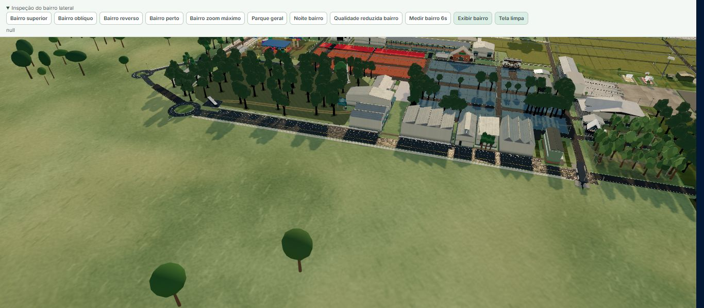
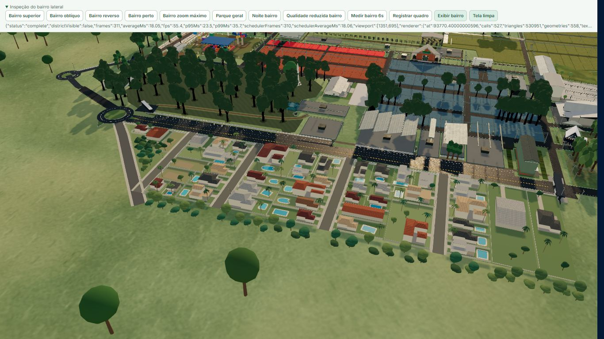
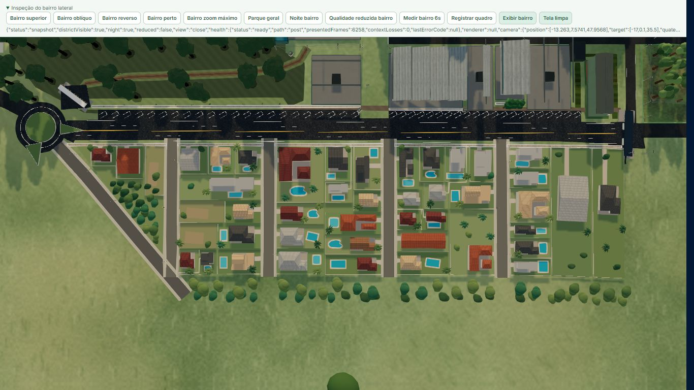
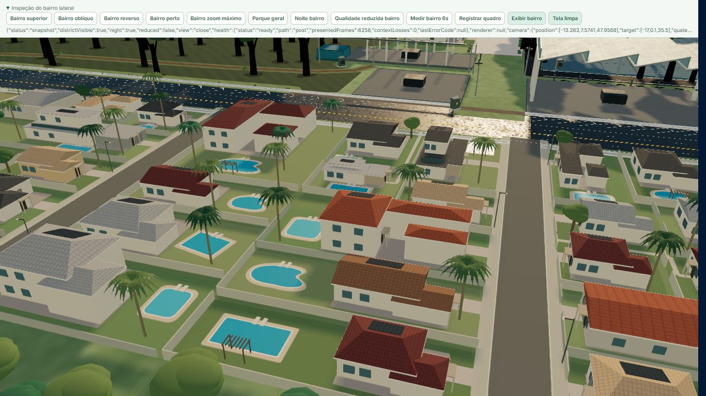
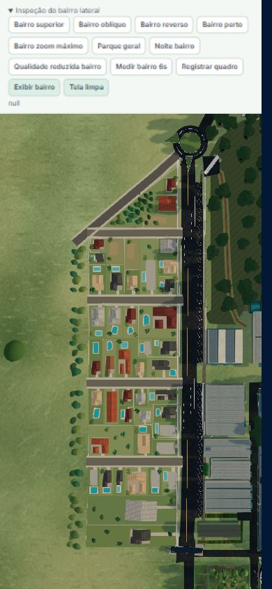
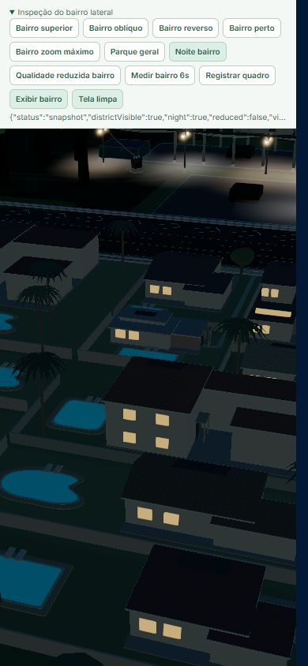

# Fenasoja 2028 — bairro lateral do Mapa Comercial 3D

Esta expansão interpreta a faixa urbana externa à Av. Benvenuto de Conti, desde a cunha próxima ao trevo até a transição institucional ao lado do Portão 3. As imagens fornecidas orientam a malha, a ocupação dos lotes, os volumes principais, as piscinas e as massas de vegetação. Não são levantamento cadastral nem permitem confirmar unidades habitacionais, altura de fachadas, limites legais ou espécies vegetais.

## Referências e método de leitura

| Imagem | Arquivo fornecido | Uso na interpretação |
| --- | --- | --- |
| 1 | `IMG_0350.jpeg` | Estado anterior do mapa: faixa verde vazia na face externa da avenida, trevo no extremo sul e relação com o parque existente. Não fornece cadastro do bairro. |
| 2 | `96D4B700-97E1-4FDF-ADDA-66F3F4657ACF.jpeg` | Musicanto, Campeira, cunha Carsul, acesso diagonal e borda do campo. Ajuda a completar a parte sul ocultada nas outras capturas. |
| 3 | `874FDCFB-4551-4C26-9EBD-DF52B22CDF42.jpeg` | Campus identificado na captura como RBS, faixa residencial ao norte da Rua Fenasoja e parte da quadra imediatamente ao sul. |
| 4 | `BECFA27B-7E29-424B-9F4D-22334C229F23.jpeg` | Faixa residencial norte, Rua Fenasoja, quadra Fenasoja–10 de Agosto e parte da quadra seguinte. É a principal referência da grande cobertura longitudinal e do jardim amplo. |
| 5 | `9836045B-5B95-4B39-AEAC-832BFF283CE7.jpeg` | Quadra 10 de Agosto–Musicanto quase completa, sequência dos lotes, piscina orgânica da villa maior e início da quadra Musicanto–Campeira. |
| 6 | `7D4DA3DA-442B-4828-B4BE-A2003F2F3F34.jpeg` | Complemento muito semelhante à imagem 2: permite conferir a cunha, o acesso diagonal e a quadra Campeira–Musicanto. |

As capturas 2 e 6 repetem grande parte da mesma área. As demais também se sobrepõem. A contagem considera cada conjunto de coberturas apenas uma vez; a presença em duas imagens não cria uma segunda casa. Interfaces, rótulos e árvores ocultam parte dos telhados e quintais. A escala gráfica de 20 m ajuda na leitura de proporções, mas o enquadramento, a rotação e a resolução variam entre capturas. Não foi feita uma ortorretificação ou uma medição topográfica independente.

As cinco unidades são numeradas do trevo para o Portão 3. A primeira é uma cunha arborizada com ocupação comercial; a quinta combina residências e um campus institucional. Preservar essas diferenças é necessário para representar as referências, em vez de transformar toda a faixa em quadras residenciais iguais.

## Inventário por quadra

| Unidade | Limites e forma | Leitura aproximada das imagens | Implantação adotada | Piscinas adotadas |
| --- | --- | --- | --- | ---: |
| Q1 | Avenida, Rua Campeira e acesso diagonal; cunha triangular | 2 conjuntos construídos identificáveis, com possibilidade de anexos; bosque e clareira dominantes | 2 conjuntos comerciais e 1 parcela livre | 0 |
| Q2 | Campeira–Musicanto, avenida e borda vegetada do campo; retangular | Cerca de 9–11 conjuntos ocupados; subdivisão da cobertura comprida é incerta | 9 conjuntos: 8 residenciais e 1 comercial; 2 parcelas livres centrais | 6 |
| Q3 | Musicanto–10 de Agosto, avenida e campo; retangular e mais extensa | Cerca de 11–13 conjuntos ocupados; alas de cobertura e dependências não são contadas separadamente | 11 conjuntos residenciais, incluindo a villa de esquina com quintal maior | 10 |
| Q4 | 10 de Agosto–Fenasoja, avenida e campo; retangular | Cerca de 11–13 conjuntos de coberturas; a cobertura longa pode integrar uma propriedade vizinha | 12 conjuntos classificados como residenciais, com jardim amplo e cobertura longitudinal preservados | 6 |
| Q5 | Ao norte da Rua Fenasoja, entre avenida e campo, até a transição junto ao Portão 3 | 5–6 residências na faixa estreita e 2 edifícios do mesmo campus | 6 conjuntos residenciais e 2 institucionais | 5 |
| **Total** | **5 unidades morfológicas** | **Estimativa visual, não cadastro de moradias** | **42 conjuntos construídos: 37 residenciais, 3 comerciais e 2 institucionais; 3 parcelas livres explícitas** | **27** |

O valor `houseCount` do diagnóstico técnico conta todo registro que possui `house`, incluindo galpões e edifícios institucionais. Portanto, **42 não significa 42 casas independentes**. Em especial, a cobertura longitudinal de Q4 e o anexo escuro de Q5 permanecem interpretações, e os dois edifícios institucionais pertencem visualmente ao mesmo campus. O código conserva essas ressalvas por meio de `confidence: 'inferred'` e dos resumos por quadra.

### Q1 — cunha sul

As imagens 2 e 6 mostram um volume de telhado vinho junto à avenida, coberturas compridas atrás dele e vegetação densa na direção do acesso diagonal. A implantação mantém dois conjuntos edificados, uma clareira e o bosque na parte mais larga da cunha. O uso comercial é uma interpretação dos rótulos e da configuração visível, não uma verificação da atividade atual. Não há piscina identificável. A borda diagonal determina a forma da quadra; não foi substituída por uma grade retangular.

### Q2 — Campeira a Musicanto

O lado da avenida combina uma casa de esquina de telhado escuro, uma casa clara com pátio e a cobertura identificada na captura junto ao rótulo Valmax. No miolo aparece um conjunto branco comprido; ao longo da Musicanto há volumes de telhado ocre, cinza e claro, com casas voltadas à borda do campo. Dois trechos gramados centrais menos ocupados são mantidos livres. Seis piscinas identificáveis são representadas com formas retangulares, arredondadas e orgânicas. Palmeiras pontuam quintais e esquinas; árvores menores completam a arborização sem ocultar todos os lotes. A associação exata entre alas do conjunto comprido e moradias é incerta.

### Q3 — Musicanto a 10 de Agosto

A imagem 5 mostra a maior concentração de piscinas. A villa escura de esquina próxima à Musicanto ocupa um lote maior e tem piscina orgânica em amplo gramado. Casas mais estreitas e coberturas claras se alinham à avenida; a borda oriental apresenta villas de telhados vinho, cinza e cerâmico, com quintais e piscinas de vários tamanhos. A implantação adota onze conjuntos de coberturas e dez piscinas. Um telhado cerâmico compacto não possui piscina claramente identificável. As palmeiras têm presença forte nos jardins centrais e na villa maior. A variação de ocupação e recuo é mais relevante que o alinhamento regular de fachadas.

### Q4 — 10 de Agosto a Fenasoja

A imagem 4 mostra casas contemporâneas e telhados cinza junto à avenida, coberturas metálicas menores no centro, uma cobertura cerâmica longitudinal e uma propriedade maior com jardim amplo no lado norte/oriental. Esse jardim permanece aberto e recebe árvores e palmeiras; não é convertido em lote adicional. São adotadas seis piscinas, incluindo uma estreita e comprida, formas arredondadas e a piscina levemente girada próxima ao campo. A cobertura longitudinal é um conjunto volumétrico próprio para reproduzir a silhueta aérea, mas sua independência cadastral não está estabelecida. Os doze registros não devem ser divulgados como doze residências verificadas.

### Q5 — faixa norte e campus institucional

As imagens 3 e 4 mostram uma faixa de cinco a seis residências voltadas à Rua Fenasoja, com casas brancas de volumetria contemporânea, uma grande cobertura cerâmica composta e volumes cinza. Cinco piscinas são legíveis na faixa; a distinção entre uma casa escura e um anexo da propriedade vizinha é incerta. Acima dessa faixa, dois edifícios e grandes gramados formam o campus identificado na captura como RBS. A modelagem diferencia o galpão/estúdio do volume administrativo e conserva os espaços livres. Os gramados institucionais não são tratados como lotes vagos disponíveis para receber casas.

## Implantação e escala

O sistema autoral utiliza coordenadas métricas locais `[s, t]`: `s` avança do trevo para o Portão 3; `t` se afasta da avenida em direção ao campo. A transformação aplica **0,15 unidade de mundo por metro**, com base no sistema de coordenadas já usado pelo parque. O ponto de origem é a referência existente do trevo `[1110, 4185]` no desenho oficial, convertida por `officialPdfPointToLocal`.

A função `lateralDistrictPointToWorld` acompanha as pequenas mudanças da linha existente da avenida, em vez de retificar ou deslocar a estrada do parque. A ocupação começa após o trevo, em torno de `s = 25 m`, e a última unidade chega a `s = 409 m`. As quadras regulares ocupam aproximadamente `t = 11–101 m`; árvores de borda prolongam a composição em direção ao campo. A escala é uma calibração de modelagem para compatibilizar as referências com o mapa existente, não uma certificação métrica do bairro real.

A avenida continua sob responsabilidade de `ParkAccessInfrastructure`. O bairro acrescenta quatro ruas transversais — Campeira, Musicanto, 10 de Agosto e Fenasoja — e o acesso diagonal sul. Não foi inventada uma via longitudinal asfaltada atrás das casas: as imagens mostram uma faixa vegetada junto ao campo. As ruas locais têm 7,4 m de largura autoral e o acesso diagonal 8,2 m, valores aproximados de modelagem; as calçadas e meios-fios são representações proporcionais. Os recuos, caminhos, muros e garagens são detalhamento arquitetônico inferido dentro dos envelopes definidos para cada lote.

## Arquitetura e vegetação

`lateralResidentialDistrict.ts` contém a fonte de dados por parcela, sem distribuição aleatória de edifícios. Cada casa tem centro, envelope, tipologia, cor, pavimentos e eventual piscina definidos individualmente. Os seis sistemas são villa de quatro águas, casa com pátio e alas, duas águas, contemporânea de cobertura plana, volumes em níveis e cobertura longitudinal. Essas famílias são combinadas com proporções e alturas diferentes, térreas e de dois pavimentos, telhados vinho, cerâmicos, claros e cinza. O número de pavimentos é uma interpretação arquitetônica, pois as capturas aéreas não o confirmam diretamente.

O plano geométrico compõe paredes, alas, coberturas, beirais, embasamentos, entradas cobertas, portas, garagens, janelas, varandas, painéis solares, muros, acessos e pergolados onde existe espaço. Os envelopes, as piscinas e a área livre orientam a composição; variação determinística é reservada a acabamento, cor e pequenos detalhes. A presença generalizada de painéis acompanha os telhados visíveis, sem pretensão de reproduzir cada instalação elétrica.

Quatro volumes internos sem testada própria são interpretados como anexos com circulação pedonal compartilhada: a casa de fundos de Q2 se liga ao conjunto da esquina Campeira; a cobertura branca estreita de Q3 ao conjunto sudoeste; a cobertura metálica central de Q4 ao conjunto moderno com piscina estreita; e a casa vinho central de Q4 ao conjunto vinho sul. Passagens de 0,8 m percorrem faixas livres e separações existentes, com aberturas correspondentes nos muros. Entradas e garagens das demais casas acompanham a testada do lote; os anexos orientam suas portas para a passagem, conservando os envelopes das coberturas. Essa é uma hipótese de coerência arquitetônica, sem comprovação de condomínios, titularidade ou subdivisão legal. Os quatro volumes continuam incluídos nos 37 registros residenciais e não representam quatro moradias independentes verificadas.

As piscinas usam três geometrias compartilhadas: retangular, arredondada e orgânica. Deck, borda e água formam camadas opacas com alturas distintas. A água tem cor azul/turquesa e brilho contido, evitando uma dependência de reflexos em tempo real. Palmeiras recebem copas largas de folhas curvas; árvores de copa composta variam em altura, diâmetro e cor. As posições principais de quintal e da borda do campo são autorais e determinísticas. A identificação de espécies e o número exato de árvores reais não são inferíveis dessas imagens.

A borda do campo reproduz uma faixa plantada densa, como nas imagens 2, 5 e 6: 24 árvores altas ao fundo de Q2–Q5 recebem raios de copa de 4,5–5,4 m e são intercaladas com 26 árvores mais baixas em uma segunda camada irregular. Essa camada fica atrás dos quintais, entre `t = 114,5–117 m`, preserva as aberturas das ruas e o acesso diagonal e não cria novos lotes. Q1 recebe um bosque de 27 árvores, mantendo sua clareira e os afastamentos das construções e vias. O inventário final possui **38 palmeiras, 98 árvores de copa larga e 14 postes**. A vegetação reutiliza os lotes de instâncias de troncos e copas, sem novos materiais ou luzes.

## Organização de renderização e desempenho

- `lateralResidentialGeometry.ts` gera um plano de renderização determinístico, independente de WebGL, dividido nas cinco células espaciais das quadras.
- `lateralResidentialAssets.ts` cria geometrias e materiais compartilhados. Instâncias usam transformações e cores próprias; coberturas e painéis recebem subdivisões visuais por shader, sem uma malha separada para cada telha ou célula solar.
- `LateralResidentialDistrict.tsx` monta lotes de `InstancedMesh` por categoria e por célula. As superfícies de chão, calçadas e acessos são mescladas por célula. Os volumes principais permanecem legíveis à distância.
- Detalhes pequenos são ocultados pela distância com histerese; palmeiras alternam entre geometrias de copa próxima e distante nos limiares de 45/53 unidades de mundo. O perfil de gráficos reduzidos adota menor alcance de detalhes (20/26) e a copa simplificada. Os limites efetivos ficam no componente. O ajuste final do alcance das palmeiras retirou 38 mil triângulos da vista de medição desktop, mantendo as folhas detalhadas nas aproximações.
- Sombras projetadas ficam restritas à alvenaria e coberturas próximas no perfil completo. O bairro não acrescenta luzes pontuais reais. Postes instanciados, luminárias emissivas, janelas aquecidas e manchas suaves de luz no piso compõem a leitura noturna. Essas manchas não iluminam fisicamente os objetos vizinhos.
- As malhas decorativas não participam de seleção por raycast. O sistema conserva os postes quando o usuário oculta vegetação. Geometrias, materiais e dados de instâncias possuem descarte explícito.
- Os limites espaciais das malhas consideram os elementos emitidos, incluindo copas e bocas de rua, para evitar desaparecimento precoce nas bordas do enquadramento. Árvores procedurais do entorno são excluídas do perímetro da implantação para evitar sobreposição com casas e ruas.

Essas medidas reduzem trabalho redundante, mas a existência de instanciamento e LOD não prova ausência de regressão de desempenho. Draw calls do plano são uma contagem estrutural; FPS, tempo de quadro, compilação inicial e comportamento durante navegação exigem medição no mapa em execução, por dispositivo/perfil.

## Validação e evidências de aceitação

Validação realizada em 5 de setembro de 2026 na rota DEV `/__dev/commercial-map-rendering`, que utiliza o mesmo `CommercialMapCanvas` do produto. Os controles específicos do bairro são removidos do build de produção. As capturas abaixo são do renderer em execução, não imagens geradas ou montagens.

| Verificação | Resultado e evidência |
| --- | --- |
| Geometria e dados | Testes cobrem inventário, colocação na face externa, transformação inversa, lotes sem sobreposição, piscinas e decks dentro dos lotes, normais dos telhados, encaixe de janelas/portas, contato dos painéis solares, garagens, passagens compartilhadas e orçamento de instâncias. |
| Integração viária | Quatro aberturas recortam somente a representação da calçada Benvenuto. Identificadores e coordenadas oficiais permanecem intactos. A superfície visual duplicada da avenida é suprimida apenas enquanto a infraestrutura principal a representa; seleção e fallback continuam disponíveis. |
| Desktop | Chromium do navegador integrado, 1366×768; também capturas em 1366×599. Inspecionadas vistas superior, oblíqua, reversa, próxima, aproximação mínima permitida e overview do parque. |
| Mobile | Viewport de 390×844 no mesmo navegador/GPU desktop, com canvas de 375×681. Inspecionadas vistas superior, oblíqua, próxima, aproximação mínima e noite. Verificada também orientação horizontal de 844×390. **Não é teste em telefone físico nem Safari/iOS.** |
| Noite | Ruas, piscinas e volumes permanecem legíveis; janelas e postes recebem emissão controlada. Alternâncias de dia/noite e retorno da aproximação mantiveram `ready`, quadros apresentados e zero perda de contexto. |
| Estabilidade | **80 transições / 40 ciclos** entre hidrologia e qualidade, em 149 s: resultado `passed`, quatro grupos de recursos aquecidos cobertos, nenhuma perda de contexto ou erro de apresentação. Relatório completo em [stress-80-transitions.json](screenshots/lateral-residential/stress-80-transitions.json). |

### Medição de navegação

Trajetória determinística de seis segundos, descartando o primeiro delta ocioso e os primeiros 400 ms. A comparação oculta apenas o grupo do bairro, mantém câmera, resolução e demais elementos iguais e usa a via de renderização direta adotada pelo mapa durante navegação. O teste exige documento visível e em foco; um contador independente de `requestAnimationFrame` confere o agendamento. GPU: **Intel UHD Graphics, ANGLE / D3D11**, perfil HIGH; DPR adaptativo **0,72 durante navegação**. Cada resultado abaixo é uma amostra, não uma certificação universal de FPS.

| Viewport / bairro | FPS | Quadro médio | P95 / P99 | GPU média | Draw calls | Triângulos |
| --- | ---: | ---: | --- | ---: | ---: | ---: |
| Desktop 1366×768, visível | 51,3 | 19,50 ms | 29,7 / 37,3 ms | 17,133 ms | 579 | 590.428 |
| Desktop 1366×768, oculto | 55,4 | 18,05 ms | 23,5 / 35,7 ms | 15,038 ms | 527 | 530.951 |
| Mobile 390×844, visível | 59,8 | 16,72 ms | 16,9 / 17,8 ms | 8,439 ms | 356 | 497.331 |
| Mobile 390×844, oculto | 60,0 | 16,67 ms | 17,0 / 17,3 ms | 7,935 ms | 305 | 437.860 |

No desktop, a expansão acrescentou 52 draw calls, 59.477 triângulos e aproximadamente 2,1 ms de GPU nessa trajetória. O custo é mensurável: **não se afirma ausência absoluta de queda de FPS ou 60 FPS constantes em desktop**. O par móvel acrescentou 51 draw calls e 59.471 triângulos, mantendo aproximadamente 60 FPS no ambiente emulado. As contagens de geometrias/texturas/programas permaneceram iguais dentro de cada par. O buffer desktop era 972×500 e o móvel 270×490; não são medições em DPR nativo de um smartphone.

Resultados brutos: [desktop visível](screenshots/lateral-residential/iab-desktop-visible-final.json), [desktop oculto](screenshots/lateral-residential/iab-desktop-hidden-final.json), [mobile visível](screenshots/lateral-residential/mobile-visible-final.json), [mobile oculto](screenshots/lateral-residential/mobile-hidden-final.json). Consultas GPU possuem limite de fila: o par desktop descartou consultas excedentes, mas não registrou consultas disjuntas; os JSONs expõem número de amostras, P95 e descartes. Medições preliminares numa sessão Chrome limitada pelo agendador a cerca de 1 FPS foram excluídas desta comparação.

### Verificações automatizadas e limites conhecidos

- `npx tsc --noEmit -p tsconfig.app.json`: passou.
- Repetição final dos cinco arquivos de testes da expansão e integração (`LateralResidentialDistrict`, `LateralResidentialArchitecture`, `LateralResidentialStreetIntegration`, `RoadSurfaceOwnership`, `ParkAccessInfrastructure`): **29/29 testes passaram** após os ajustes finais.
- ESLint dos 19 arquivos TypeScript/TSX da expansão e do teste de infraestrutura alterado: passou; o arquivo de integração foi conferido novamente após o ajuste final do gate DEV.
- `npm run build`: passou após os ajustes finais; permanecem avisos do projeto sobre chunks grandes e base Browserslist antiga. O código de diagnóstico do bairro não integra os bundles de produção.
- Suíte ampla `npx vitest run src/test/commercialMap --maxWorkers=2 --minWorkers=1`: 919 testes, 912 passaram e sete falharam na execução inicial. Uma asserção antiga de bump do asfalto foi atualizada para a decisão de material atual; os nove testes desse arquivo passaram na repetição. Os seis erros restantes foram reproduzidos no commit base `5543034`, em checkout separado, sem alterações desta expansão. A suíte ampla não foi declarada inteiramente verde.
- Falhas pré-existentes: afastamento de condutores elétricos (937 ocorrências em ambos os commits); duas referências locais ausentes da churrascaria; expectativa textual de independência da página; duas expectativas de histerese de apresentação; e uma asserção de texto dependente de LF no checkout CRLF do overlay Lactalis. No checkout base, os mesmos cinco arquivos produziram 45 testes aprovados e seis falhas.

A avenida já apresentava granulação e diferenças de luminosidade nas capturas anteriores. A integração elimina a superfície base duplicada e a dupla perturbação de normais do material de asfalto, mantendo suas texturas de cor/rugosidade e as marcações. Alguns contrastes do material e das sombras continuam visíveis na avenida existente; esta expansão não certifica a ausência de todo artefato preexistente do parque. A contagem de moradias, a geometria cadastral exata, telefones físicos, Safari/iOS e o desempenho em outros equipamentos permanecem fora da evidência disponível.

### Capturas para revisão

| Antes | Depois |
| --- | --- |
|  |  |

| Vista superior | Aproximação |
| --- | --- |
|  |  |

| Mobile superior | Mobile noite |
| --- | --- |
|  |  |

As demais capturas na mesma pasta incluem vista reversa, máxima aproximação, visão oblíqua móvel e noite em ambos os formatos.
