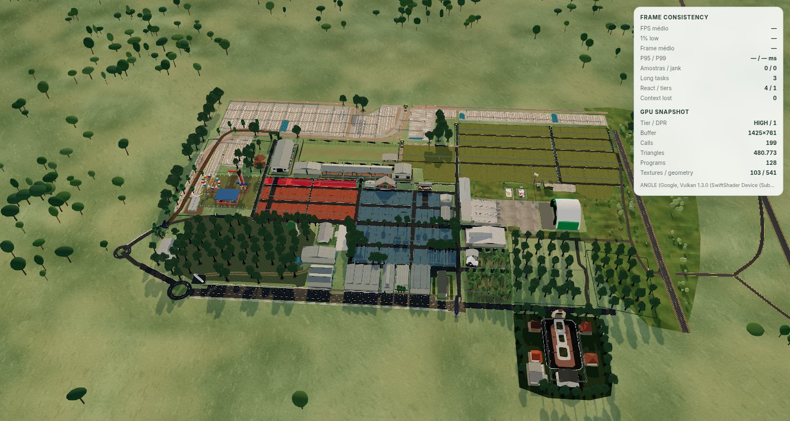
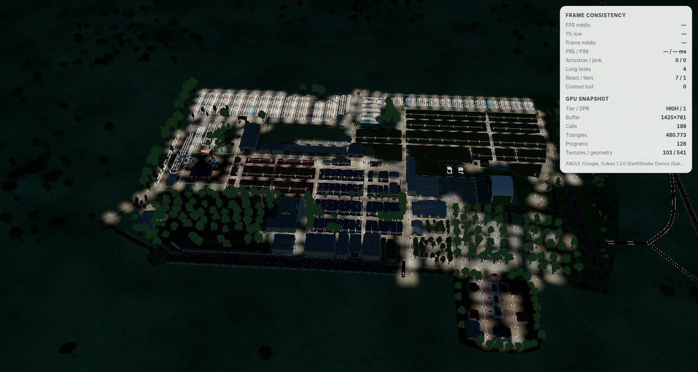
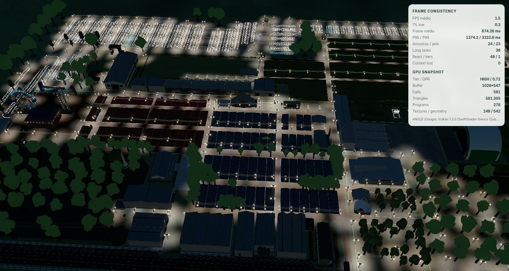
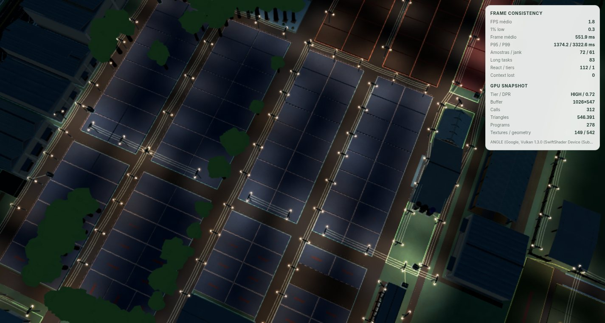
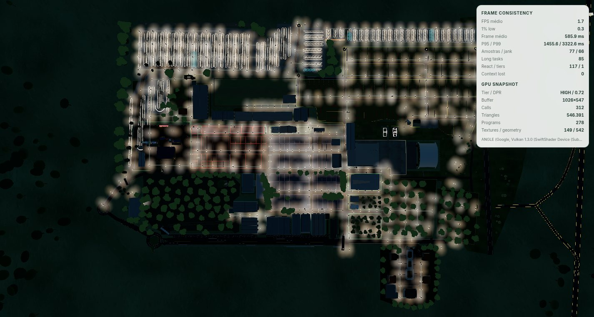
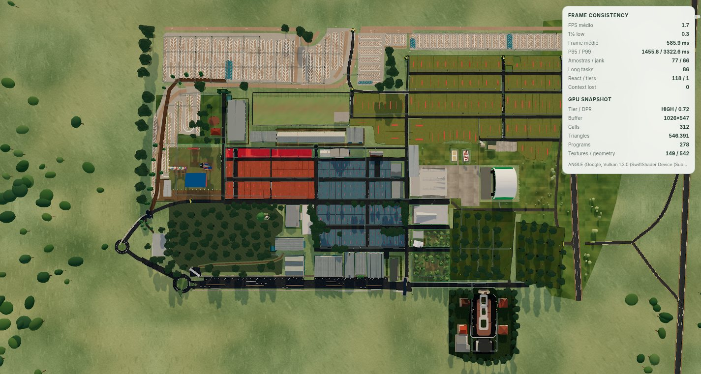
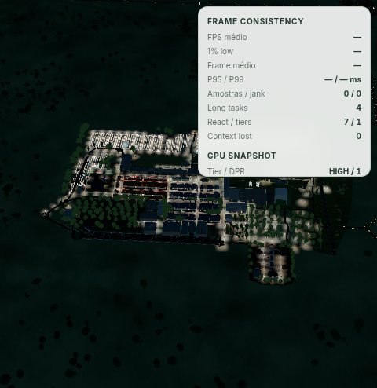
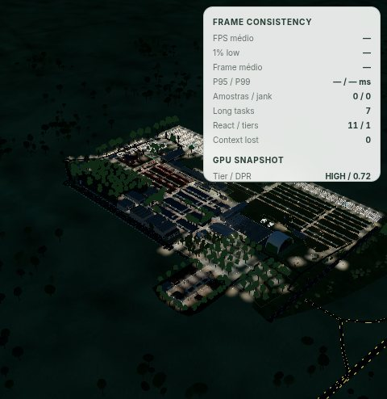

# Modo Noturno global do Mapa Comercial

## Resultado

O Mapa Comercial ganhou um **Modo Noturno de parque inteiro**, acionado por um ícone de lua ao lado dos modos existentes (desktop e celular). Ao ativá-lo, céu, névoa, luz ambiente, hemisférica e o sol escurecem em conjunto (~1,5 s), enquanto a rede oficial de postes acende luminárias LED e projeta poças de luz sobre vias, lotes, calçadas e estruturas. O parque de diversões mantém a apresentação noturna já existente (brinquedos em movimento e luzes decorativas) e passa a fazer parte desse contexto global. Dia, amanhecer e a noite local do parque de diversões continuam funcionando exatamente como antes.

## Inventário de postes (derivado dos dados)

A quantidade não foi estimada manualmente: `buildNightLampFixtures` percorre `COMMERCIAL_ELECTRICAL_NODES` com os mesmos `resolveElectricalNodePlacements` e `buildElectricalPoleCrossarmLayouts` usados pela camada elétrica.

| Métrica | Valor |
| --- | ---: |
| Postes (`type: 'POLE'`) | 408 |
| Postes com 2 luminárias (braço esquerdo/direito) | 351 |
| Postes com 3 luminárias (junções de duas cadeias de alinhamento) | 57 |
| Luminárias LED no total | 873 |
| Draw calls da camada de iluminação | 5 |

Um poste recebe a terceira luminária apenas quando cruza duas cadeias de alinhamento com separação angular ≥ 30°; cadeias quase colineares mantêm as duas luminárias padrão. Transformadores nunca recebem luminárias.

## Arquitetura

- **Estado**: `nightModeActive` no `useCommercialMapStore`, com `setNightModeActive`/`toggleNightMode`. Reproduzir o amanhecer (`requestSunrise`) e trocar de escopo (`activateScope`) sempre devolvem o dia. Seleção, câmera, rótulos e hover não são tocados.
- **Atmosfera** (`COMMERCIAL_MAP_NIGHT_ATMOSPHERE` em `data/commercialMapEnvironment.ts`): o `CommercialMapEnvironment` mantém um `nightBlend` amortecido (`THREE.MathUtils.damp`, λ 2,2 entrando e 2,9 saindo) que mistura fundo, névoa, ambiente, hemisférica, `environmentIntensity`, intensidade do sol e o próprio céu. O céu recebe a paleta noturna e um campo de estrelas por hash dentro do mesmo programa (`nightBlend` é apenas uniforme; não há segundo shader nem recompilação). O sol direcional é ocultado quando o blend assenta, eliminando o shadow pass à noite.
- **Camada de iluminação** (`NightLightingLayer.tsx`), cinco `InstancedMesh` para as 873 luminárias:
  1. braços (`MeshStandardMaterial`);
  2. cabeças LED emissivas (HDR 6,4, acima do limiar de bloom 3,2 → brilho via o bloom já existente);
  3. halos aditivos em billboard com tamanho angular mínimo, para que postes distantes ainda leiam;
  4. poça de **irradiância** (multiplicativa, `dst × (1 + luz)`, ganho ≤ 0,75): lotes, grama e coberturas recuperam a própria cor sob a lâmpada;
  5. poça de **preenchimento** (screen, `dst + luz × (1 − dst)`, ganho 0,11): asfalto escuro mostra a poça sem nunca saturar o branco.
  Não há `PointLight`/`SpotLight` dinâmicos nem sombras noturnas. Cada lâmpada carrega intensidade, temperatura de cor e semente próprias (`aLamp`), então nenhuma poça é idêntica e a revelação é escalonada.
- **Transição**: a camada amortece um `reveal` (λ 1,9 entrando, 3,4 saindo) que controla opacidade dos braços, emissivo das cabeças e `uReveal` dos shaders; `invalidate()` só é chamado enquanto o blend se move, preservando o `frameloop="demand"`.
- **Dois caminhos de render**: em navegação o mapa usa o caminho direto (sem composer); a camada reduz os ganhos das poças/halos nesse caminho para que a noite pareça igual parada ou em movimento.
- **Parque de diversões**: `NightAwareAmusementPark` passa `parkActive={selected || nightModeActive}`; só esse landmark assina a flag, evitando re-render dos demais.
- **UI**: `Moon` do lucide em `CommercialMapTopBar` (desktop, após o amanhecer) e `MapToolbar` (trilho mobile + barra desktop), com estados ativo/hover próprios; abaixo de 364 px o botão de foco migra para o menu para acomodar o sexto botão do trilho.

## Arquivos

- `src/features/commercial-map/state/useCommercialMapStore.ts`
- `src/features/commercial-map/data/commercialMapEnvironment.ts`
- `src/features/commercial-map/components/canvas/CommercialMapEnvironment.tsx`
- `src/features/commercial-map/components/canvas/CommercialMapCanvas.tsx`
- `src/features/commercial-map/components/canvas/NightLightingLayer.tsx`
- `src/features/commercial-map/components/canvas/StrategicLandmarks.tsx`
- `src/features/commercial-map/utils/nightLighting.ts`
- `src/features/commercial-map/components/controls/CommercialMapTopBar.tsx`
- `src/features/commercial-map/components/controls/MapToolbar.tsx`
- `src/features/commercial-map/components/controls/commercial-map-topbar.css`
- `src/features/commercial-map/commercial-map.css`
- `src/features/commercial-map/commercial-map-mobile.css`
- `src/features/commercial-map/diagnostics/CommercialMapRenderingDiagnosticsPage.tsx` (botão "Noturno" e `?night=1&preset=` para QA sem login)
- `src/test/commercialMapNightMode.test.ts`

## Validação executada

- `commercialMapNightMode`, `commercialMapEnvironment`, `commercialMapAmusementPark`, `commercialMapMobileExperience` e demais suítes do Mapa Comercial aprovadas; `tsc -p tsconfig.app.json --noEmit` e ESLint nos arquivos alterados sem ocorrências.
- Validação visual no harness `/__dev/commercial-map-rendering` (Chrome headless + ANGLE/SwiftShader, portanto FPS não representativo): visão geral, média, close com órbita, superior, retrato mobile 480×852 e o retorno ao dia com a câmera preservada.

