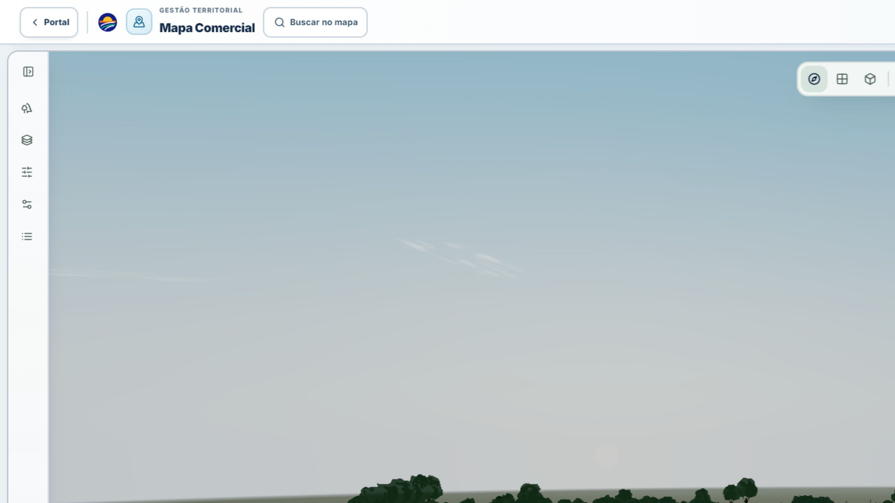
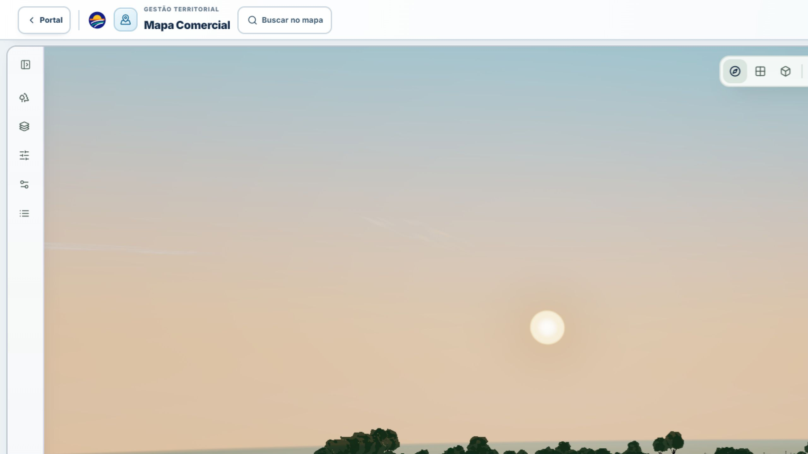
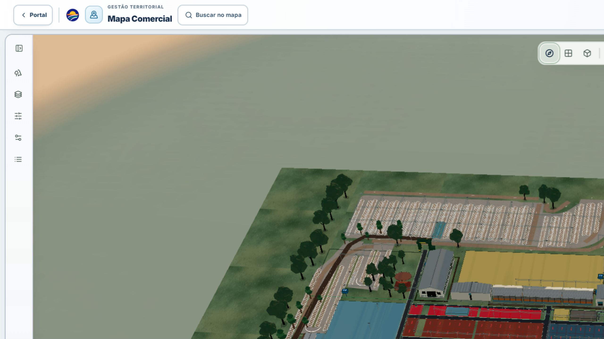

# Amanhecer premium do Mapa Comercial

## Resultado

O ambiente compartilhado do Mapa Comercial agora executa um amanhecer determinístico de 12 segundos sem remontar o `Canvas` e sem bloquear órbita, pan, zoom ou seleção. A composição preserva o mapa e acrescenta céu atmosférico, disco solar em espaço de mundo, nuvens procedurais esparsas, luz rasante, sombras longas, névoa de horizonte, reflexos ambientais e bloom seletivo.

## Direção solar confirmada

- Direção de horizonte: `[0, 0, -1]`, o topo/traseira da planta oficial mostrado nas referências 1–2.
- Azimute local do mapa: `0°`.
- Elevação animada: `-0,6°` a `+3,2°`.
- Alvo do horizonte: centro do mapa projetado na direção `-Z`.
- Diâmetro visual do disco: `1,62°`; corona: `7,2°`.

Essa orientação é deliberadamente documentada como rumo local da planta. As referências não estabelecem norte geográfico aferido, portanto não foi inventada uma correspondência com azimute solar real. Um único vetor derivado de azimute e elevação controla o `Sky`, o disco, a luz direcional, as sombras, as nuvens, a névoa e os diagnósticos.

## Arquitetura de renderização

- `THREE.Sky` fornece espalhamento Rayleigh/Mie, com turbidez `7,1`, Rayleigh `2,35`, Mie `0,0068` e anisotropia `0,84`.
- Um plano tangente à esfera celeste representa o disco e a corona em espaço de mundo. Ele permanece no rumo `-Z`, usa escala angular e não acompanha a câmera.
- A iluminação combina uma luz direcional quente com preenchimento hemisférico/ambiente frio. A intensidade, elevação, névoa, nuvens e exposição são derivadas do mesmo progresso normalizado.
- O pós-processamento usa limiar HDR para restringir bloom ao núcleo solar e aplica ACES uma única vez no pipeline ativo.
- Materiais, geometrias, texturas procedurais e render targets são persistentes. Uniformes e luzes são atualizados imperativamente, sem estado React por frame.
- A qualidade é escolhida uma vez entre `full`, `balanced` e `reduced`; o nível reduzido mantém atmosfera e iluminação, mas elimina bloom.
- O `frameloop="demand"` é invalidado durante o amanhecer e a navegação e volta a repousar quando estável.

## Configuração de qualidade

| Nível | Shadow map | Bloom | Nuvens |
| --- | ---: | ---: | ---: |
| Full | 2048 | 7 níveis | 7 |
| Balanced | 1536 | 5 níveis | 5 |
| Reduced | 512 | desativado | 4 |

O orçamento incremental declarado é de cinco draw calls da camada ambiental antes do pós-processamento: céu, sol, dois planos de terreno e nuvens instanciadas.

## Validação executada

- Perspectivas das referências 1–2, horizonte frontal, visão geral elevada e câmera oblíqua.
- Início e fim do amanhecer na mesma posição de câmera.
- Sol central, parcialmente enquadrado e fora do frustum por órbita.
- Navegação durante a animação, reinicialização e conclusão estável.
- Build de produção, ESLint focado e testes Vitest focados.
- Console limpo após recarga integral, sem erro WebGL ou perda de contexto no estado final.

Snapshot diagnóstico representativo do mapa estático: aproximadamente 601 chamadas, 375.693 triângulos, 476 geometrias, 108 texturas e 133 programas. Esses números são uma leitura do renderer no navegador de desenvolvimento, não uma medição instrumentada de GPU. O compositor reinicia os contadores de `WebGLRenderer.info`, portanto o snapshot não deve ser interpretado como custo total do frame pós-processado.

## Evidência visual

Mesma câmera, início e conclusão:

Ângulos adicionais:

## Limitações conhecidas

- A validação responsiva foi feita no navegador de desktop; não houve medição em iPhone/Android físico, gesto tátil físico ou perfil instrumentado de CPU/GPU/FPS.
- Não foi gravado vídeo em hardware representativo nesta entrega.
- A ferramenta de captura usada apresentou escala interna de `DPR 0,5`; as evidências finais foram recortadas para o viewport lógico efetivo de 2560 × 1440.
- O azimute é local à planta. Uma futura calibração com norte cadastral confirmado pode convertê-lo para um cálculo solar geográfico sem alterar a arquitetura.

## Referências de engenharia

- [Three.js Sky](https://github.com/mrdoob/three.js/blob/dev/examples/webgl_shaders_sky.html)
- [PMNDRS Drei](https://github.com/pmndrs/drei)
- [React Postprocessing](https://github.com/pmndrs/react-postprocessing)
- [SunCalc](https://github.com/mourner/suncalc)
