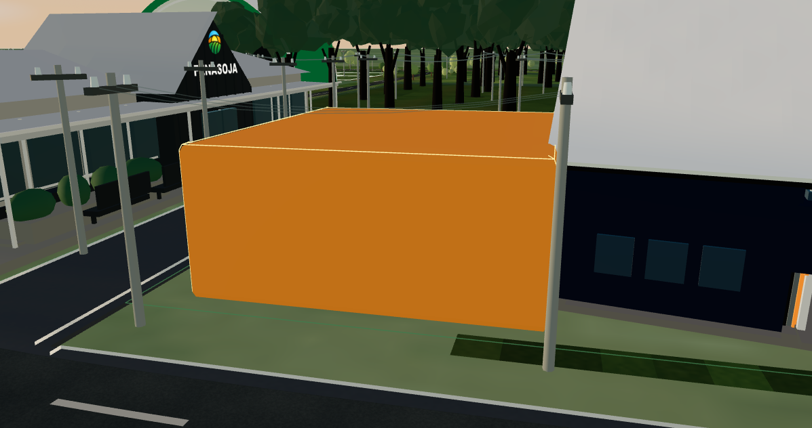
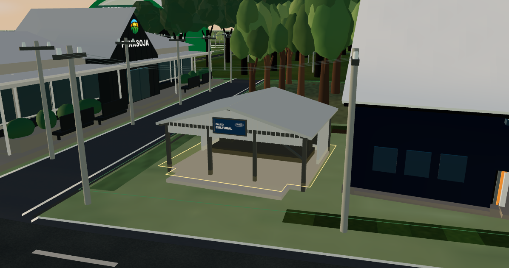
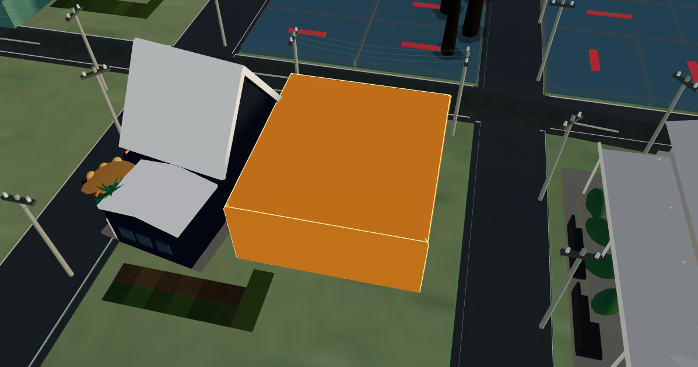
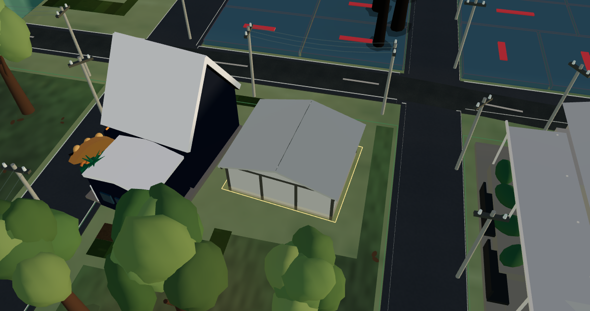
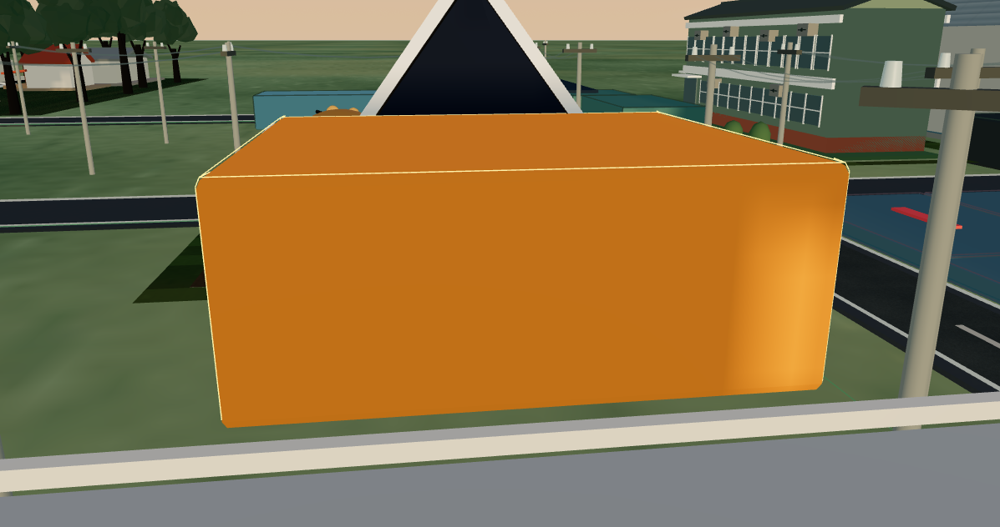
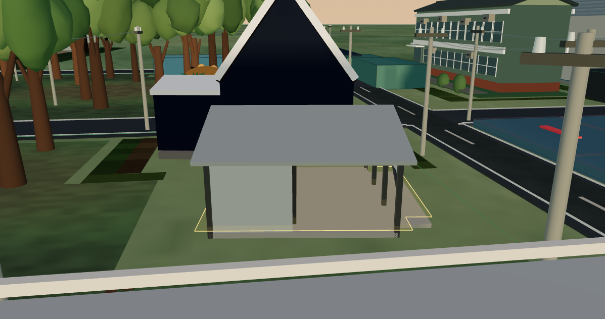
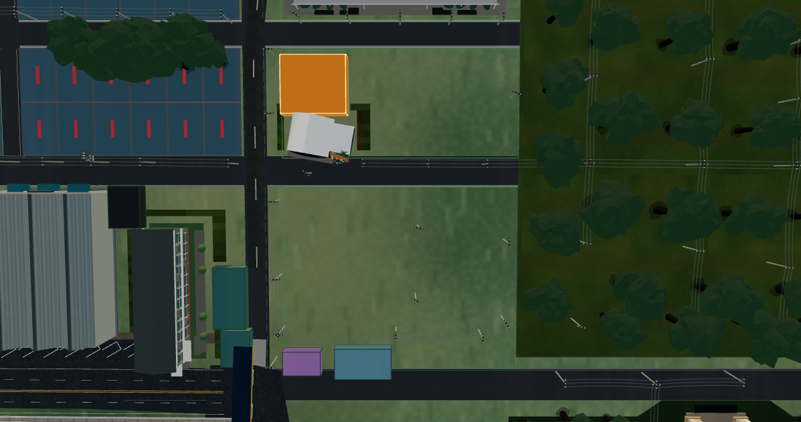
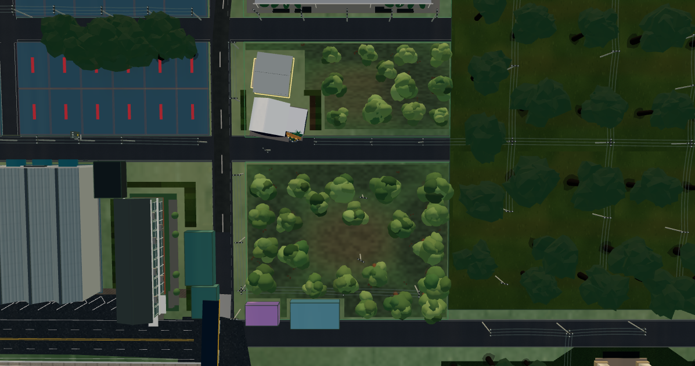
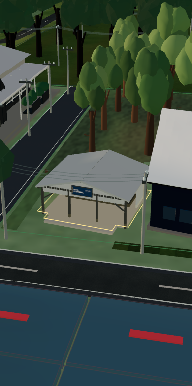

# Quadras A/B e Palco Cultural Lactalis — relatório de reconstrução

## Escopo e leitura das referências

Esta entrega altera somente a apresentação 3D das Quadras A e B do Mapa Comercial. A geometria oficial, os IDs, a seleção, a edição, a persistência e os dados comerciais continuam sendo os existentes.

| Referência | Uso na reconstrução |
| --- | --- |
| `4d5553bc-e7bb-4b7b-bea7-82b430272a8b.jpeg` | Vista traseira do estado anterior, limites visíveis, Sede e placeholder de B13. |
| `19f56352-460e-4796-b9cb-a8430e2a168b.jpeg` | Vista frontal do estado anterior e relação B13/B12. |
| `WhatsApp Image 2026-08-30 at 23.40.19.jpeg` | Evidência espacial principal para massas arbóreas, clareiras, solo, vias e relação A/B. |
| `4618B88E-96C4-4F78-98A2-6E21E6C254F2.jpeg` | Referência arquitetônica principal para cobertura, estrutura, abertura, palco, cladding e placa. |

A Quadra B permanece ao norte da Rua Argentina, entre Rua Brasília e o eixo leste, com B13 e a Sede Fenasoja/B12 no setor oeste e a maior massa arbórea no setor leste. A Quadra A permanece ao sul da Rua Argentina e ao norte da Av. dos Imigrantes, com copas irregulares nas bordas e a clareira principal preservada no interior. Nenhum novo lote, via ou equipamento urbano foi criado.

## Registro do componente substituído

Antes da substituição, o bloco laranja foi identificado como a apresentação genérica da entidade oficial B13:

- identificador público: `B13`;
- fonte oficial em runtime: `reference:2026:b13`;
- UUID persistido observado na sessão autenticada: `982ecf89-cf43-4ba8-a5be-78594466b57c`;
- nome migrado: `Palco Cultural Lactalis`;
- classificação/uso: `EVENT_VENUE`, não comercial, pertencente à Quadra B;
- centro local `[16.189091, 13.090909]`, yaw anterior `0 rad` e extrusão genérica `1.05`;
- footprint oficial aproximado `2.749091 × 2.443636` unidades do mapa.

A arquitetura nova reutiliza a mesma entidade e o mesmo footprint de interação. O bloco anterior não permanece oculto, não há segundo hitbox, rótulo legado ou material laranja órfão.

## Palco Cultural Lactalis

Todas as medidas são unidades do mundo do Mapa Comercial, não metros levantados em campo. Elas ficam centralizadas em `LACTALIS_STAGE_LAYOUT` para permitir correção posterior sem desmontar o modelo.

| Parâmetro | Valor |
| --- | ---: |
| Corpo arquitetônico | `1.84181 × 1.59292` |
| Altura do beiral | `0.70` |
| Altura da cumeeira | `0.98` |
| Profundidade do acesso frontal | `0.34` |
| Folga mínima validada da Sede/B12 | `0.045` |
| Centro de B13 | `[16.189091, 13.090909]` |
| Centro-alvo D-12 | `[11.943636, 12.545455]` |
| Vetor frontal | `[-0.991847, -0.127432]` |
| Rotação final | `-1.698576 rad` / `-97.321234°` |

A rotação é derivada em espaço de mundo por `atan2(targetX - stageX, targetZ - stageZ)`. O erro angular automatizado em relação ao centro de D-12 é zero dentro da precisão numérica. O envelope validado inclui cobertura inclinada, espessura, beirais, calhas e área frontal e continua integralmente dentro de B13, sem interceptar B12, vias ou Quadra D.

O modelo tem cobertura metálica de duas águas de baixa inclinação, cladding cinza-claro, estrutura escura, colunas, vigas, contraventamentos, calhas, plataforma elevada, fechamento posterior/lateral parcial, treliça, luminárias e caixas acústicas proporcionais. A placa usa canvas dedicado com “PALCO CULTURAL” e “LACTALIS”; não há branding desproporcional. A abertura é volume real e permanece voltada para D/D-12, independentemente da câmera.

## Paisagismo e materiais

- O solo usa quatro tratamentos PBR procedurais: grama mantida, grama seca, solo exposto e solo sombreado. Albedo, normal e roughness são compartilhados e tratados com color space correto.
- O plano completo gera 979 células dentro dos polígonos oficiais, sendo 702 em A e 277 em B, já recortadas por vias, prédios, superfícies duras e pelo tratamento validado da Sede.
- Foram adicionadas 34 árvores interpretadas a partir da distribuição da imagem aérea: 22 em A e 12 em B. Os registros são marcados como `CLUSTER_INTERPRETED`, não como levantamento individual.
- Altura, raio de copa, tronco, silhueta, densidade, cor e rotação variam deterministicamente. As clareiras de referência ficam livres e todas as copas mantêm folga das máscaras de via/edificação.
- Folhas e pequenas imperfeições usam uma única instância não selecionável. Árvores e detalhes não participam do raycast de seleção.
- A iluminação de alvorada existente foi preservada; metais têm roughness alta o suficiente para evitar efeito espelhado e o interior recebe luz técnica sem ficar preto.

## Integração e estratégia de desempenho

- B13 continua sendo a única entidade selecionável do palco; o mesh arquitetônico usa o footprint oficial de apresentação.
- O foco exclusivo de B13 usa distância mínima `3`, distância nominal `5.1` e direção frontal determinística. Em canvas retrato estreito, a elevação mínima sobe de `0.26` para `0.48` exclusivamente para B13, evitando a copa existente entre D e o palco sem alterar árvores ou câmera global.
- O rótulo continua no fluxo contextual compartilhado de hover/toque/foco/busca/seleção e não gira com a câmera.
- Vegetação repetida é instanciada; materiais e geometrias são memorizados e compartilhados; o palco não cria cabos independentes e usa detalhe procedural para a chapa corrugada.
- Os overlays de A, B, B13, vetores, âncoras, exclusões e pontos arbóreos só carregam em desenvolvimento com `?quadrasABDebug`; não entram na apresentação de produção.
- O renderer continua em `frameloop="demand"`; não foram reduzidos DPR global, resolução do Canvas, qualidade geral ou sombras do mapa.

## Validação executada

### Testes e build

- testes focados: `56/56` aprovados em 7 arquivos;
- TypeScript: `npx tsc --noEmit` aprovado;
- ESLint dos 15 arquivos alterados: aprovado;
- `git diff --check`: aprovado (somente avisos de conversão LF/CRLF do checkout Windows);
- build Vite de produção: aprovado em `32.58 s`;
- suíte ampla `commercialMap*.test.ts(x)`: `660/665` aprovada em 86 arquivos; os 5 testes falhos são os mesmos da baseline (`647/652`) em Hydrological Infrastructure (1), Independence (2) e Presentation (2), sem arquivos desta entrega.

### Viewports e renderer

| Perfil efetivo | Canvas | Resultado |
| --- | ---: | --- |
| Desktop padrão `1280×720` | `1197×632` | Sem overflow, foco e navegação estáveis. |
| Desktop grande `1920×1080` | `1837×992` | Sem overflow ou clipping. |
| Ultrawide `2560×720` | `2477×632` | Sem overflow; fachada permanece voltada a D-12. |
| Retrato responsivo `390×844` | `390×783` | Palco completo acima das copas; painel e canvas estáveis. |
| Paisagem responsiva `844×390` | `761×312` | Sem overflow; controles preservados. |

Perfil controlado de órbita/pan no build de desenvolvimento autenticado:

- desktop padrão: média `60.38 FPS`, mediana `59.88 FPS`, p95 `17.1 ms`, 157 amostras;
- landscape responsivo: média `59.55 FPS`, mediana `59.88 FPS`, p95 `16.8 ms`, 150 amostras;
- estado observado: `1` renderer, `1` canvas, `1` OrbitControls ativo, `0` context loss e nenhuma long task durante as duas amostragens;
- snapshot desktop em foco: 154 draw calls, 363.922 triângulos, 413 geometrias, 133 texturas e 144 programas no mapa completo;
- zoom validado em `3.05`, `5.1` e `266` unidades, sem perda de contexto, frame cinza ou congelamento.

Os tamanhos mobile são emulação responsiva do navegador. Gestos touch possuem cobertura automatizada existente, mas esta execução não substitui certificação de pinch/FPS/GPU em aparelho físico.

### Evidências visuais em posições correspondentes

| Vista | Antes | Depois |
| --- | --- | --- |
| Frontal |  |  |
| Traseira |  |  |
| Lateral |  |  |
| Aérea/top-down |  |  |

Evidência adicional do foco corrigido em retrato: .

## Arquivos de implementação

- `src/features/commercial-map/utils/lactalisStage.ts`
- `src/features/commercial-map/data/quadrasABEnvironment.ts`
- `src/features/commercial-map/utils/quadrasABEnvironment.ts`
- `src/features/commercial-map/components/canvas/LactalisCulturalStage.tsx`
- `src/features/commercial-map/components/canvas/QuadrasABEnvironmentLayer.tsx`
- `src/features/commercial-map/components/canvas/QuadrasABValidationOverlay.tsx`
- `src/features/commercial-map/components/canvas/CommercialMapCanvas.tsx`
- `src/features/commercial-map/components/canvas/StrategicLandmarks.tsx`
- `src/features/commercial-map/components/canvas/CommercialTreeLayer.tsx`
- `src/features/commercial-map/data/commercialTrees.ts`
- `src/features/commercial-map/utils/commercialSiteEnvironment.ts`
- `src/features/commercial-map/utils/landmarks.ts`
- `src/test/commercialMapQuadrasABLactalis.test.ts`
- `src/test/commercialMapTrees.test.ts`
- `src/test/commercialMapTreePresentation.test.ts`
- `src/test/commercialMapTreeControls.test.tsx`

## Limites de evidência

A posição de cada árvore é uma interpretação rastreável das massas e clareiras da imagem aérea, não um inventário dendrométrico ou levantamento topográfico. As dimensões arquitetônicas são proporcionais ao footprint cadastral e à fotografia, em unidades internas do mapa. Uma campanha de campo pode substituir esses parâmetros centralizados sem mudar IDs, integração ou regras comerciais.
