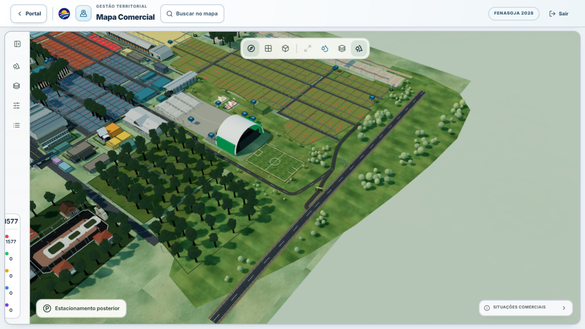

# Mapa Comercial — reconstrução viária posterior

Revisão de 29/08/2026. Base comparada: `d0e78c0530070aaa1cdf7dd90fc6f485880917ec`.
Branch: `codex/rear-road-arena-gate5-topology`.

Implementação e inspeção visual local realizadas. **Aceite integral ainda pendente** de validação em aparelho físico, ambiente autenticado de destino e aprovação da interpretação cartográfica. A PR é apresentada como rascunho, não como certificação topográfica ou de desempenho em todos os dispositivos.

## Referências e limites da calibração

Os sete anexos foram inspecionados antes da edição da geometria:

| Anexo | Evidência e uso |
| --- | --- |
| 1–2 | Implementação incorreta: anel pela mata, ligação indevida de Etnias e acesso artificial junto à Arena. |
| 3–4 | Trajetória pretendida de Brasília/Ubiretama e corredor entre Arena e bosque. |
| 5 — `IMG_9933.jpeg` | Quadro de seis percentuais fornecido pelo usuário, origem superior esquerda; imagem de 1179 × 1250, incluindo borda inferior. |
| 6 — `IMG_9934.jpeg` | Separação física entre aproximação interna, portão e rodovia. |
| 7 — `IMG_9936.jpeg` | Ordem topológica independente: ponto 2 = aproximação Brasília; 1 = portão; 3 = saída na BR-472. |

Os centros dos círculos desenhados no anexo 5 não coincidem literalmente com todos os percentuais escritos no pedido. Foi priorizado o quadro percentual explícito, combinado com a topologia do anexo 7, sem mover os pontos individualmente para conservar a estrada antiga.

A transformação afim única abaixo registra o quadro no sistema da planta oficial. Seus três controles são P1 no término cadastral de Etnias, P2 no corredor interno livre de Brasília e P5 no corredor de Ubiretama. P3, P4 e P6 derivam dessa mesma matriz. Os controles intermediários de curva evitam as exclusões da planta; estão expostos no código e no overlay.

```text
sourceX = 6829.079961464356 - 2.433044315992305 × x% - 37.48121387283236 × y%
sourceY = -193.06358381502892 + 47.97687861271676 × x% + 18.497109826589593 × y%
```

| Ponto | Percentual do pedido | Coordenada na planta, arredondada | Significado |
| --- | --- | --- | --- |
| P1 | 80%, 30% | 5510, 4200 | Término de Rua das Etnias, sem ligação ao portão. |
| P2 | 53%, 73% | 3964, 3700 | Aproximação da única Rua Brasília. |
| P3 | 53%, 46% | 4975.9928, 3200.5780 | Continuação da mesma Brasília. |
| P4 | 55%, 15% | 6133.0443, 2723.1214 | Encontro Brasília–Ubiretama. |
| P5 | 38%, 20% | 5987, 2000 | Eixo de Ubiretama. |
| P6 | 62%, 13% | 6190.9754, 3021.9653 | Apresentação física do Portão 5. |
| J | Correspondência satélite 3 | 6266.9263, 3234.2335 | Entroncamento externo da BR. |

A conversão final é a função existente `officialPdfPointToLocal`. A proporção uniforme é `5500 / 120` unidades da planta por unidade local. Larguras de pista: Brasília 37, Ubiretama/acesso 36, BR 70; acostamentos do acesso 5 por lado e da BR 12 por lado, na unidade da planta. Etnias mantém a superfície cadastral.

**Não são metros certificados.** Os anexos não fornecem CRS, levantamento de campo, escala métrica certificada ou controle geodésico suficiente. A precisão numérica da matriz não transforma esta interpretação de apresentação em levantamento as-built. A posição geográfica absoluta, raios e canalização detalhada do entroncamento precisam de aprovação de referência/campo antes do aceite integral.

## Topologia e remoção da implementação anterior

- Brasília: aproximação sul → P2 → P3 → P4, sob um único proprietário cadastral `RUA-BRASILIA`.
- Ubiretama: P5 → P4, sem segunda Brasília ou prolongamento paralelo inventado.
- Acesso: P4 → P6/Portão 5 → J; a rodovia permanece uma malha externa independente, encontrando o acesso somente em J.
- Etnias: superfície oficial de `AV-IMIGRANTES` termina em P1. Não há trecho P1 → portão ou anel na mata.
- Os triângulos do acesso são recortados no encontro com a BR. Há somente dois patches de interseções reais; emendas entre trechos do mesmo eixo não recebem discos duplicados.
- As antigas apresentações de Brasília, Ubiretama e da faixa esquemática `RODOVIA-RS-472` são substituídas somente no mapa completo não hidrológico. O nome exibido é **BR-472**, mantendo o ID oficial.
- Foram retirados da rede executável os trechos/identidades artificiais `RUA-POSTERIOR-ETNIAS`, `RUA-ETNIAS-TRANSVERSAL`, `RUA-RETAGUARDA-ARENA`, `RUA-CIRCULACAO-LOTES`, `ACESSO-ALCA-LESTE` e `RS-472-CONTINUACAO`, além da identidade viária artificial `RUA-EXPORURAL` dessa camada. As menções negativas nos testes documentam a regressão que não pode voltar.
- A reconstrução dos quatro batches descarta as fitas, marcações e interseções antigas. Não permanecem meshes de seleção da estrada removida. Não foi adicionada textura: o asfalto, solo, grama e seus mapas existentes são reutilizados.

P6 governa estrutura, interação, rótulo e foco do Portão 5. O cadastro de A5 continua em `[5974, 3678]`, com o mesmo ID; nenhuma persistência foi alterada. A estrutura de apresentação tem duas colunas e uma travessa, sem pedestal atravessando a pista.

Os rótulos seguem o `EntityLabel` contextual existente. Busca, toque/clique, seleção e foco devolvem os proprietários oficiais, sem entidades paralelas. A malha oculta continua montada, mas não participa do raycast.

## Proteção espacial e vegetação

O conjunto auditável contém **441 limites**: 147 entidades oficiais, 9 zonas da Arena, 112 fileiras de estacionamento e 173 elementos elétricos no recorte. O teste usa as faixas suavizadas com largura e acostamentos, não apenas os pontos de controle: nenhuma colisão não autorizada foi encontrada na planta testada.

- As 132 árvores instanciadas da ambientação posterior foram preservadas e testadas fora das faixas viárias.
- Das 20 árvores decorativas da Arena, quatro foram reposicionadas na margem de grama; nenhuma dessas 20 foi removida.
- O filtro espacial existente exclui da apresentação 14 copas cadastrais conflitantes: `tree-e-01…08`, `tree-parking-west-23…25` e `tree-rear-parking-west-01…03`. O inventário é imutável. Essa exclusão é de compatibilidade espacial, **não uma redução de vegetação para melhorar métricas**; precisa ser aprovada na revisão cartográfica.
- Foram preservados os seis postes decorativos, escolhendo margens livres também das pistas adjacentes nas interseções.
- Cinco postes oficiais (`pole-ref-145`, `225`, `295`, `296`, `297`) receberam somente deslocamentos de apresentação. O receptor `transformer-ref-011` usa a face livre do C1. Ligações elétricas acompanham essas posições; coordenadas fonte, IDs e conexões persistidas permanecem iguais. Fora do modo viário corrigido, mantém-se a apresentação anterior.

## Causas confirmadas no renderer local e correções

| Causa observada ou confirmada por geometria/telemetria | Correção |
| --- | --- |
| Winding das fitas viárias invertido, mascarado por `DoubleSide`, incompatível com normais +Y. | Índices orientados para +Y e `FrontSide`; teste dos triângulos efetivamente enviados à GPU. |
| Terreno da Arena em 0.052 e caminho em 0.066 cobriam pista em 0.032. | Subtração planar exata preservando UVs/cores, com costura rebaixada apenas na borda. Não se elevou arbitrariamente o asfalto. |
| Conversão XY → XZ invertia a frente do terreno posterior. | Winding, normais e volumes de culling corrigidos; raycast de cima coberto por teste. |
| Feather transparente do terreno em −0.105 competia com base em −0.08 em ângulo oblíquo. | Bias de profundidade somente nesse fundo (`polygonOffset` +1/+2, sem escrita de profundidade). |
| Near plane de close-up permanecia pequeno no afastamento máximo, reduzindo precisão do depth buffer. | Near proporcional à distância, limitado pela altura da câmera; sem alteração de resolução ou posição. |
| `key={areaScope}` permitia remontar o Canvas; DPR mudava no início/fim do gesto. | Canvas sem essa chave e DPR estável por viewport, mantendo os limites de qualidade existentes. |
| Seleção comum reconstruía a referência de árvores e seus buffers de instâncias. | Memo separado para compatibilidade viária; somente o caso específico da árvore lunar modifica sua seleção de copas. |
| Timer pendente de refit desfazia zoom/pan após fechar a seleção. | Cancelamento do refit e preservação da vista manual até um foco explícito. Não foi acrescentado atraso para esconder a falha. |
| Toolbar mobile aparecia até 950 px, mas a desktop só desaparecia a 720 px. | Breakpoint de ocultação alinhado em 950 px; paisagem 844 × 390 sem controles sobrepostos. |
| Inspeção ao nível do Portão 5 revelou postes em acostamentos e receptor de fachada na pista. | Folgas de apresentação e testes elétricos descritos acima. |

Geometrias, texturas e centerlines são memoizados/cacheados; materiais e instâncias mantêm identidade durante interação. A rede consolidada tem orçamento de quatro draw calls base e até 24 mil triângulos, verificado em teste. Sombras, texturas, arquitetura importante e funções do mapa não foram globalmente desativadas para obter esses resultados.

O `frameloop="demand"` mantém invalidação durante controles/transições e quando a projeção muda. A leitura de navegação para clique fora da geometria usa o estado atual, sem obrigar o wrapper do Canvas a se inscrever em cada início/fim de gesto.

O overlay é importado apenas em DEV, com `?rearRoadDebug`, em Suspense próprio. O build final foi inspecionado: não contém o overlay, sua query, a rota de QA ou a telemetria temporária. Duas correções de tipagem preexistentes nos agrupamentos de materiais/identificadores também foram feitas sem alterar geometria.

## Evidência visual e cobertura

Comparações antes/depois usam a mesma base oficial, viewport CSS **1366 × 768**, FOV, posição e alvo. JPEGs têm 2732 × 1536 pixels de captura devido à escala do navegador; isso não representa um teste com viewport CSS 2732 × 1536.

| Câmera | Antes | Depois | Posição / alvo / FOV |
| --- | --- | --- | --- |
| Superior | [Antes](screenshots/rear-road-before-top.jpg) | [Depois](screenshots/rear-road-after-top.jpg) | `[58,90,.02]` / `[58,.4,0]` / 45°, up `[0,0,-1]` |
| Oblíqua | [Antes](screenshots/rear-road-before-oblique.jpg) | [Depois](screenshots/rear-road-after-oblique.jpg) | `[92,58,46]` / `[58,.4,0]` / 38° |



Outras inspeções:

- [Oblíqua baixa/lateral](screenshots/rear-road-after-ground.jpg): `[78,13,27]` → `[58,.4,0]`, FOV 38°. Não é uma captura à altura do pedestre.
- [Altura do solo no Portão 5](screenshots/rear-road-gate5-ground-level.jpg): `[63.5,.64,4.9]` → `[61.98,.38,1.02]`, FOV 38°.
- [Overlay final](screenshots/rear-road-validation-overlay.jpg): centerlines ciano, controles amarelos, exclusões vermelhas, P1–P6 magenta e correspondência satélite verde. Rótulos são sprites voltados à câmera, sem DOM por âncora.
- [Frente da Arena no desktop](screenshots/rear-road-desktop-front.jpg) e [desktop amplo](screenshots/rear-road-desktop-wide.jpg): evidência de navegação/layout anterior ao último ajuste de folga dos postes; a geometria final é a dos pares superior/oblíquo e da câmera do portão acima.
- [Mobile retrato com seleção](screenshots/rear-road-mobile-portrait-selection.jpg) e [mobile paisagem com seleção](screenshots/rear-road-mobile-landscape-selection.jpg): capturas após o ajuste final dos postes.

| Viewport CSS efetivo | Cobertura realizada |
| --- | --- |
| 1366 × 768 desktop | Superior, oblíquas, lateral e solo; zoom mínimo/médio/máximo; órbita/pan; Brasília, P4, Portão 5/BR e término de Etnias; busca e seleção contextual; fechar seleção e conservar vista. |
| 1680 × 900 desktop amplo | Visão geral, layout e continuidade da sessão após redimensionamento. Não se afirma uma nova rodada completa dos extremos de zoom nessa largura. |
| 390 × 844 mobile emulado | Zoom mínimo/médio/máximo, seleção/desseleção da Arena, layout retrato e manutenção da cena. |
| 844 × 390 mobile emulado | Visão geral e aproximação, seleção/desseleção, órbita, pan e zoom por ponteiro; toolbar e painel de detalhes em paisagem. |

As capturas de câmera fixa usam renderização forçada apenas para produzir pares idênticos; **não são medição de desempenho**. As sequências interativas usam o CameraRig normal. O teste extremo sobre o teto da Arena não foi usado como evidência de visibilidade das vias. Não houve quadro cinza/vazio nas capturas válidas nem erro de console na sequência final do portão/mobile.

Telemetria temporária registrou cena, câmera, grupo de vias, DPR e contexto WebGL. Na rodada desktop/retrato/paisagem/amplo, os mesmos UUIDs persistiram nas nove amostras: cena `cea0ec00-8854-485c-86f8-2347f018a82f`, câmera `b859ae03-f4b5-4193-9795-137588616be1`, grupo `57f25ff3-72dd-4d97-bef7-a28879898748` (quatro filhos). DPR = 1; contexto perdido = falso; near variou de aproximadamente 0.03682 a 3.01292. Programas 127–128, geometrias 473–483 e texturas 93–109: aquecimento/LOD não são contagens constantes nem prova de ausência de pressão de GPU.

Após o ajuste final dos postes e um reload deliberado, as cinco amostras de retrato/paisagem conservaram novamente os mesmos UUIDs entre interações: cena `a19ae5cf-de48-4ab5-b5c5-1a956fd91b6e`, câmera `724b1234-c1b1-4896-8fc9-a27beca94204`, grupo `e45b6317-df87-49ab-9abf-40e213e81707`. DPR = 1 e contexto perdido = falso. Mudança de UUID entre reloads de desenvolvimento não foi classificada como remontagem causada por seleção.

## Validação técnica final

- **74/74** testes direcionados em sete arquivos: rede, exclusões/vegetação/elétrica, solo, ambiente, viewport e experiência mobile.
- **TypeScript:** `npx tsc --noEmit -p tsconfig.app.json`, aprovado.
- **ESLint:** 30 arquivos TypeScript alterados/novos, zero erros e zero avisos. Não se afirma lint global limpo.
- **Build:** aprovado, 5101 módulos, 31,27 s. Permanecem os avisos de Browserslist desatualizado e chunks grandes; não foram mascarados.
- **Suíte completa:** 1230/1267, com 37 falhas. Base isolada: 1222/1259, também 37 falhas. Comparação dos nomes completos dos testes que falharam: nenhuma diferença.
- As falhas herdadas estão nos arquivos de Agenda, Alvorada, infraestrutura hidrológica, independência/apresentação/pavilhões operacionais do mapa, Cronograma, encerramento da colheita e apresentação de eventos. A suíte completa **não está verde**.
- `git diff --check` aprovado; `App.tsx`, autenticação, hook de dados e backend sem alteração final.

A inspeção local usou temporariamente a planta canônica com 1577 lotes bloqueados, não dados comerciais autenticados do servidor. Essa rota, o fixture, a instrumentação de câmera e o script exploratório foram removidos antes do commit. Foram eliminadas somente 12 capturas intermediárias próprias; as 11 evidências acima permanecem versionadas.

### Portas de aceite ainda abertas

1. Testar pinça/touch e movimento rápido em aparelhos físicos representativos, com métricas de FPS/frame time/GPU e observação contínua de flicker. A API de toque disponível não permitiu executar pinça; ponteiro em viewport mobile não substitui esse teste.
2. Validar no ambiente autenticado de destino: dados persistidos atuais, edição de estruturas, busca/foco e os modos/rotas compartilhados relevantes. O fixture local não comprova esse aceite.
3. Aprovar o registro do quadro percentual, a exclusão de 14 copas e os deslocamentos elétricos de apresentação, além da escala e geometria fina do entroncamento, contra referência geográfica/levantamento confiável.

## Arquivos de implementação e testes

Sob `src/features/commercial-map/`:

- `CommercialMapPage.tsx`: estabilidade do Canvas.
- `components/canvas/CommercialMapCanvas.tsx`: Portão 5, proprietários de interação, foco, rótulos, estabilidade de câmera/DPR/árvores e carga DEV do overlay.
- `components/canvas/RearParkRoadNetwork.tsx`, `RearParkEnvironmentLayer.tsx`, `RearRoadValidationOverlay.tsx`: batches, frentes do terreno e inspeção espacial.
- `components/canvas/ArenaFrontInfrastructure.tsx`, `CommercialMapEnvironment.tsx`: recortes de solo/caminhos e profundidade do fundo.
- `components/canvas/CommercialElectricalInfrastructureLayer.tsx`, `CommercialSiteEnvironmentLayer.tsx`: folgas elétricas de apresentação e tipagem do agrupamento de materiais.
- `components/controls/commercial-map-topbar.css`: breakpoint de paisagem.
- `data/rearParkRoadNetwork.ts`, `rearParkEnvironment.ts`, `rearRoadExclusions.ts`, `parkEnvironment.ts`, `electricalPresentation.ts`: rede, ambientação, limites e deslocamentos rastreáveis.
- `utils/rearSpatialCalibration.ts`, `rearRoadNetwork.ts`, `planarSurfaceGeometry.ts`, `rearRoadGroundIntegration.ts`, `rearTerrainGeometry.ts`: transformação, curvas, recortes e orientação de superfícies.
- `utils/commercialLayerPresentation.ts`, `entityExplorer.ts`, `viewport.ts`, `electricalInfrastructure.ts`: camada contextual, busca, projeção/DPR e conexão elétrica às posições exibidas.

Sob `src/test/`: `commercialMapRearRoadNetwork.test.ts`, `commercialMapRearRoadTreeClearance.test.ts`, `commercialMapRearRoadGround.test.ts`, `commercialMapEnvironment.test.ts`, `commercialMapMobileExperience.test.ts`, `commercialMapViewport.test.ts`, `commercialMapElectricalInfrastructure.test.ts`.

Não há migrations, alteração de regras comerciais, escrita no banco, mudança de IDs, rotas de produção ou autenticação nesta entrega. A alteração automática de `supabase/functions/mcp/index.ts` feita pelo build foi restaurada apenas nesta cópia isolada; a árvore de trabalho original do usuário não foi alterada.
