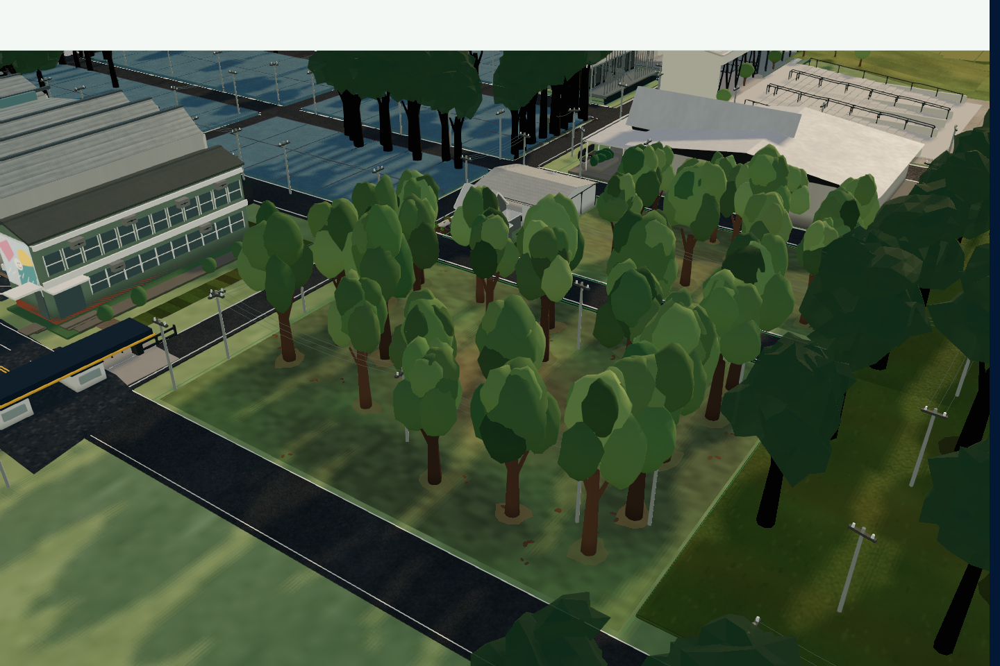
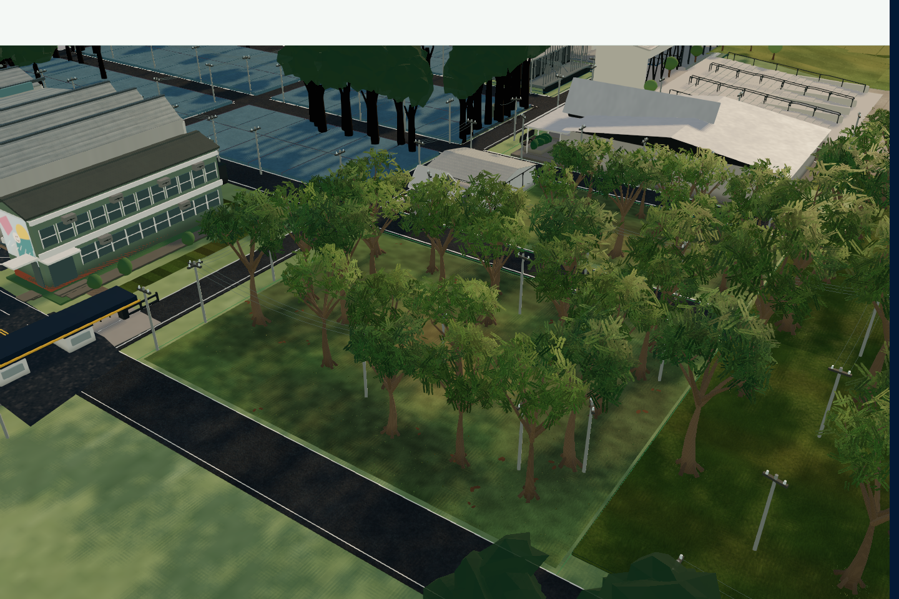
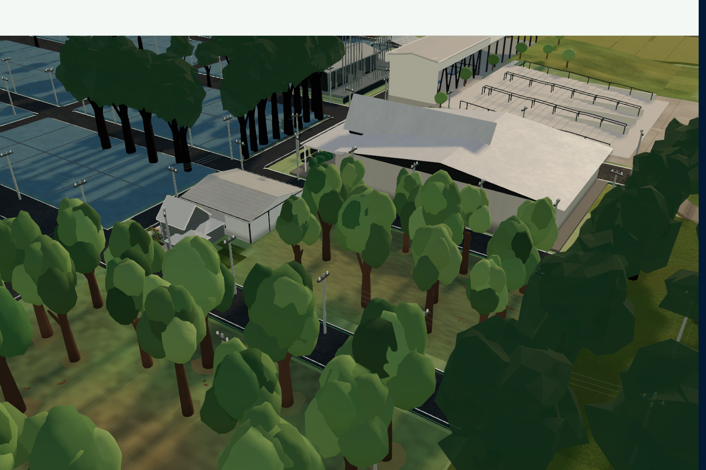
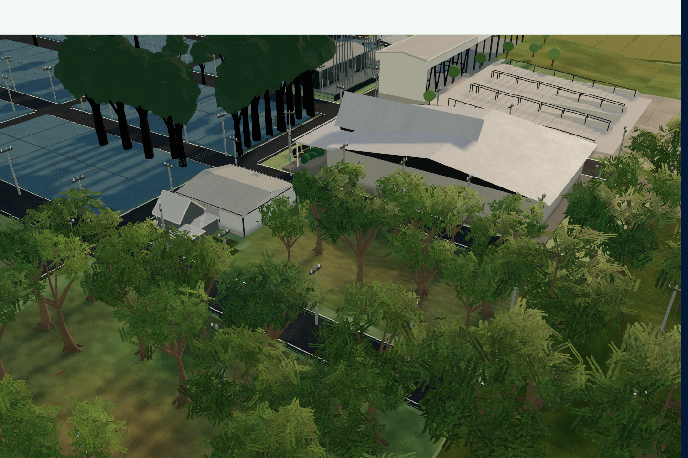
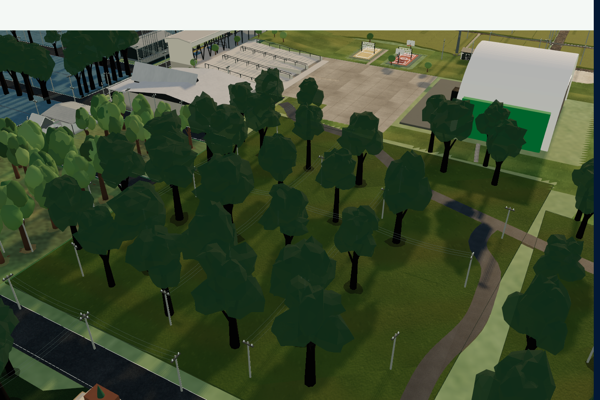
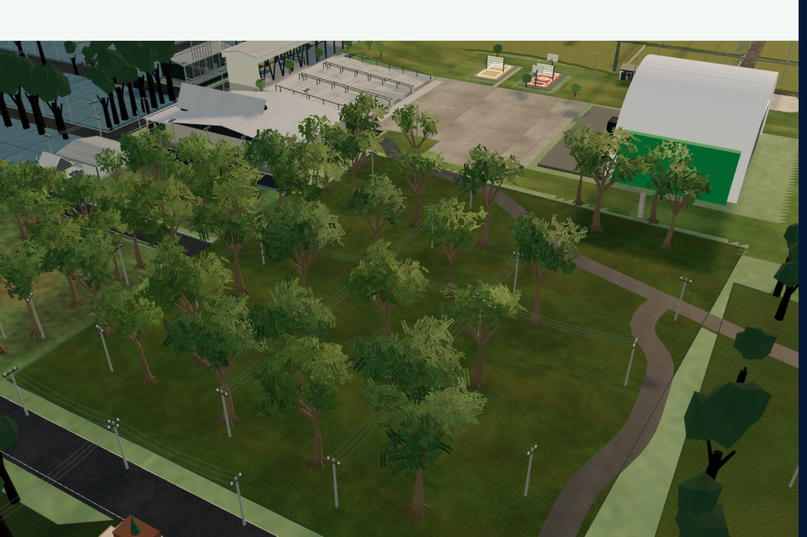

# Piloto de vegetação do Mapa Comercial

Implementação restrita a Quadra A, Quadra B e Estacionamento de Expositores e Visitantes. Referência de comparação: `b0600c1f` (main, antes deste piloto). A imagem fornecida orientou a composição de luz, grama e copas; os recursos usados no aplicativo são procedurais e não contêm imagens externas.

## Alterações por área

| Área | Inventário e apresentação | Mudança visual |
|---|---|---|
| Quadra A | 22 árvores, raízes nas posições existentes | Copas com folhas recortadas, galhos conectados, casca com sulcos e variação de porte. Grama em tufos nas células livres já aprovadas; transições entre verde, seco e solo exposto. |
| Quadra B | 12 árvores, raízes nas posições existentes | Mesma biblioteca compartilhada, com perfil determinístico por árvore, volumes abertos/fechados, tons distintos e contato com o solo. Mantém as exclusões dos prédios e das vias. |
| Estacionamento de Expositores e Visitantes | 40 registros preservados; 29 renderizados pelas regras anteriores | Material de solo exclusivo de `EST-EXP-VIS`, copas e troncos refinados. Tufos concentrados nas pequenas bases das árvores existentes, sem preencher pistas/vagas com geometria adicional. |

Há **74 registros canônicos e 63 árvores apresentadas** no conjunto do piloto. As regras anteriores de afastamento das vias continuam excluindo 11 registros do estacionamento. Nenhum ID, posição canônica, polígono, edifício, via, cadastro ou regra comercial foi alterado. Os demais grupos continuam no renderizador legado.

## Sistemas e orçamento

- Três famílias de árvores reutilizam geometria instanciada para madeira, copa principal e detalhes. Variação estável por ID em orientação, porte, largura, altura e tonalidade; grupos de espécie existentes orientam a copa aberta.
- Troncos afilados, raízes, galhos principais e secundários fazem parte de uma geometria compartilhada por família. A casca recebe resposta áspera e sulcos longitudinais.
- Um atlas procedural de **256 × 256** representa ramos com 16 folhas. Recorte de alpha com escrita de profundidade, sem ordenação de transparência. Mipmaps mantêm cobertura até o último texel para impedir o desaparecimento das copas à distância.
- Copas principais e troncos permanecem em todos os níveis de zoom. As folhas secundárias encolhem continuamente de 14 a 38 unidades; são retiradas do desenho somente depois dessa faixa. Não há troca de silhueta principal por distância.
- Grama opaca: cinco lâminas curvas, **15 triângulos por tufo**, limites de 2.400/2.400/1.800 instâncias para A/B/estacionamento. A distribuição reduzida mantém metade do conjunto e os detalhes encolhem de 10 a 28 unidades. Tufos completos respeitam as margens dos recortes autorizados.
- Materiais próprios de madeira, folha, grama e solo. Normais das copas, tons internos e iluminação traseira sutil usam o sol existente. As copas principais projetam sombras na qualidade completa; o modo reduzido usa uma pequena textura de sombra irregular com o sol fixo existente.
- Solo com variação em coordenadas do mundo em várias escalas, detalhe fino filtrado por derivadas e uma textura de ruído de **256 × 256**, compartilhada apenas entre materiais do piloto. Sem mutação de `ShaderChunk`, iluminação global, texturas ou materiais de outras áreas.
- Materiais, texturas, geometrias e buffers de instâncias têm descarte explícito. As novas malhas não participam do raycast de seleção.

## Evidência visual

[Galeria com comparador antes/depois](screenshots/vegetation-pilot/index.html) · [Todas as medições](screenshots/vegetation-pilot/measurements.md) · [Dados das comparações](screenshots/vegetation-pilot/comparison.json).

A galeria reúne posições de câmera idênticas nas vistas próximas, médias, superiores, geral e de controle externo, em desktop, retrato e paisagem. Inclui três vistas sob as copas no desktop. As poses exatas estão nos JSONs `before-*` e `after-*`.

| Área | Antes | Depois |
|---|---|---|
| Quadra A |  |  |
| Quadra B |  |  |
| Estacionamento |  |  |

As folhas recortadas substituem os volumes compactos repetidos e deixam os galhos legíveis. O resultado melhora a profundidade e a variedade da cena, mas ainda é uma vegetação procedural de tempo real; não equivale à fotografia de referência em detalhe próximo.

## Desempenho medido

Chrome headless com aceleração ANGLE/D3D11, Intel UHD, viewports 1440 × 960, 390 × 844 e 844 × 390. Cada amostra movimenta a câmera por 6,8 s e descarta os primeiros 0,8 s. A qualidade adaptativa original continua ativa; cada JSON inclui tier, DPR, chamadas, triângulos e saúde do renderizador. A medição inclui a cadência de apresentação e trabalho do navegador; não é um cronômetro GPU isolado.

| Vista | Desktop, ms antes → depois | Retrato emulado | Paisagem emulada |
|---|---:|---:|---:|
| Quadra A próxima | 30,7 → 33,5 | 20,8 → 19,5 | 22,3 → 21,6 |
| Quadra B próxima | 19,7 → 24,5 | 17,7 → 16,7 | 17,5 → 16,8 |
| Estacionamento próximo | 21,0 → 24,9 | 17,5 → 16,7 | 17,7 → 17,9 |
| Piloto superior | 18,1 → 22,0 | 17,7 → 16,7 | 17,7 → 16,9 |
| Parque geral | 25,1 → 29,1 | 17,8 → 17,6 | 19,5 → 28,5 |

**Há custo adicional:** o desktop ficou entre 22,0 e 33,5 ms por quadro nessas amostras, e a vista geral em paisagem passou de 19,5 para 28,5 ms. A adaptação mudou de MEDIUM para LOW em duas vistas desktop e de HIGH para MEDIUM na geral em paisagem. Portanto, esta evidência não sustenta uma promessa de custo zero ou qualidade global idêntica sob carga. O comparador registra o comportamento real da política adaptativa existente, sem forçar artificialmente um tier fixo. A área de controle móvel é idêntica nos arquivos antes/depois; no desktop a adaptação altera a resolução, embora seus materiais e objetos permaneçam no sistema anterior.

## Validação e limites

- **149 testes direcionados passaram em 14 arquivos**, incluindo limites espaciais dos tufos, inventário/IDs, geometria finita, orçamento, mipmaps, textura compartilhada, terreno, LOD, ambiente e estabilidade. TypeScript da aplicação, ESLint dos arquivos alterados e build de produção passaram.
- A primeira suíte ampla teve 51 falhas. **50 foram reproduzidas no commit base em checkout limpo**, listadas em [baseline-failures.json](screenshots/vegetation-pilot/baseline-failures.json). A outra era uma expectativa de código-fonte da partição anterior A/B; foi atualizada para o piloto e passou. A suíte ampla não é declarada integralmente verde.
- Zoom e modos: resultados em `verification-desktop.json` e `verification-portrait.json`. Comparação exata das matrizes e dos 63 IDs durante 36 passos de zoom por viewport. A análise de pixels de 72 capturas detecta candidatos a quadro uniforme; inspeção das vistas salvas cobre silhueta, recortes, contato e material.
- Navegação, filtros, seleção e responsividade: resultados em `functional-desktop.json` e `functional-mobile.json`, com autenticação/dados sintéticos locais. Requisições de escrita no backend ficam bloqueadas pelo fixture; o teste não publica dados.
- Teste de transições: `stress.json` concluiu **40 ciclos / 80 transições em 183.1 s**, com zero perdas de contexto e zero códigos de erro. Nas quatro configurações aquecidas, o crescimento de geometrias, texturas e programas foi **zero**.
- Não foram observados quadros uniformes, corrupção de material, perda de contexto ou falha de navegação nos cenários concluídos. Capturas discretas e contadores não certificam ausência absoluta de cintilação subpixel, artefatos entre amostras ou travamentos de driver em outra máquina.
- Viewports móveis são **emulação**, com mouse no exercício de órbita; não validam multitouch real, Safari/iOS, temperatura, GPU de entrada móvel nem 60 FPS contínuos. O renderizador por demanda também registra intervalos de inatividade/inicialização nos diagnósticos; esses contadores não devem ser interpretados como FPS contínuo. Não houve acesso a um aparelho físico nesta execução.

## Reprodução

1. `npm run dev -- --host 127.0.0.1 --port 4196`.
2. Com Playwright/Chrome e Sharp disponíveis, executar `node scripts/vegetation-pilot/capture.cjs before desktop` e `node scripts/vegetation-pilot/capture.cjs after desktop`; repetir com `portrait` e `landscape`. Os caminhos alternativos dos módulos podem ser fornecidos em `PLAYWRIGHT_MODULE` e `SHARP_MODULE`.
3. `node scripts/vegetation-pilot/verify.cjs desktop` e `node scripts/vegetation-pilot/verify.cjs portrait`.
4. `node scripts/vegetation-pilot/functional.cjs` e `node scripts/vegetation-pilot/functional.cjs --mobile` (fixture usa apenas o hostname configurado em `.env`, sem credenciais reais).
5. `node scripts/vegetation-pilot/stress.cjs`; `node scripts/vegetation-pilot/report.cjs` recompõe a galeria e as tabelas.

`?vegetationPilotBaseline` habilita o desenho anterior apenas no ambiente DEV para comparação. `?vegetationPilotGroundBaseline` isola o material de solo para diagnóstico. Ambos não desabilitam o piloto por URL na build de produção. O inspetor de vegetação usa o harness DEV já existente.
