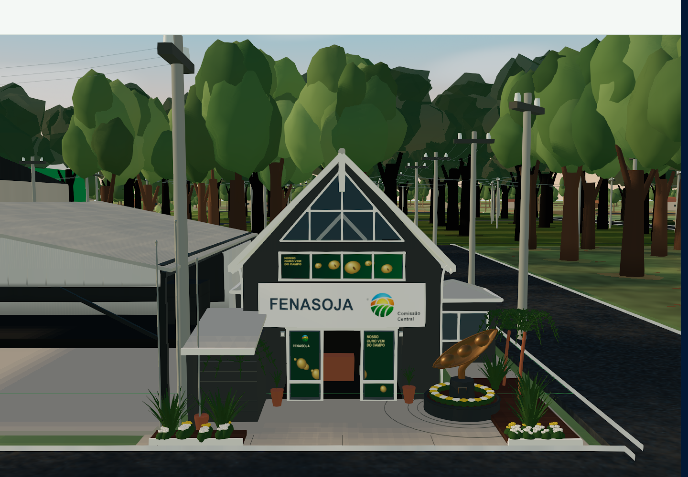
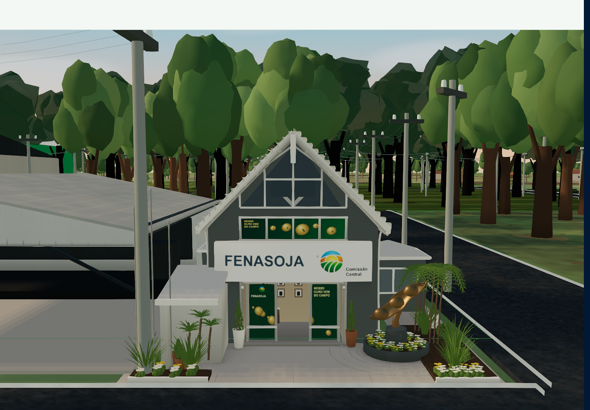
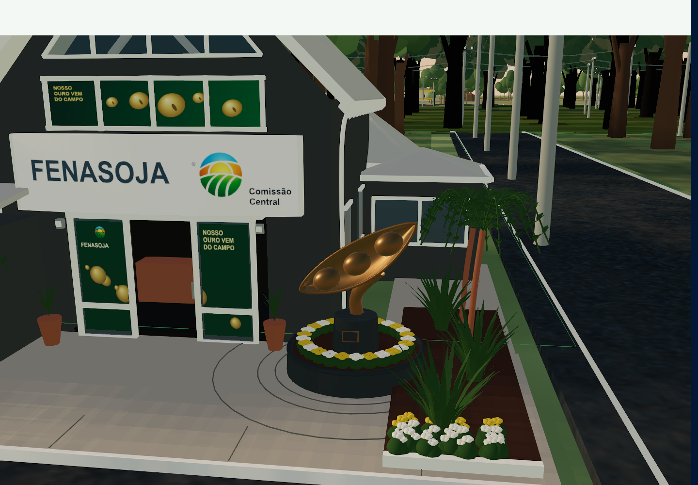
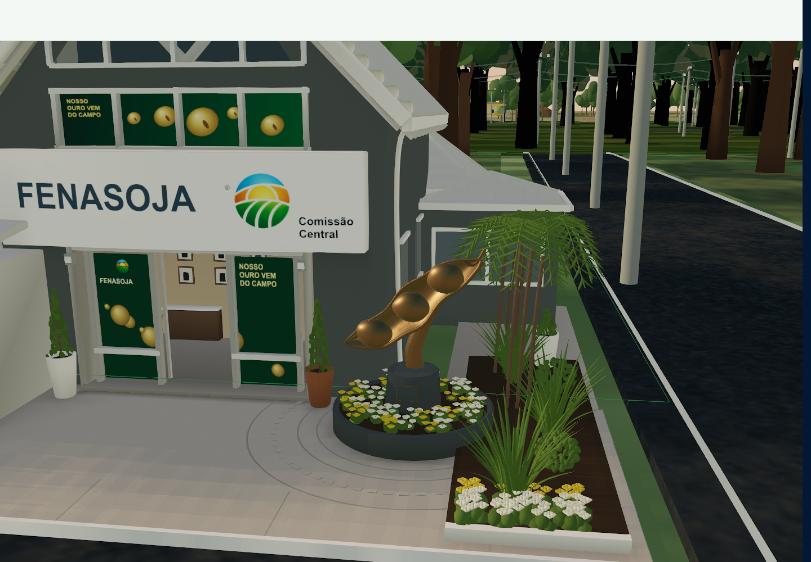
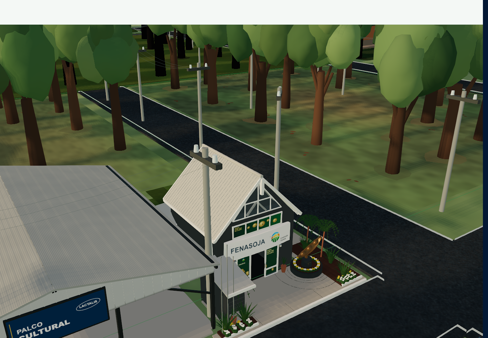
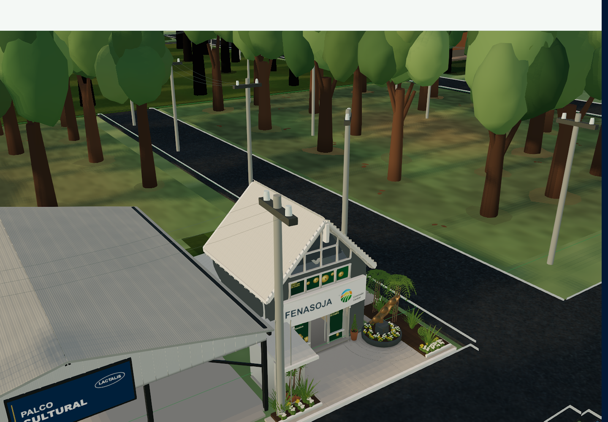
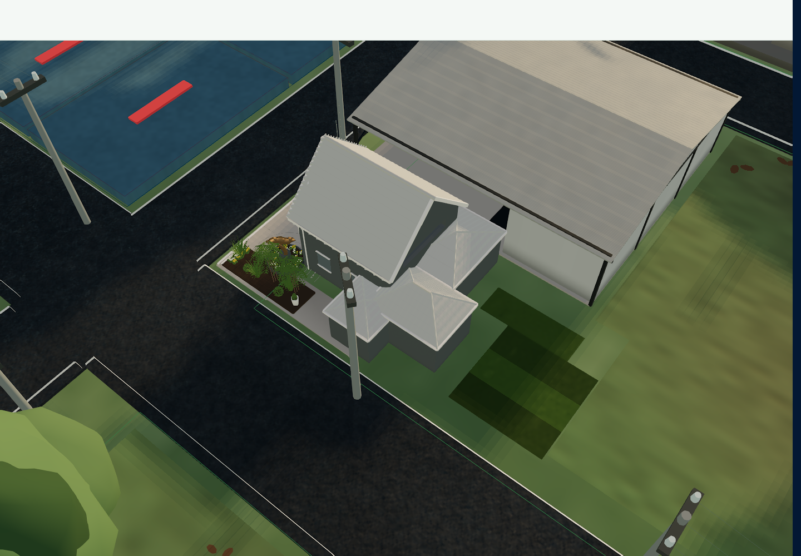

# Sede Fenasoja — refinamento arquitetônico

## Auditoria antes das alterações

Base desta segunda etapa: commit `0a2c6a78`, a primeira reconstrução aprovada como ponto de partida. As capturas `screenshots/fenasoja-hero/before-*` foram preservadas antes das mudanças. Os relatórios JSON originais mantêm o campo `phase: after` porque representam o resultado da primeira etapa.

A fotografia `1A00F8C4-D5A7-4D15-BCF5-021760A825E2.jpeg`, enviada no pedido inicial, permanece a verdade arquitetônica. `download (7).png` e `download (8).png` mostram esta base. `ChatGPT Image 10 de set. de 2026, 03_21_21.png` é a meta visual gerada, e não evidência para inventar arquitetura, textos ou quantidade de grãos.

| Decisão | Módulos e motivo |
| --- | --- |
| KEEP | B12, posição, yaw -90°, escala uniforme 0,148695 unidade/m estimado, polígonos registrados, planta das coberturas, sala lateral conectada, passeio, posição do monumento e palco B13 da primeira etapa. |
| KEEP | `StrategicLandmarks` e seu alvo de seleção; projeção de dados por identificador persistente; painel, edição, metadados, histórico quando disponível e `HeadquartersInteriorScene`; câmera e Canvas únicos. |
| REFINE | Empena e caixilharia: a abertura superior precisa de laterais verticais, montantes e estrutura interna com profundidade; a fileira inferior precisa de revelos. Telhado requer perfil, bordas e cumeeiras. |
| REBUILD | Seção da placa branca, camadas da entrada, superfície orgânica da vagem e grãos, vegetação ornamental e distribuição de flores. São geradores locais, sem alteração na implantação. |
| REMOVE | Recepção representada por uma caixa marrom exposta, repetição regular de flores, frondes planas muito escuras, linhas de piso salientes e excessivamente pretas. |

## Integração e luz existentes

`CommercialMapCanvas → StrategicLandmarks → FenasojaHeadquarters` mantém a seleção no pai e usa metros locais (+Z frente, +X direita) dentro de uma única transformação uniforme. A origem arquitetônica é compensada pelo centro do polígono de seleção. As malhas de apresentação não fazem raycast. Não existem GLB/GLTF da Sede: a arquitetura é gerada, agrupada por material e descartada apenas no desmontar.

O mapa já fornece sol direcional, preenchimento, hemisfério, ambiente e transição noturna; usa ACES no caminho direto e o compositor existente no caminho pós-processado. O mapa de sombras cobre o parque inteiro (até 2048²), portanto não resolve sozinho cada junta de centímetros. Foram preservadas exposição, fontes de luz e reflexos existentes. Contatos geométricos, relevos, cores e oclusão local foram trabalhados na própria Sede.

## Arquitetura e materiais entregues

O gerador anterior concentrava casca, texturas, flores e escultura num único componente. Foi dividido em `headquarters/architecture.ts`, `geometry.ts`, `artwork.ts`, `materials.ts`, `contact.ts`, `monument.ts` e `landscape.ts`. O componente raiz mantém apenas montagem, recursos, modo noturno e LOD. São 33 lotes de geometria e três lotes instanciados, em vez de componentes React por folha ou telha.

- **Empena e cobertura:** espessura de telhado, segunda camada de forro, testeiras com pequenos chanfros, caibros, perfil cerâmico contínuo no LOD próximo, arremates curvos de borda e cumeeira. O encontro dos volumes e sua implantação anterior permanecem.
- **Aberturas:** parede frontal contínua com três aberturas reais, revelos, caixilhos, vidro superior com laterais verticais, divisão horizontal, montantes e estrutura interna atrás do vidro. A faixa inferior de campanha ocupa um vão rebaixado.
- **Placa:** perfil branco curvo, 28 cm de espessura estimada, projeção adicional de 18 cm, pequenas bordas chanfradas e suportes. Arte de 1536×384 com símbolo oficial, “FENASOJA” e “Comissão Central”, sem esticar o logotipo.
- **Entrada:** soleira, marcos, camadas de caixilharia e puxadores. Volume interno raso com paredes quentes, balcão discreto e silhuetas de quadros evita a antiga caixa marrom isolada. Esse detalhe só aparece de perto; a visita interna continua usando sua cena existente.
- **Lateral:** acabamento claro de alvenaria, encontros, calhas/descidas e unidade de ar-condicionado visível. Sala dos Voluntários continua ligada à casca e recuada. Não foram inventados novos textos ou aberturas traseiras elaboradas.
- **Passeio:** piso de concreto tessellado para contato local, juntas finas, faixas curvas embutidas, pequenos blocos de acabamento próximos, meios-fios, terra e ligação com a base do monumento. Caminho central livre.

| Superfície | Resposta adotada |
| --- | --- |
| Alvenaria cinza | `#676e6e`, sem metal, rugosidade alta, normal de microtextura discreto |
| Testeiras / caixilhos / forro | Três brancos próximos, rugosidade 0,44–0,78; metalness 0,08 apenas no caixilho |
| Telhado claro | Perfil e normal de telha; rugosidade nominal 0,86 modulada pelo mapa; sem metal |
| Vidro | Material físico, roughness 0,12, IOR 1,5, transparência controlada e ambiente do mapa; sem SSR ou transmissão de tela adicional |
| Impresso | Verde profundo, rugosidade 0,58–0,61; albedo sRGB, sem emissão |
| Concreto / terra | Rugosidade alta, normal suave, variação pequena sem sombras na textura |
| Bronze | `#ab8c62`, metalness 0,83, roughness 0,43, microvariação e reflexos ambientais moderados |
| Cerâmica / pedestal | Perfis com espessura e bordas, rugosidade 0,57 / 0,83 |
| Vegetação | Folhas opacas com normais e variação de cor, faces duplas; sem milhares de recortes transparentes |

Mapas de microtextura: 256²; telhado: 512². Campanha: 1024×256 e 1024². Mipmaps, filtragem trilinear e anisotropia até 8, limitada pelo dispositivo. Albedo em sRGB; normais/rugosidade em espaço linear. A arte de campanha é uma interpretação vetorial/procedural com o texto correto e o símbolo oficial, pois não foi localizado o arquivo original da campanha da fotografia.

## Monumento e paisagismo

A vagem tem duas superfícies conectadas, espessura, três câmaras assimétricas, bordas curvas e ponta elevada. Os três grãos têm deformação orgânica e normais suavizadas. A haste curva afunila e encontra a face inferior da vagem; pedestal, aro e placa sem inscrição foram refeitos. A fotografia real mostra três grãos; os cinco do conceito gerado não foram copiados. Altura total aproximada 2,86 m, incluindo a base, é uma interpretação e não uma medição.

O aro circular recebeu flores em agrupamentos irregulares, com altura e rotação variadas. O passeio recebeu dracenas, touceiras de folhas curvas, palmeiras com folíolos, arbustos, vasos cerâmicos e brancos com solo visível. São 2.652 instâncias compartilhadas de pétalas/folhas pequenas no nível máximo; as folhas maiores usam superfícies dobradas com normais contínuas. A vegetação do restante do parque não foi substituída.

A inspeção detectou o poste `pole-ref-337` dentro da cobertura ampliada de B13. `electricalPresentation.ts` desloca somente sua apresentação para além da borda frontal da cobertura, mantendo o marcador e as conexões. O teste lança raios contra a cobertura real da Sede também, para evitar transferir a colisão ao anexo. O poste 357 mantém sua associação histórica, embora sua âncora já fique fora do envelope corrigido de B12.

## Padrões transferidos dos repositórios solicitados

| Referência | Aplicação concreta e limite |
| --- | --- |
| [pmndrs/drei](https://github.com/pmndrs/drei) | Padrão de `Detailed` com histerese, recursos compartilhados de `Instances` e integração com o ambiente existente. O LOD altera visibilidade/contagem diretamente, sem setState por frame. A estratégia limitada de `ContactShadows` inspirou avaliar custo antes de introduzir FBOs; aqui o contato é geométrico, calculado uma vez, sem novo passe. AdaptiveDpr/PerformanceMonitor não foram duplicados: o mapa já possui controle adaptativo. |
| [pmndrs/gltfjsx](https://github.com/pmndrs/gltfjsx) | Separação entre módulos arquitetônicos, malhas nomeadas e tabela de materiais; recursos reutilizáveis e controláveis de forma independente. A Sede continua procedural: não foi convertida artificialmente em GLB, nem copiado um modelo/demo. |
| [glTF-Transform](https://github.com/donmccurdy/glTF-Transform) | Aplicação dos princípios de deduplicação, preservação de normais/UVs, remoção de dados redundantes e resolução de textura proporcional ao uso. A união indexada preserva as descontinuidades de material/UV/normal. Meshopt, Draco e KTX2 não foram adicionados, pois não há GLB novo nem cadeia de carregamento que os justifique neste ativo. |
| [react-postprocessing](https://github.com/pmndrs/react-postprocessing) | Respeito ao compositor único, agrupamento de acabamento e pipeline de cor existente. Nenhum bloom, sharpening, AO de tela, segundo composer ou captura de reflexos foi acrescentado para disfarçar geometria. |

O contato usa BVH temporária sobre a arquitetura: oito raios hemisféricos, alcance local de 0,85 m e atenuação limitada. Afeta somente luz indireta; não fixa a direção do sol. A BVH é descartada após o cálculo. Na parede frontal, uma aproximação analítica contínua parametrizada pela especificação evita manchas triangulares em faces grandes. Ela representa oclusão ambiente de beiral, placa e base; não é uma sombra solar fotografada.

Na revisão noturna, os planos de luz do parque, originalmente a 0,205 unidade do chão, atravessavam paredes, vasos e plantas da Sede, cujo piso é mais baixo. `headquarters/nightReceiver.ts` registra o passeio e os volumes de B12; `NightLightingLayer.tsx` reaproveita as mesmas luminárias, cores, intensidades e transições em dois lotes instanciados no piso real. A máscara considera a projeção da câmera e a obstrução dos volumes baixos, evitando faixas brilhantes sobre a arquitetura. São **dois draw calls adicionais somente à noite**, um quad compartilhado e dois materiais derivados; nenhum framebuffer, nova fonte de luz ou passe de pós-processamento. A correção fica desativada quando B12 não está presente.

Os três defeitos da revisão intermediária foram corrigidos e inspecionados novamente: parede encobrindo vidros (aberturas verificadas por raycast), folhas pretas (atributo de cor do protótipo instanciado) e encontro da haste com a vagem (superfícies contínuas, vistas frontal e próxima).

## LOD e orçamento

O telhado, a empena, a placa, a silhueta da vagem e o pedestal existem em todos os níveis. Detalhes adicionais entram a menos de 5,8 unidades da câmera e saem acima de 7,1; o nível distante entra acima de 19 e sai abaixo de 16. As distâncias têm histerese; não se recriam materiais/geometrias na navegação. Folhas pequenas usam 100%, 62% ou 18% das instâncias, com distribuição intercalada no gerador.

Orçamento máximo final da Sede: 106.421 triângulos em geometria agrupada + 63.648 nas instâncias = **170.069 triângulos**, 36 lotes, 24 materiais, 15 texturas e um lote transparente. Buffers indexados de geometria: aproximadamente **4,00 MiB**. Texturas RGBA com mipmaps: aproximadamente **16,67 MiB**. São estimativas de dados do ativo; WebGL não expõe a memória VRAM real do driver. Instâncias acrescentam cerca de 0,20 MiB de matrizes/cores, além do protótipo compartilhado. O contato é calculado apenas na montagem, com duração registrada no JSON.

A primeira versão detalhada custava 221.873 triângulos. Depois da inspeção e medição, foram retiradas subdivisões redundantes das paredes, reduzida a amostragem interna do telhado e simplificadas apenas as faixas verticais das pétalas achatadas. O contorno da cobertura, os arremates e a malha da escultura foram mantidos. Isso reduziu 23,3% do orçamento máximo daquela versão de trabalho. A ordem determinística das instâncias distribui o detalhe reduzido entre todos os canteiros.

## Validação e evidências

O roteiro está em `scripts/fenasoja-complex/`: `capture.cjs`, `functional.cjs`, `inspect.cjs`, `stress.cjs` e `night-stress.cjs`. `TerritoryQa` é carregado somente pela rota DEV e fornece poses, limites reais, contagens e saúde do renderer. A câmera de diagnóstico é aplicada antes dos callbacks de LOD, sem transferir a responsabilidade de renderização à Sede.

As câmeras A/B correspondem aos anexos aéreos (`attachment1`/`attachment2`); C à foto frontal (`referenceFront`); D/E ao conjunto em 3/4 (`beforeView6`); F à lateral direita (`rightRoom`); G às junções de cobertura (`roof`); H ao monumento (`monument`); I à navegação normal (`frontage`). Há também traseira, palco, vistas antigas 4/5 e afastamento amplo de diagnóstico. Os limites efetivos de zoom do usuário são exercitados separadamente no roteiro funcional. Coordenadas exatas estão no script e nos JSONs; não se depende de órbita manual.

### Comparações na mesma câmera

As imagens abaixo são capturas do aplicativo WebGL em execução. Nenhuma é render gerado por IA. A coluna anterior é o primeiro passe `0a2c6a78`; a imagem frontal real continua sendo a referência arquitetônica.

O [comparador local com controle deslizante](fenasoja-headquarters-comparison.html) reúne nove câmeras. Abra o HTML a partir deste checkout para comparar em tamanho grande; o GitHub apresenta seu código-fonte.

| Vista | Primeiro passe | Refinamento final |
| --- | --- | --- |
| C — fachada |  |  |
| H — monumento e entrada |  |  |
| D/E — três quartos |  |  |
| G — cobertura |  |  |

Outras inspeções: [aérea A](screenshots/fenasoja-hero/after-attachment1.png), [aérea B](screenshots/fenasoja-hero/after-attachment2.png), [sala e lado direito F](screenshots/fenasoja-hero/after-rightRoom.png), [traseira](screenshots/fenasoja-hero/after-rear.png), [distância normal I](screenshots/fenasoja-hero/after-frontage.png), [palco](screenshots/fenasoja-hero/after-stageFront.png), [noite](screenshots/fenasoja-hero/after-night-monument.png), [mobile frontal](screenshots/fenasoja-hero/after-mobile-referenceFront.png), [mobile monumento](screenshots/fenasoja-hero/after-mobile-monument.png), [paisagem móvel com controles](screenshots/fenasoja-hero/functional-mobile-landscape.png).

As [vistas neutras](screenshots/fenasoja-complex/neutral-attachment1.png) registram a implantação separando polígonos de parede, telhado e passeio. Os testes geométricos do refinamento também lançam raios pelas aberturas, verificam normais finitas e limites, e verificam a folga do poste contra as coberturas reais.

<!-- PERFORMANCE_START -->
### Desempenho medido

Chrome 152.0.7977.82, Windows, Intel UHD via ANGLE/D3D11, uma sessão por vez. Desktop CSS 1440×1000; viewport móvel 390×844, touch emulado. Nas amostras de navegação, DPR adaptativo 0,72 e buffers 1026×667 / 280×490. Cada amostra dura seis segundos após aquecimento, com deslocamento senoidal idêntico de câmera. São tempos rAF do mapa completo, não tempo GPU isolado nem certificação de FPS contínuo.

**Dia**

| Viewport / câmera | Média antes → depois (ms) | p95 antes → depois (ms) | Draw calls antes → depois | Triângulos antes → depois | Qualidade antes → depois |
| --- | --- | --- | --- | --- | --- |
| desktop / Frente / navegação | 18,50 → 20,13 | 19,70 → 22,90 | 134 → 140 | 613.474 → 672.345 | HIGH → HIGH |
| desktop / Frente do palco | 18,24 → 18,81 | 20,40 → 21,30 | 136 → 136 | 610.120 → 641.765 | HIGH → HIGH |
| desktop / Três quartos | 18,63 → 20,19 | 21,90 → 24,30 | 117 → 133 | 675.115 → 763.310 | HIGH → MEDIUM |
| desktop / Afastamento diagnóstico | 25,92 → 28,80 | 23,90 → 27,10 | 880 → 886 | 774.645 → 805.344 | MEDIUM → MEDIUM |
| mobile / Frente / navegação | 17,44 → 17,39 | 16,90 → 16,90 | 106 → 109 | 583.768 → 642.604 | HIGH → HIGH |
| mobile / Frente do palco | 16,67 → 16,67 | 16,90 → 16,80 | 108 → 108 | 559.441 → 559.441 | HIGH → HIGH |
| mobile / Três quartos | 16,67 → 16,67 | 16,90 → 16,80 | 97 → 109 | 555.677 → 612.928 | HIGH → HIGH |
| mobile / Afastamento diagnóstico | 16,98 → 18,78 | 19,80 → 17,60 | 766 → 772 | 651.324 → 682.023 | HIGH → HIGH |

**Noite, após aquecimento de todas as câmeras**

| Viewport / câmera | Média antes → depois (ms) | p95 antes → depois (ms) | Draw calls antes → depois | Triângulos antes → depois | Qualidade antes → depois |
| --- | --- | --- | --- | --- | --- |
| desktop / Frente / navegação | 17,53 → 18,88 | 20,30 → 22,10 | 139 → 147 | 639.664 → 698.579 | HIGH → HIGH |
| desktop / Frente do palco | 17,91 → 18,61 | 20,50 → 21,10 | 139 → 144 | 616.700 → 669.595 | HIGH → HIGH |
| desktop / Três quartos | 18,04 → 20,30 | 20,20 → 22,60 | 122 → 140 | 701.305 → 789.544 | HIGH → HIGH |
| desktop / Afastamento diagnóstico | 22,00 → 23,01 | 24,00 → 26,80 | 893 → 901 | 805.483 → 836.226 | MEDIUM → MEDIUM |
| mobile / Frente / navegação | 16,67 → 16,67 | 16,90 → 16,80 | 111 → 117 | 609.958 → 668.853 | HIGH → HIGH |
| mobile / Frente do palco | 16,67 → 16,67 | 16,90 → 16,80 | 113 → 115 | 585.631 → 585.675 | HIGH → HIGH |
| mobile / Três quartos | 16,67 → 16,67 | 16,80 → 16,80 | 102 → 116 | 581.867 → 639.162 | HIGH → HIGH |
| mobile / Afastamento diagnóstico | 16,63 → 16,71 | 16,80 → 17,00 | 778 → 786 | 681.994 → 712.737 | HIGH → HIGH |

Na vista frontal diurna, o custo aumentou 1,63 ms no desktop e ficou praticamente estável no viewport móvel. O custo nas vistas amplas aumentou; uma amostra desktop em três quartos terminou em MEDIUM, enquanto a base terminou em HIGH. Não foi alterado o sistema adaptativo para esconder essa diferença. Os tempos variam entre rodadas; o conjunto de seis segundos não sustenta uma promessa de 60 FPS.

Na frente diurna desktop: geometrias residentes 605 → 622, texturas 139 → 148, programas 177 → 194. Móvel: 599 → 616 geometrias, 138 → 147 texturas, 174 → 191 programas. O contador da Sede registrou zero renders React nas três câmeras próximas durante a medição e um no afastamento, associado à atualização contextual, não um por frame. O cálculo inicial de contato durou aproximadamente 663 ms nesta rodada; acontece uma vez na montagem, fora da navegação.

A primeira visita noturna compilou variantes de shader em ambas as versões, chegando a consumir uma janela inteira de amostragem sem frames úteis. Isso continua sendo uma limitação de entrada fria do pipeline existente. Os JSONs noturnos preservam `warmup` separado; as tabelas usam somente a segunda passagem aquecida. Não se mistura compilação inicial com a medição estável nem se afirma que a transição fria é instantânea.

Dados completos: [antes desktop](screenshots/fenasoja-hero/measurement-baseline/before-desktop.json), [depois desktop](screenshots/fenasoja-hero/after-desktop.json), [antes móvel](screenshots/fenasoja-hero/measurement-baseline/before-mobile.json), [depois móvel](screenshots/fenasoja-hero/after-mobile.json), [antes noturno desktop](screenshots/fenasoja-hero/measurement-baseline/before-desktop-night.json), [depois noturno desktop](screenshots/fenasoja-hero/after-desktop-night.json), [antes noturno móvel](screenshots/fenasoja-hero/measurement-baseline/before-mobile-night.json), [depois noturno móvel](screenshots/fenasoja-hero/after-mobile-night.json). Todas essas medições finais terminaram `ready/direct`, sem perda de contexto ou erro de página.

### Testes concluídos e limites da última rodada

- **50/50 testes focados**, TypeScript do projeto (`tsconfig.app.json`), ESLint dos arquivos afetados e build de produção passaram. [Resultado dos testes](screenshots/fenasoja-hero/verification/focused-tests.json), [build](screenshots/fenasoja-hero/verification/build.txt).
- **14 transições dia/noite após a correção final**: um Canvas, quadros apresentados progredindo, nenhum erro/perda de contexto e crescimento zero de geometrias/texturas/programas nos grupos aquecidos. [Relatório](screenshots/fenasoja-hero/night-stress.json).
- **40 ciclos / 80 transições de qualidade/hidrologia** passaram antes do ajuste final do receptor noturno; crescimento zero nas configurações aquecidas. Essa bateria não foi repetida depois do ajuste. [Relatório](screenshots/fenasoja-hero/stress.json).
- Seleção alternada B12/B13, foco, filtros, pan, zoom extremo, entrada/saída do interior, toque/pinch emulado e ausência de overflow passaram em desktop e mobile antes do último ajuste noturno. Nenhuma escrita no backend. [Desktop](screenshots/fenasoja-hero/functional-desktop.json), [mobile](screenshots/fenasoja-hero/functional-mobile.json).
- A suíte ampliada executada teve **56/58**: duas falhas elétricas preexistentes, reproduzidas isoladamente na base (**19/21**). São a projeção de `transformer-ref-007` e o teste global de folga de fases (937 violações fora do escopo). A base também falha em `commercialMapSiteEnvironment` (8/9; máscara com 3 interseções em vez de 1). [Ampliada](screenshots/fenasoja-hero/verification/expanded-tests.json), [base elétrica](screenshots/fenasoja-hero/verification/baseline-electrical-tests.json), [base de ambiente](screenshots/fenasoja-hero/verification/baseline-site-tests.json). Não se declara a suíte inteira verde.

A pedido do usuário, a publicação prosseguiu com estas evidências. Ficaram pendentes a repetição da bateria funcional/40 ciclos após o ajuste noturno, novas capturas neutras do refinamento e testes em iPhone/Safari físicos. As capturas finais de dia/noite e as 14 alternâncias já incluem o ajuste. O comparador HTML foi preparado; não houve uma rodada adicional de automação dedicada à sua interface.

<!-- PERFORMANCE_END -->

### Como reproduzir

Após instalar as dependências, execute `npm run dev -- --host 127.0.0.1 --port 4194 --strictPort`. Os roteiros exigem Chrome e Playwright disponíveis no ambiente Node (`PLAYWRIGHT_MODULE` pode indicar seu módulo). `QA_URL` e `QA_OUTPUT` permitem escolher servidor e pasta de evidências.

```powershell
node scripts/fenasoja-complex/capture.cjs after
node scripts/fenasoja-complex/capture.cjs after --mobile
node scripts/fenasoja-complex/capture.cjs after --night-only
node scripts/fenasoja-complex/capture.cjs after --night-only --mobile
node scripts/fenasoja-complex/capture.cjs neutral --quick
node scripts/fenasoja-complex/inspect.cjs
node scripts/fenasoja-complex/functional.cjs desktop http://127.0.0.1:4194/mapa-comercial
node scripts/fenasoja-complex/functional.cjs mobile http://127.0.0.1:4194/mapa-comercial --mobile
node scripts/fenasoja-complex/stress.cjs
node scripts/fenasoja-complex/night-stress.cjs
npx tsc --noEmit -p tsconfig.app.json
npm run build
```

Use checkouts separados para os commits anteriores. Se compartilhar `node_modules` via junction, configure `cacheDir` exclusivo no Vite de cada checkout: caches de otimização compartilhados provocaram falha de importação Rapier em uma rodada descartada. A medição final usa sessões Chrome sequenciais, sem build ou testes concorrentes.

O `npm ci` da base falha por divergências já existentes entre Firebase e o lockfile. A instalação de trabalho usou `npm install --no-package-lock --no-audit --no-fund`. A PR declara diretamente `three-mesh-bvh@^0.7.8`, já presente transitivamente no lock, e não regrava o lock completo para corrigir dependências alheias.

### Arquivos e contratos

- `components/canvas/FenasojaHeadquarters.tsx` e `components/canvas/headquarters/{architecture,geometry,artwork,materials,contact,monument,landscape,nightReceiver}.ts`: ativo modular e recursos locais.
- `data/fenasojaComplexReconstruction.ts`, `data/officialReference2026.ts`, `hooks/useCommercialMap.ts`: registro espacial e projeção versionada para B12/B13.
- `components/canvas/{StrategicLandmarks,CommercialMapCanvas,LactalisCulturalStage,FenasojaComplexOverlay,NightLightingLayer}.tsx`: integração, foco, palco da primeira etapa, overlay DEV e receptor noturno local.
- `utils/{headquarters,lactalisStage,lactalisOrientationProposal,landmarks}.ts`, `data/electricalPresentation.ts`: contratos geométricos, direção do palco e única colisão de poste corrigida.
- `diagnostics/TerritoryQa.tsx`, `scripts/fenasoja-complex/*`, testes específicos em `src/test/commercialMap*.test.ts`, estes dois relatórios e suas evidências.
- `package.json` / `package-lock.json`: declaração direta da BVH usada no cálculo único de contato. Sem novas dependências de pós-processamento.

Os caminhos de código acima são relativos a `src/features/commercial-map/`, salvo quando indicados. Alterações locais alheias em `supabase/functions/mcp/index.ts`, arquivos de ambiente, caches e a pasta `artifacts/` foram excluídos da PR.

## Limites da reconstrução

As medidas derivam da barra de 10 m e das fotografias, com incerteza aproximada de ±1 m em planta e ±0,7 m em altura. A proporção frontal foi corrigida sem copiar distorção de perspectiva. Detalhes ocultos permanecem conservadores; não há levantamento interno/topográfico.

O ambiente de reflexão atual do parque é simplificado: o vidro responde ao céu/ambiente disponível, mas não reproduz reflexos exatos das árvores da fotografia. A resolução de sombras compartilhada do parque limita contatos solares muito pequenos. O resultado continua pertencendo ao renderizador do mapa; não deve ser apresentado como equivalente a uma renderização offline ou ao conceito gerado.

Validação móvel usa Chrome com viewport/touch emulados, não iPhone físico, Safari/iOS ou medição de GPU móvel. Os testes funcionais usam uma organização/autenticação sintéticas e não escrevem no backend. Metadados e permissões são preservados por contrato e testes; isso não constitui teste de escrita com permissões de produção. Conteúdo histórico existente continua acessível onde há vínculo editorial verificado; nenhuma história foi inventada para B12.
