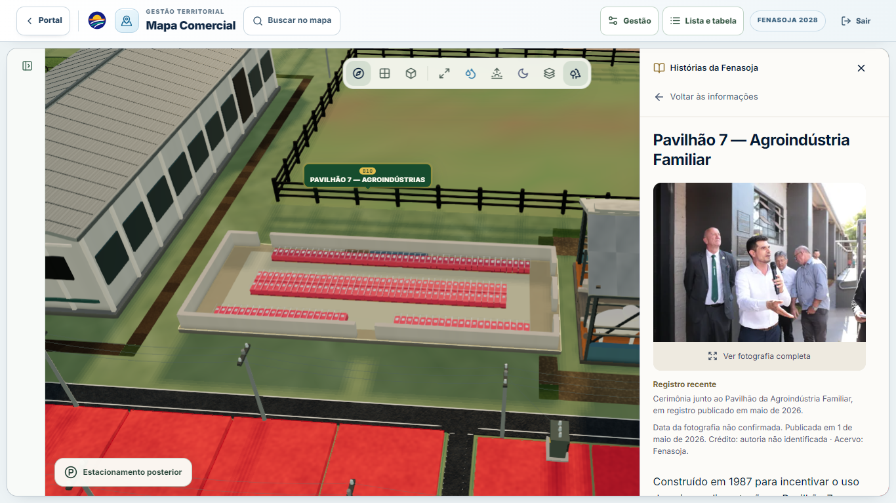
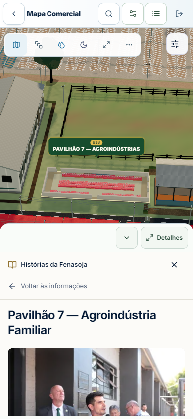

# Histórias da Fenasoja integradas ao mapa

Entrega validada em 6 de setembro de 2026, sobre origin/main em 33929757. A ação **Conhecer a história** está no painel de seleção de /mapa-comercial: **21 histórias em identidades existentes e nove fotografias verificadas**. Não foram criados prédios, marcadores ou dependências.

## Estruturas e pendências

O [catálogo de manutenção](historias-fenasoja-catalogo.md) relaciona todos os **51 itens editoriais**: 21 publicados, três incorporados a outras fichas e 27 pendentes. A [auditoria fotográfica](historias-fenasoja-imagens.md) e seu [JSON](historias-fenasoja-imagens.json) registram inspeção visual das 21 originais, procedência, créditos, EXIF, hashes, autorização e motivos para excluir as outras 12 imagens.

| ID existente | História integrada |
| --- | --- |
| G | Árvore Lunar e monumento Apollo 14 |
| B20 | Praça das Nações |
| C8 | Casa da Etnia Alemã |
| C6 | Casa da Etnia Italiana |
| C5 | Casa da Etnia Polonesa |
| C7 | Casa da Etnia Africana |
| B7 | Cozinha da Soja / Cozinha da Neca, Pavilhão 4 |
| B28 | Casa do Leite / Espaço do Cooperativismo |
| D5 | Casa do Núcleo de Criadores de Cavalos Crioulos |
| PISTA-CAMPEIRA | Pista Campeira |
| EXPORURAL | Setor Exporural |
| F | Arena Fenasoja |
| B13 | Palco Cultural Lactalis |
| B11 | Centro Administrativo e auditório |
| C1 | Centro de Eventos |
| C4 | Churrascaria da Exporural |
| D3 | Mirante |
| D2 | Via Expressa, área coberta de alimentação |
| A1 | Pórtico do Portão 1 |
| B10 | Pavilhão 7 e Praça Raízes da Terra |
| B2 | Pavilhão 14 |

O vínculo usa publicIdentifier exato em allowlist, inclusive com chave primária UUID. Entidades arquivadas, outros lotes e módulos internos não herdam histórias. H05 integra H04/G; H21 integra P07/B10; P04 remete a H14/B7. B9 mantém o conjunto existente dos pavilhões 6, 10 e 11.

Principais pendências: identidade física da Casa Fenasoja e sua relação com B12; restaurante noticiado em 2024 versus C1/C2; história individual de pavilhões; fotos sem identificação suficiente; estruturas retiradas do payload existente; divergência do dia do plantio da Árvore Lunar (13 ou 18 de agosto de 1981). A interface usa somente o mês confirmado. Texto comprovado está disponível sem foto.

As nove fotos foram incorporadas com base na autorização declarada pelo usuário nesta tarefa, **“Sim pode colocar as fotos”**. Titular patrimonial e documento emitido por ele não foram informados; continuam pendentes. A declaração não foi apresentada como licença pública institucional. Publicação e captura têm campos separados. Nenhuma imagem foi gerada, reconstruída ou retocada com IA.

## Integração e comportamento

O painel comercial permanece montado, conservando abas e ações. Voltar às informações restaura o foco no botão da história. No desktop, a história ocupa o painel lateral; no mobile, usa painel inferior de metade da altura e os controles existentes para recolher, restaurar e expandir. O estado expandido continua disponível para ler o conteúdo completo.

Galeria HTML com legenda, resumo, marcos, fontes e créditos; setas, teclado e swipe; sem autoplay. Ampliação com o diálogo existente, foco contido, Escape e fotografia inteira. Eventos de ponteiro, toque e roda dentro do painel não chegam ao mapa. Falhas de foto principal, miniatura, ampliação ou chunk editorial preservam o texto e a saída para as informações comerciais.

Texto e metadados fotográficos são carregados no chunk lazy HistoryView; o viewer é outro chunk. Somente a foto ativa é requisitada, com miniatura ativa/vizinha e respeito a saveData. A cena não recebe texturas dessa galeria DOM.

O hook compartilhado de apresentação suprime notificações de reenquadramento enquanto a história está aberta e durante o layout de fechamento. A guarda atravessa a entrega do ResizeObserver e é liberada após dois frames; nova seleção retoma imediatamente o comportamento correspondente. O wrapper comercial conserva a disposição horizontal no estado mobile recolhido. Não há alteração nos arquivos de Canvas, OrbitControls, shaders, geometria oficial, preços ou permissões.

## Capturas conferidas visualmente

Desktop, história no painel lateral:

Mobile, mapa visível acima do painel inferior:

[Mobile expandido](screenshots/historias-fenasoja/mobile-expandido.png) · [Marcos no mobile](screenshots/historias-fenasoja/marcos-mobile.png) · [Galeria](screenshots/historias-fenasoja/galeria-desktop.png) · [Fotografia completa](screenshots/historias-fenasoja/ampliacao-desktop.png) · [Sem foto](screenshots/historias-fenasoja/sem-foto-desktop.png) · [Falha HTTP](screenshots/historias-fenasoja/falha-foto-mobile.png) · [Comercial recolhido](screenshots/historias-fenasoja/comercial-recolhido-mobile.png).

Fluxo pela busca normal no **build de produção**: [desktop](screenshots/historias-fenasoja/producao-desktop.png) e [mobile](screenshots/historias-fenasoja/producao-mobile.png).

## Validações

- **99/99 testes em sete arquivos**, após os ajustes finais, em 23,12 s. Painel real, catálogo, seleção, navegação contextual, controles, legenda e independência do módulo.
- TypeScript da aplicação (npx tsc -p tsconfig.app.json --noEmit), ESLint dos arquivos alterados e git diff --check: aprovados.
- npm run build: aprovado em 58,55 s. Avisos existentes de chunks grandes e base Browserslist antiga permanecem.
- Browser em /mapa-comercial, Chrome Windows acelerado em Intel UHD, desktop 1366 × 768 e mobile emulado 390 × 844, DPR 1. Autenticação/organização sintéticas, dados oficiais de referência e todas as chamadas Supabase interceptadas; sem escrita na base real.
- Zero, uma e duas fotos; HTTP 404 mantendo texto; última seleção prevalecendo; foco restaurado; teclado/swipe e gestos sem mover a câmera. Larguras 360, 390 e 430 sem overflow horizontal. Painel half de 394 px sobre canvas de 788 px, sem redimensionar o canvas.
- Produção: busca B10, seleção pelo resultado normal, história, ampliação, Tab contido, Escape e retorno com busca preservada. Fotografias e chunks lazy carregaram corretamente. Os diagnósticos numéricos de câmera são exclusivos do modo instrumentado; produção registra cameraPreserved=null e não é usada como prova numérica.
- **Fechamento mobile half e expanded após a correção:** medição instrumentada, aguardando **1,8 s após fechar**, com posição, alvo, quaternion e offset iguais. Recolher/restaurar manteve título e controles acessíveis. O teste automatizado também confirma retomada do resize comercial e da próxima seleção.
- **12 ciclos após aquecimento:** desktop manteve 585 geometrias, 153 texturas e 171 programas; mobile manteve 573/152/169. Um canvas e um conjunto de controles; status ready, path post, zero perdas de contexto e nenhum lastErrorCode.

A sequência ampla de galeria/stress antecedeu o último ajuste do fechamento; os testes e smokes instrumentados half/expanded verificaram essa correção. A [evidência JSON](screenshots/historias-fenasoja/validation.json) conserva câmeras, contadores e waterfall. A [validação automatizada detalhada](historias-fenasoja-validacao-testes.md) separa falhas anteriores: antes do merge, 925 de 932 testes passaram; seis asserções também falharam na base antiga e um timeout não se reproduziu isoladamente. Uma asserção foi corrigida pelo upstream. A suíte ampla não foi repetida sobre o merge final; não se afirma aprovação integral.

Emulação Chrome Windows não certifica Safari/iOS, dispositivo físico, multitouch real, offline ou FPS sustentado. Service workers ficaram desabilitados para tornar a falha HTTP determinística. Permissões, preços e ações foram cobertos por fixtures; não foi realizada venda real.

## Carregamento antes e depois

Build base 33929757, mesma configuração e fixture em preview local. Soma corpos de resposta de JS/CSS em /assets/, excluindo fontes externas e script injetado pelo antivírus local. Uma amostra de carregamento, sem promessa de desempenho em outra rede.

| Medida inicial | Base | Funcionalidade |
| --- | ---: | ---: |
| Requisições JS/CSS da aplicação | 38 | 38 |
| Bytes dos corpos de resposta | 2.024.215 | 2.026.459 |
| Requisições de fotos históricas | 0 | 0 |
| Requisições HistoryView / HistoryImageViewer | 0 | 0 |

Diferença inicial: **2.244 bytes**, cerca de 0,11%. HistoryView: 38.591 bytes, 9.585 gzip; viewer: 1.136 bytes, 652 gzip. O chunk Three permaneceu idêntico (maps-three-eyBdhobD.js, 3.208.276 bytes). O pequeno history-*.js inicial é o ícone Lucide já presente na base.

Os 52 arquivos fotográficos somam 7.642.872 bytes no pacote de publicação, incluindo nove originais preservadas; não representam download inicial. O piloto B10 foi validado antes da expansão. Na rodada ampla, primeiras aberturas locais mediram 212 ms desktop e 107 ms mobile; não são SLA ou simulação de rede móvel.

## Reprodução

O [script de browser](../scripts/check-commercial-map-history.cjs) requer Playwright/Chrome no ambiente de QA, sem nova dependência no bundle. Para runtime externo, configure NODE_PATH para seu node_modules. Usa a VITE_SUPABASE_URL do .env local, intercepta chamadas ao respectivo domínio e aceita somente URLs locais.

    npm run build
    npm run preview -- --host 127.0.0.1 --port 4180
    # Em outro terminal:
    node scripts/check-commercial-map-history.cjs production http://127.0.0.1:4180/mapa-comercial --no-flow --production-smoke
    node scripts/check-commercial-map-history.cjs production http://127.0.0.1:4180/mapa-comercial --mobile --no-flow --production-smoke
    node scripts/check-commercial-map-history.cjs production-half http://127.0.0.1:4180/mapa-comercial --mobile --no-flow --production-smoke --half-close

Para a sequência ampliada, execute Vite em desenvolvimento e use rótulo final sem --no-flow. Nesse modo, somente a seleção de cenários usa o store DEV; o painel, a galeria e a cena são reais. Relatórios brutos ficam em artifacts/historias-fenasoja/.

As alterações locais prévias em supabase/functions/mcp/index.ts e artifacts/contextual-panel/ foram preservadas fora desta entrega.
