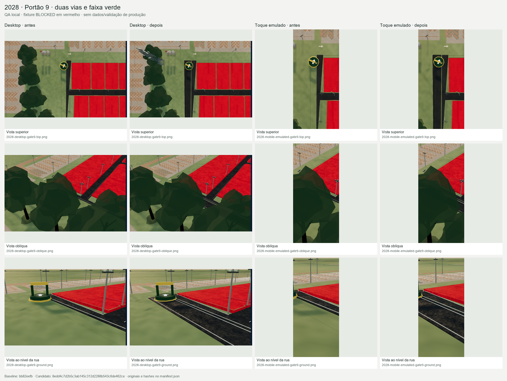
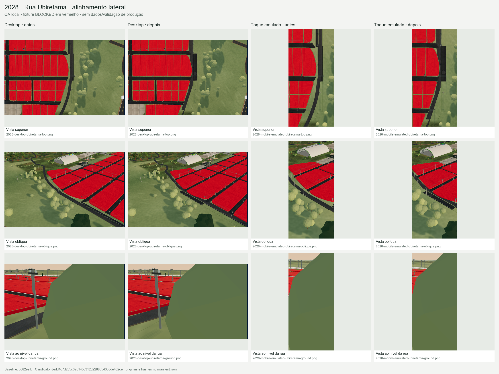
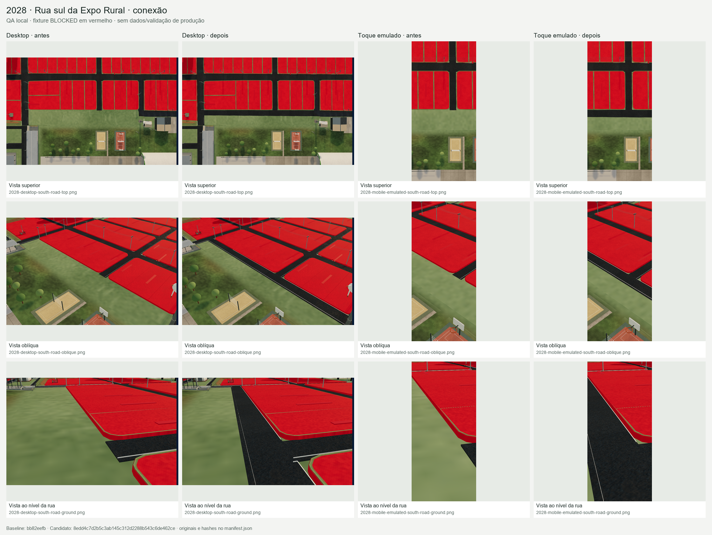
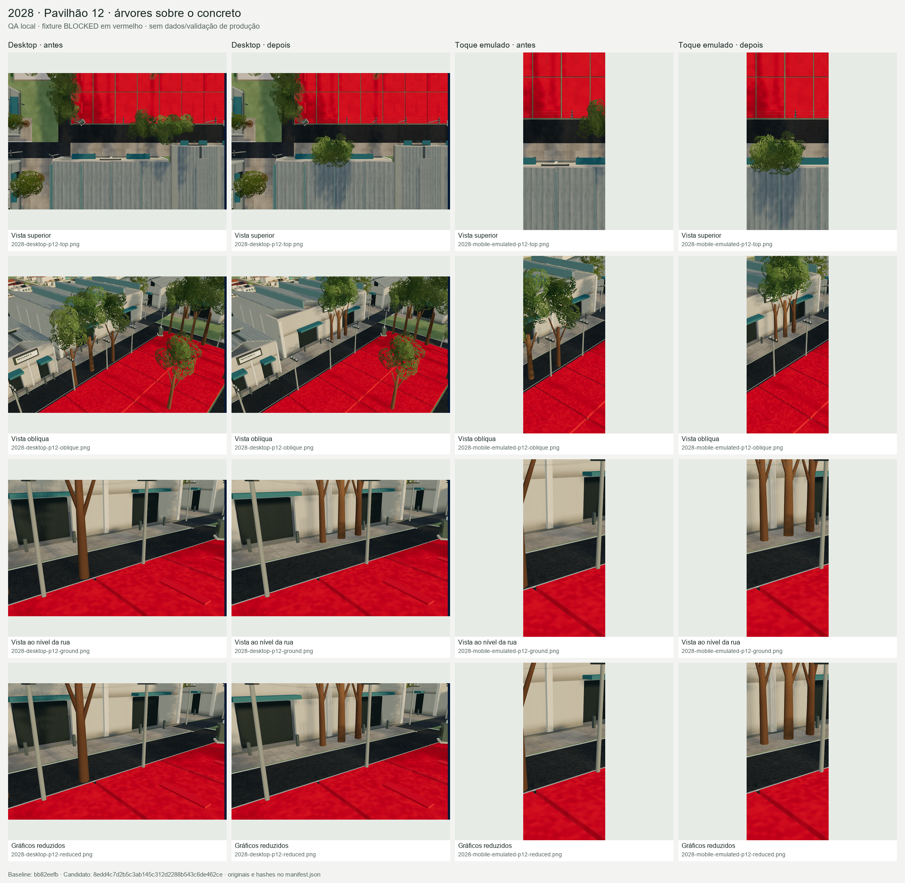
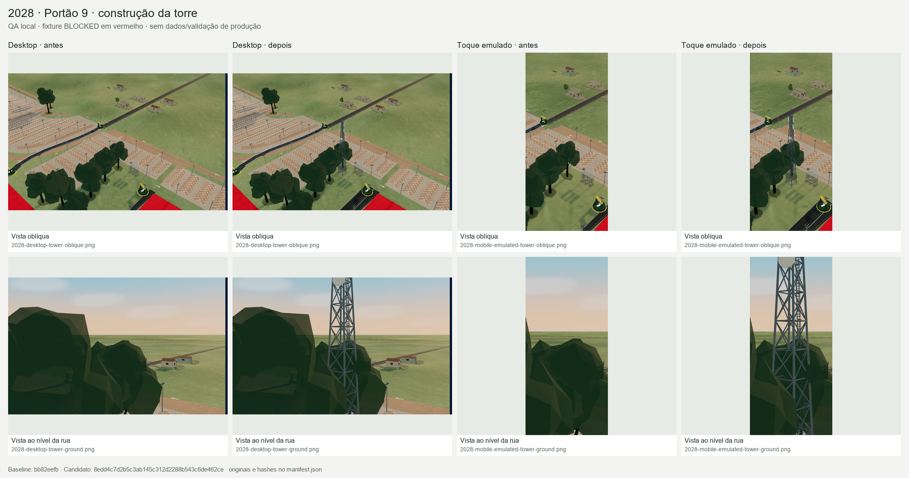
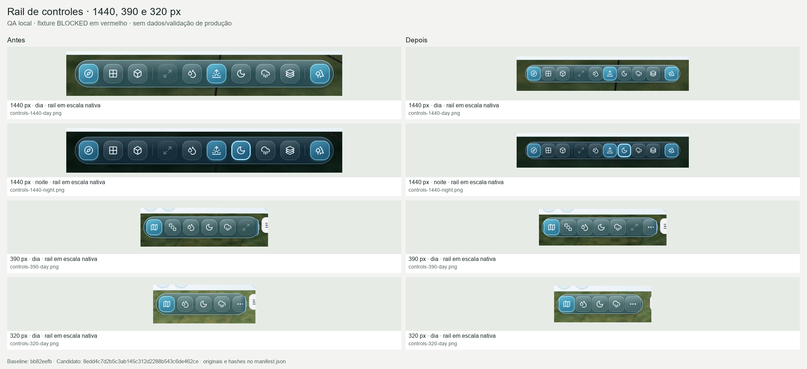
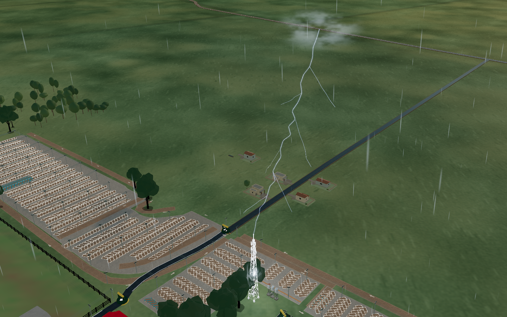
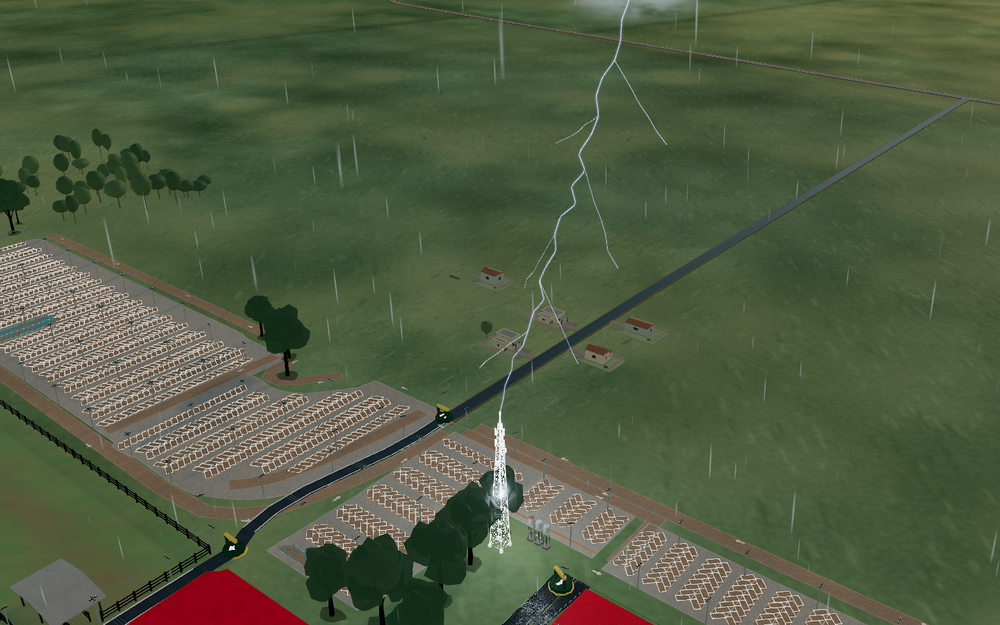

# Comparação visual local

QA local · fixture BLOCKED em vermelho · sem dados/validação de produção.

Baseline `bb82eefb`; commit candidato `8edd4c7d2b5c3ab145c312d2288b543c6de462ce`. Toque é emulação de Chromium, sem validação em dispositivo físico.

As folhas mantêm proporção e usam LANCZOS. A rail usa recortes registrados, em escala comum. Os originais não são movidos nem alterados por este script.

[Manifesto completo de fontes e SHA-256](manifest.json)

## 2028 · Portão 9 · duas vias e faixa verde



## 2028 · Rua Ubiretama · alinhamento lateral



## 2028 · Rua sul da Expo Rural · conexão



## 2028 · Pavilhão 12 · árvores sobre o concreto



## 2028 · Portão 9 · construção da torre



## Rail de controles · 1440, 390 e 320 px



## Raio real · nuvem, contato e torre iluminada



## Raio real · gráficos reduzidos



A vista ao nível da rua de Ubiretama tem obstrução parcial por copa existente. O alinhamento é legível nas vistas superior/oblíqua e verificado pelos testes de geometria e suporte físico.

## Reprodução

```powershell
& 'C:/Users/Leonardo/.cache/codex-runtimes/codex-primary-runtime/dependencies/python/python.exe' scripts/access-spatial-correction/gallery.py
```

Após arquivar os originais, acrescente `--source-root <diretório-do-arquivo>`. Os relatórios `before/controls.json` e `after/controls.json` são buscados nos docs quando não existem no arquivo externo; outro local pode ser passado com `--reports-root`. Para registrar o commit final, acrescente `--candidate-commit <sha>`.
