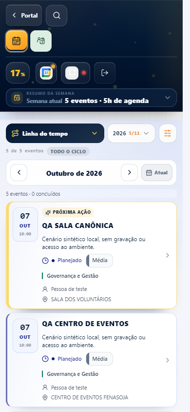
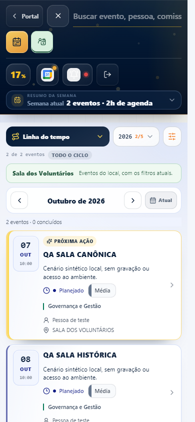
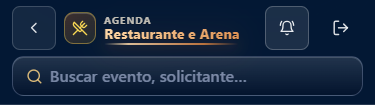
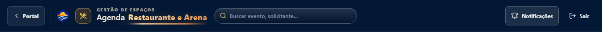

# Cabeçalhos das agendas: organização responsiva e notificações

Referência revalidada em 06/10/2026: `88993b2475d7eab0f59860dfc5cdb05633eba84e`, igual ao `origin/main` observado antes da implementação. Os três prints fornecidos mostram os modos afastados do Portal, a lupa no extremo direito e o skip link exposto acima do cabeçalho.

## Correção

- `CronogramaModuleShell.tsx`: coloca a busca compacta imediatamente após o Portal na ordem do documento.
- `MobileSearchToggle.tsx`: usa um único campo compacto na primeira linha; a lupa vira o botão de fechar durante a expansão. Enter, Escape e o botão de fechar devolvem o foco sem pedir rolagem. Texto, debounce e limpeza continuam no contexto existente.
- `cronograma-command-layer.css`: até 1023 px, organiza Portal/busca na primeira linha e os dois modos na segunda, alinhados à esquerda. Ações auxiliares ocupam outro grupo, com separador e quebra normal. O skip link da Agenda usa clipping quando inativo e aparece somente em `:focus-visible`.
- `cronograma-mobile-refit.css`: remove o posicionamento absoluto e o card da busca. O campo usa apenas uma linha inferior e fonte de 16 px.

`CronogramaHeaderSearch.tsx`, `cronograma-refino.css` e `index.css` foram inspecionados. A busca desktop e a regra global dos outros skip links permanecem como na referência.

O usuário também solicitou a correção das notificações da **Agenda Restaurante e Arena**, em desktop e mobile, nesta mesma PR. `VenueNotificationsButton.tsx` recebe uma classe própria; `venue-events-shell.css` define texto claro, borda e fundo discretos no estado normal, alvo de 44 px e indicação de foco. O `ghost` global usava texto escuro sobre a barra azul e ganhava fundo claro somente no hover, causando a aparência de botão escondido. Não foi necessário alterar camadas ou z-index.

O diff da aplicação limita-se a esses seis arquivos. Rotas, filtros, eventos, permissões, abertura do painel de notificações, assinaturas push/Google, Restaurante, Supabase e fluxos de dados estão preservados.

## Evidência

O runner usa componentes e estilos reais, com a fixture sintética identificada como QA do harness existente. Hooks e requisições externas são interceptados; nenhuma sessão de produção foi utilizada.

As medições comparam os limites reais de links, botões e inputs visíveis, além das regiões de modos, ações, busca e conteúdo. Ausência de overflow é uma verificação adicional.

Larguras: 320, 360, 390, 430, 640, 767, 768, 820, 1023, 1024, 1280 e 1366 px. Os dois modos são conferidos com busca fechada e aberta. O runner também exercita foco, Tab, Enter, Escape, limpeza, preservação de texto e modo, filtro, rolagem/retorno ao topo, viewport reduzido e mudança de orientação.

Resultados detalhados: [depois](evidence/after/browser-report.json) e [referência desktop](evidence/baseline/browser-report.json).

- Agenda Fenasoja: **641/641 verificações** passaram. As 12 comparações de cabeçalho desktop (1024, 1280 e 1366 px, ambos os modos e busca normal/com foco) tiveram **zero pixels alterados** e a mesma geometria dos controles.
- Testes focados da Agenda: **34/34** passaram em quatro arquivos.
- Testes adicionais do Restaurante/Arena: `venueNotifications.test.ts` passou (2/2). `venueEventsPresentation.test.ts` teve 7/10 passando; as mesmas três falhas foram reproduzidas no checkout limpo de referência. Elas verificam navegação, marcação do seletor e etapas do formulário, arquivos preservados nesta alteração. [Resumo da reprodução na referência](baseline-venue-unit.json).
- TypeScript e ESLint dos componentes/configuração alterados passaram.
- Build de produção da versão final passou em 1 min 23 s, com os avisos existentes de Browserslist e tamanho de chunks.
- Foco da busca compacta: **129/129 verificações adicionais** passaram, incluindo sublinhado de 2 px com foco visível e 1 px inativo, sem mudança de altura. [Relatório](evidence/focus/browser-report.json).
- Notificações do Restaurante/Arena: **212/212 verificações** passaram em 320, 390, 768, 1024 e 1366 px, nos temas claro e escuro. Estados normal, hover e foco, toque, Enter, abertura do painel, Escape e retorno de foco foram conferidos. O contraste normal no tema claro passou de **1,00:1 para pelo menos 11,66:1**; o alvo passou de 36 para 44 px. `elementFromPoint` confirma que o botão e o painel não estão cobertos, e as caixas dos controles não se cruzam. [Relatório](evidence/venue/after/browser-report.json) · [Comparação](evidence/venue/baseline-comparison.json).

Os runners não registraram erros JavaScript nem tentativas de escrita externa nas verificações finais.

### Limite herdado do desktop em 1024 px

Na referência, os seletores de modo já se cruzam com o resumo semanal em 1024 px, nos dados da fixture. A comparação preserva essa geometria; a correção responsiva termina em 1023 px conforme o escopo de manter o desktop igual. Esse cruzamento não é apresentado como resolvido. Os relatórios distinguem essa ocorrência das verificações de ausência de interseção nas larguras corrigidas.

### Limites da reprodução

O Chrome local permite verificar teclado físico por eventos, viewport reduzido, orientação e rolagem normal. A redução de altura simula o espaço disponível quando o teclado virtual abre, mas não comprova o comportamento de um teclado real de celular. Um wheel para cima no topo também não reproduz o gesto físico de puxar ou o overscroll elástico do Safari/iPhone. Esses comportamentos não foram validados em aparelho físico. A ocultação foi conferida pelo clipping calculado e pela navegação com foco visível; a rolagem global não foi desativada.

## Capturas

Mobile em 390 px, Agenda geral:

Mobile em 390 px, busca compacta aberta na Sala dos Voluntários:

[320 px](evidence/after/320-general-open.png) · [767 px](evidence/after/767-general-open-header.png) · [768 px](evidence/after/768-room-open.png) · [1023 px](evidence/after/1023-general-open.png)

Desktop: [1024 px antes](evidence/baseline/1024-general-closed-header.png) / [depois](evidence/after/1024-general-closed-header.png), [1366 px antes](evidence/baseline/1366-general-closed-header.png) / [depois](evidence/after/1366-general-closed-header.png).

Notificações do Restaurante/Arena, estado normal sem hover:

## Reprodução

Iniciar o servidor local com `npx vite --config scripts/agenda-header/qa.vite.config.ts` e executar `node scripts/agenda-header/browser-qa.cjs` com Playwright e pngjs disponíveis. `PLAYWRIGHT_MODULE` e `PNGJS_MODULE` aceitam os caminhos dos módulos do runtime local.

O runner intercepta a página de teste; nenhuma rota foi adicionada à aplicação. Para a referência, usar `AGENDA_QA_SOURCE_ROOT` apontando para um checkout limpo do commit acima, `AGENDA_QA_PHASE=baseline`, `AGENDA_QA_PORT=5199` no servidor e `AGENDA_QA_BASE=http://127.0.0.1:5199` no runner. Depois, executar a fase `after` no worktree corrigido, porta 5200. Os caches do Vite ficam separados por checkout.

Para conferir as notificações, usar o mesmo servidor e executar `node scripts/agenda-header/venue-qa.cjs`. Esse segundo harness monta o shell e o painel reais com os estilos completos do módulo e intercepta apenas autenticação/capabilities/settings/push/Google para manter o cenário local e sem gravação.
