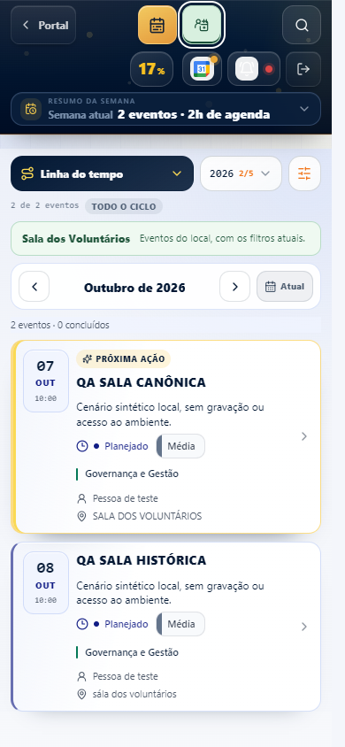

# Agenda Fenasoja: Sala dos Voluntários e pedidos do Restaurante

Referência auditada: `9e3dd24513045a55c861cc2094221ba5738f2cdf`. A implementação conserva as rotas, a consulta da agenda autorizada, os pontos de gravação e o domínio operacional existentes. Nenhum evento real foi criado, editado, aprovado ou cancelado durante a validação.

## Interface e recorte

`CronogramaModuleShell`, `CronogramaAgendaModeControls`, `CronogramaAgendaModeContext`, `CronogramaEventosPage` e `cronograma-command-layer.css` introduzem dois modos. Uma visita começa em Agenda geral. A Sala dos Voluntários usa um botão verde somente com ícone de pessoa/calendário de aproximadamente 17 px, área de toque de 44 px, tooltip, nome acessível, foco e `aria-pressed`.

`cronograma-agenda-mode.ts` compara o código canônico primeiro. Somente sem código aceita o nome completo normalizado por espaços, caixa e acentuação. Um código explícito diferente impede a correspondência. Não há categorias adicionais nem busca por partes do nome.

O recorte é aplicado aos registros já autorizados antes das partições, estatísticas, opções e visualizações. Linha do tempo, calendário, histórico, pendências, dashboard e resumo semanal compartilham esse universo, preservando as regras específicas de cada tela. Busca, filtros e posição temporal permanecem ao trocar o modo. Detalhes autorizados de outro local exibem um aviso; o formulário continua montado, preservando alterações não salvas.

## Relação persistente e gravação

A migração `20261006120000_cronograma_restaurant_bridge.sql` prepara:

| Estrutura | Finalidade |
| --- | --- |
| `agenda_private.cronograma_restaurant_config` | Organização, UUID do responsável, ativação explícita e revisão da configuração. Não recebe contas nem ativação automaticamente. |
| `agenda_private.cronograma_restaurant_links` | Chave única `(org_id, source_event_id)`, ID único do pedido, origem, revisão, snapshot mínimo e marcas de desligamento/exclusão. Preserva histórico após excluir a origem. |
| Colunas `venue_events.cronograma_source_*` | Identificação e apresentação da origem dentro da consulta existente do Restaurante, com unicidade por organização/origem. |
| Contextos privados de transação | Validam a passagem pelos gravadores existentes; flags ou parâmetros fornecidos pelo cliente não concedem esse privilégio. |

`cronograma_save_event` mantém seu nome e sua transação. O trigger privado cria/atualiza o pedido no único espaço ativo `restaurante-fenasoja`, tipo `restaurante`, com unidade de reserva ativa. Uma invariável diferida impede adicionar Arena ou outra alocação ao pedido vinculado. Se autoria, configuração, destino ou regras operacionais falham, toda a gravação é revertida, incluindo a origem e o recibo de replay.

`cronograma_delete_event` recebe uma versão opcional no mesmo ponto de entrada; o cliente envia a versão exibida. `cronograma_restaurant_alert` recebe o ID opcional da origem para excluir seu próprio pedido do alerta, com validação de visibilidade. A janela consultiva e a ocultação de detalhes existentes são preservadas. A consulta existente da agenda de comissão devolve localização, identidade e versão no mesmo snapshot; sua permissão de execução pública continua revogada. Criação da origem de comissão e encaminhamento passam a ocorrer em uma única gravação.

Não foram criadas rotas, endpoints HTTP, Edge Functions ou novas RPCs públicas. Inserções/importações diretas do Centro e escritas diretas em registros vinculados falham com orientação para usar a gravação versionada existente. O preenchimento automático da planilha não encaminha eventos históricos do Centro; não existe backfill nesta entrega.

## Idempotência, autoria e aprovação

O formulário mantém um `source_key` UUID durante correções/reenvios. `cronograma-rpc.ts` conserva o UUID da mesma submissão após resposta incerta e compartilha a requisição em andamento entre cliques repetidos. No servidor, o registro existente `venue_mutation_receipts` guarda operação, ator, organização, chave, fingerprint e resultado durável. Outra carga com a mesma chave é rejeitada. A mesma origem com outra tentativa sem a versão esperada não cria uma segunda origem. Formulários novos independentes representam submissões distintas; título, data e solicitante nunca são usados como chave de deduplicação.

As gravações usam locks transacionais e versões da origem/destino. Duas abas editando a mesma identidade não podem sobrescrever silenciosamente uma revisão. Replay revalida permissões atuais; eventos excluídos não podem ressurgir sob outra chave de requisição.

`created_by` e `requester_user_id` do Restaurante vêm do criador original verificado na organização. Uma edição posterior registra seu ator em `updated_by`/auditoria e mantém o criador. O responsável configurado não se torna criador artificial.

Um período completo válido produz `status='solicitado'`, `approval_status='pendente'`. Informações incompletas produzem `pendente_informacoes` e aprovação pendente, com timestamps ausentes; o snapshot conserva a informação parcial. Intervalos de vários dias e virada de dia são tratados sem horários inventados. Pedidos pendentes não bloqueiam disponibilidade; a ocupação só segue a aprovação do Restaurante existente.

A transição de análise/aprovação/confirmação dos pedidos vinculados exige, também no servidor, a conta configurada ativa e as permissões existentes. Não há substituto administrativo automático. A aprovação de eventos não vinculados mantém seu contrato. Aprovar no Restaurante não altera o estado da Agenda nem cria outra origem.

## Propriedade dos campos e ciclo de vida

A Agenda mantém título, período e local. O snapshot contém apenas título, datas, horários, local e precisão de data. Descrição privada, anexos e participantes não são copiados. O Restaurante mantém dados operacionais, financeiros, montagem/desmontagem, recursos, checklist e validação. Os campos espelhados ficam protegidos na interface e no banco; o detalhe do destino informa origem e solicitante e oferece o link da rota existente quando o usuário tem acesso à Agenda.

Alterações materiais de título/período/recursos invalidam aprovação anterior conforme o contrato existente. Mudanças de descrição privada e apresentação equivalente do local não apagam aprovação nem dados operacionais. Os intervalos de montagem/desmontagem editados no Restaurante acompanham mudanças de data. Checklist reutiliza a reconciliação atual, preservando itens concluídos e dispensados.

Retirar o local, cancelar ou excluir a origem cancela apenas pedidos cuja operação permite essa reconciliação, libera suas ocupações e preserva aprovação, auditoria, dados operacionais e tombstone. Operações confirmadas, em preparação, em execução ou concluídas bloqueiam mudanças materiais/exclusão da origem e pedem regularização no Restaurante. O destino vinculado não pode ser apagado diretamente. Reativar um pedido cancelado exige reconciliação explícita; não há reativação silenciosa.

## Configuração antes da produção

A migração está preparada, sem aplicação remota. Nenhuma conta de Roque foi escolhida, criada ou recebeu permissões. A grafia de um perfil ou uma foto não comprova identidade.

`scripts/agenda-restaurant/responsible-preflight.sql` é somente leitura e exige o UUID explícito da organização. Ele lista todas as candidaturas ativas com os nomes informados, suas permissões existentes, destinos e configuração. Não usa `LIMIT 1`, não resolve duplicatas e não configura automaticamente ninguém. O UUID deve ser confirmado com evidência da conta correta de Roque e do vínculo ativo com a organização.

Depois de revisar/aplicar a migração em um ambiente autorizado, registrar a configuração privada por operação administrativa auditada, com UUIDs verificados de organização, responsável e administrador autor, revisão e ativação explícita. O servidor verifica o administrador ativo informado, mantém revisão/data e audita alterações/exclusões com o mecanismo existente. A ativação verifica imediatamente o responsável e suas permissões de acesso/aprovação; as gravações/transições voltam a verificá-las. Confirmar também o espaço e unidade ativos. A entrega não concede essas permissões. Com configuração ausente/inativa ou inválida, salvar no Centro falha integralmente com mensagem útil e campos preservados. Essa dependência precisa ser resolvida antes de liberar o fluxo em produção.

As filas, notificações, auditoria e sincronização Google existentes são mantidas. Efeitos do frontend são disparados depois da gravação confirmada, e replay não cria outra alteração no banco. Não foram conectadas contas, ativadas assinaturas ou testadas entregas externas em nome de Roque.

## Validação e reprodução

- TypeScript: `npm run typecheck` passou.
- Testes focados: 104/104 passaram em onze arquivos, cobrindo modos, RPC/retry, domínio Restaurante, formulário, comissão, resumo semanal, períodos, agregações e proteção contra backfill automático.
- ESLint dos arquivos TypeScript alterados: zero erros, quatro avisos (Fast Refresh e dependências de efeito existentes).
- Navegador Chrome local: 58 verificações passaram em 1366, 768, 390 e 320 px, com os componentes e estilos reais e dados sintéticos autorizados/interceptados. Recorte exato, busca, troca de modo, teclado, Portal, alvo de 44 px, ausência de overflow e partições foram verificados. Nenhuma escrita externa foi tentada. O navegador bloqueou o WebSocket de HMR do Vite; não ocorreram erros de execução da aplicação.
- PostgreSQL 16 local: 65 asserções passaram sobre instalação/reaplicação, transações, replay, rollback, autoria, permissões, datas, proteção operacional, comissão, configuração e preservação de histórico. Foram usadas funções reais existentes com pré-requisitos sintéticos.
- Concorrência: sete verificações passaram com conexões PostgreSQL separadas, incluindo duas requisições da mesma submissão, duas tentativas com identidade de origem compartilhada, edições concorrentes e corrida entre edição/exclusão. Exatamente uma origem, destino e receipt foram gravados para a submissão repetida.
- Build: passou. Detalhes finais estão em `evidence/validation-summary.json`. O workflow `Agenda and Restaurant` repete os contratos focados e SQL/concorrência em PostgreSQL 16 isolado no CI.

Para o banco local isolado, preparar o runtime portátil já utilizado por `scripts/dashboard/db-smoke-runtime.py` e executar, a partir da raiz:

```powershell
./scripts/agenda-restaurant/db-run.ps1 `
  -SchemaPath scripts/agenda-restaurant/db-fixture.sql `
  -MigrationPath supabase/migrations/20261006120000_cronograma_restaurant_bridge.sql `
  -TestPath supabase/tests/cronograma_restaurant_bridge.test.sql `
  -ConcurrencyScript scripts/agenda-restaurant/db-concurrency.cjs
```

O runner aceita somente runtime dentro de `.git`, inicia uma base nova na interface loopback e encerra o processo ao concluir. A fixture modela autenticação/capabilities/visibilidade e usa as implementações existentes de save/transição/alocação/replay. Relações de responsáveis não vazias não são simuladas como sucesso. Essa fixture não comprova RLS, permissões, filas ou configuração do banco remoto.

Para a inspeção visual, iniciar `npx vite --config scripts/agenda-restaurant/qa.vite.config.ts`, disponibilizar Playwright e executar `node scripts/agenda-restaurant/browser-qa.cjs`. A página do teste é interceptada pelo runner; não foi adicionada à navegação da aplicação. Capturas e relatório estão em `evidence/`.

Falhas herdadas dos testes antigos foram separadas das verificações focadas. O cronograma de planilha tem duas expectativas de contagem divergentes; os testes antigos da timeline têm doze falhas de seletores/contexto confirmadas na referência. A evidência do dashboard registra a comparação de sua expectativa antiga. Isso não equivale a uma suíte completa verde.

Pendências do ambiente: migração/configuração autorizadas, validação da conta correta, teste autenticado das políticas remotas, entrega de notificações/Google, CI da PR e dispositivos físicos. Build, fixture SQL e navegador emulado não demonstram publicação ou operação em produção.

## Evidência visual



