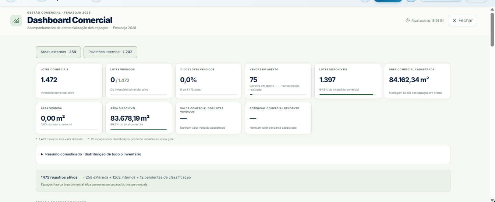
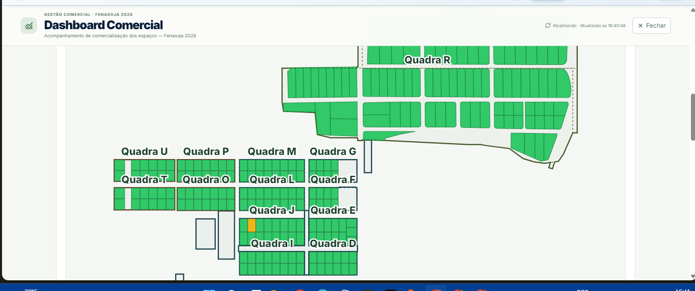
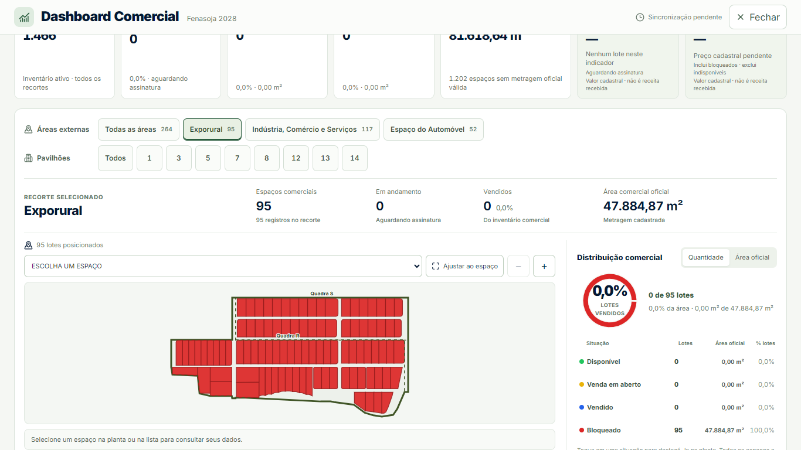
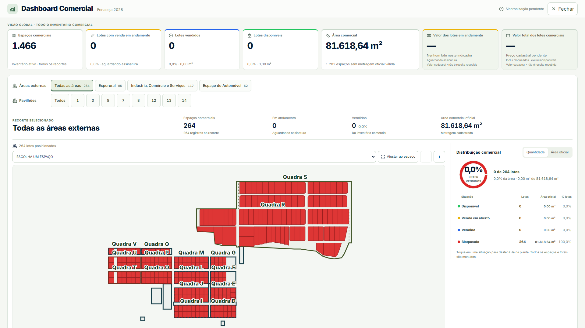
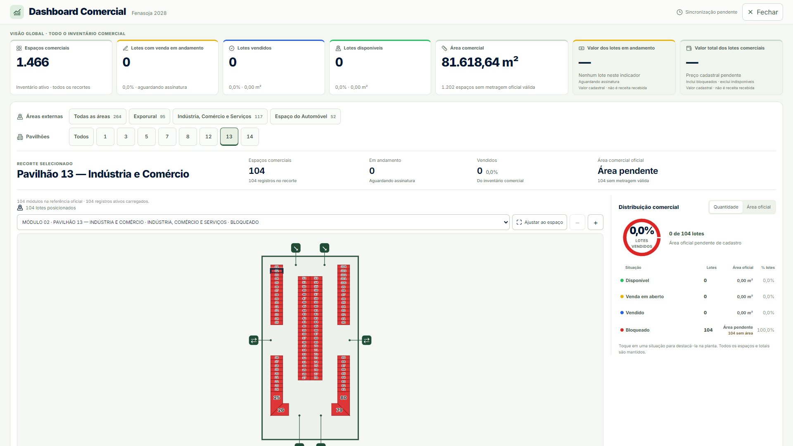
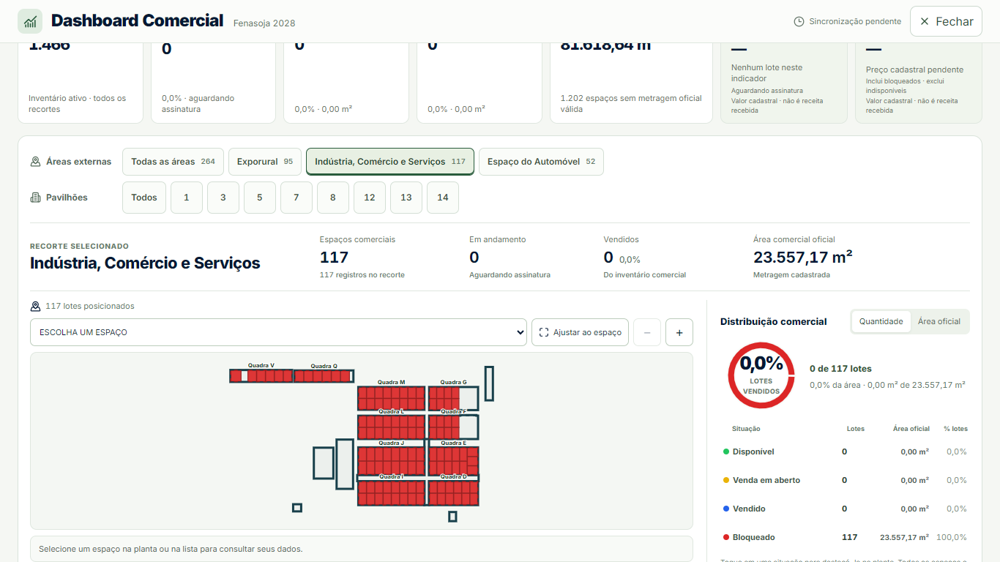

# Dashboard Comercial integrada — Fenasoja 2028

Implementação de 01/10/2026 sobre `28c23790`. A composição ativa continua em `CommercialDashboard` e `CommercialDashboardSpaces`, no overlay existente do Mapa Comercial.

## Fontes e regras preservadas

- A dashboard continua recebendo `data.entities`, `data.lots`, `dataUpdatedAt` e `isFetching` do fluxo existente. `buildCommercialDashboardSnapshot` é a única origem das agregações globais e dos recortes. Não foram criados endpoint, RPC, tabela, consulta paralela de inventário ou rota de navegação.
- O indicador “Lotes com venda em andamento” usa `saleOpenLots`: lotes distintos com status `SALE_OPEN`. Continua ao lado dos vendidos, com o amarelo comercial e a informação “aguardando assinatura”. Reservas, negociações, pedidos e parcelas não se tornam vendas por aproximação.
- A seleção visual resolve um único agregado do snapshot para mapa, resumo, gráfico e legenda. Destaque de situação altera opacidade; mantém os outros lotes e os totais. Quantidade e área oficial usam seus denominadores existentes; indisponíveis têm linha própria, fora dos percentuais comerciais.
- A área usa somente a metragem oficial válida. Ausência de área ou geometria permanece identificada, sem usar a área do desenho como cadastro. Todos os registros do recorte continuam no seletor, mesmo sem geometria desenhável.
- Pavilhão 13 participa do mesmo seletor dos demais pavilhões, com sua denominação oficial e identidade técnica B5. A planta usa os módulos carregados e não cria módulos para completar a referência.
- A confirmação fornecida pelo usuário para os 12 espaços das quadras Q e V foi incorporada ao registro compartilhado de Indústria, Comércio e Serviços. Os mesmos espaços continuam no consolidado; apenas sua associação externa passa a ser confirmada. Outros registros eventualmente sem classificação continuam acessíveis em “Classificação pendente”.
- Conforme o pedido financeiro posterior do usuário, dois cards globais dedicados mostram “Valor dos lotes em andamento” e “Valor total dos lotes comerciais”. Reutilizam `overall.saleOpenValue` e `overall.totalKnownValue`, com a cobertura de preços já presente no snapshot. O primeiro soma somente lotes `SALE_OPEN`; o segundo soma os valores cadastrais conhecidos de todo o inventário comercial ativo, incluindo os demais estados comerciais e excluindo `UNAVAILABLE`. Valores parciais são identificados como subtotal e informam quantos lotes têm preço. Ausência de preços exibe “—”; preço cadastrado zero continua um valor válido. Ambos deixam explícito “Valor cadastral · não é receita recebida”.
- A distribuição financeira independente, o valor cadastral de vendidos e as repetições financeiras por segmento/pavilhão/pendências foram removidos. Os preços e cálculos continuam no modelo existente e um preço cadastral válido também pode aparecer na ficha do espaço selecionado.

## Composição e enquadramento

Cabeçalho único com evento, atualização e fechamento; cinco indicadores comerciais globais e os dois cards cadastrais solicitados; um painel de recorte com seleção externa/pavilhão, resumo, mapa, distribuição e legenda. Conferência e comparação externa ficam em acessos secundários.

`CommercialMiniMap` continua SVG. O modo inicial “Ajustar ao espaço” usa o contêiner real, viewBox calculado com lotes, perímetros, identificações e acessos, margem de segurança e `preserveAspectRatio="xMidYMid meet"`. Zoom e deslocamento são de inspeção. Abrir, mudar recorte, redimensionar e acionar “Ajustar ao espaço” restauram a vista completa e a rolagem inicial.

Fechar e Escape continuam nos handlers da página existente, preservando a seleção e os comandos de câmera e devolvendo foco a Gestão. “Ver no mapa” continua usando o callback original, inclusive entrada interna e módulo do Pavilhão 13. Nenhum Canvas ou renderer adicional foi criado.

## Prints comparativos

As imagens “antes” são os arquivos fornecidos pelo usuário, copiados sem edição. As imagens “depois” são capturas locais da rota DEV existente com a referência oficial carregada pelo projeto. **São evidências de composição, não uma comparação dos mesmos dados de produção.** A referência local tem campos comerciais/áreas ausentes e estados que diferem dos prints enviados; esses campos não foram fabricados para reproduzir os números ou cores dos prints.

| Primeira tela — referência fornecida | Primeira tela — implementação local |
| --- | --- |
|  |  |

| Mapa externo — referência fornecida | Exporural selecionado — implementação local |
| --- | --- |
|  |  |








## Browser: execução reproduzível

O script existente `scripts/dashboard/browser-smoke.cjs` foi atualizado para desktop 1920×1080, notebook 1366×768, celular emulado 390×844 e celular compacto emulado 320×740. Usa `OFFICIAL_REFERENCE_DATA` pela rota `/__dev/commercial-map-interface`; analytics é habilitado somente na resposta interceptada pelo navegador do teste. Outra página usa as permissões read-only originais e confirma que a dashboard não fica disponível.

```powershell
npm run dev -- --host 127.0.0.1 --port 5189 --strictPort

# Em outro terminal; use o caminho do Playwright instalado no ambiente.
$env:PLAYWRIGHT_MODULE = 'C:/Users/Leonardo/.cache/codex-runtimes/codex-primary-runtime/dependencies/node/node_modules/playwright'
node scripts/dashboard/browser-smoke.cjs

# Opcional para investigar uma dimensão:
$env:DASHBOARD_VIEWPORTS = 'notebook'
node scripts/dashboard/browser-smoke.cjs
```

O script calcula os valores esperados a partir da referência atual; não fixa os números dos prints. Os JSONs por viewport registram contagens, áreas, denominadores, extensão SVG, tamanho/rolagem do painel, acessos, numeração, integridade de Canvas, erros JavaScript e tempos locais por recorte.

Cobertura: primeira abertura; três segmentos; todos os oito pavilhões incluindo B5; recortes consolidados; pendências quando existentes; seleção por teclado; distribuição por quantidade/área; destaque ligado ao mapa sem exclusão; zoom; reset; troca de recorte após zoom; resize; fechamento; Escape; retorno de foco; preservação dos comandos de câmera/seleção; callback original “Ver no mapa”; permissão read-only.

Os asserts comparam `getBBox()` do conteúdo SVG com `viewBox` e confirmam `scrollWidth <= clientWidth` e `scrollHeight <= clientHeight` no modo ajustado. As imagens continuam necessárias para conferir leitura e proporção, além da ausência de clipping geométrico.

Execução final aprovada nas quatro dimensões, com **13 recortes por dimensão (52 verificações espaciais)**: todas as áreas externas, três segmentos, oito pavilhões e todos os pavilhões. Todas as plantas começaram ajustadas, sem rolagem interna obrigatória em nenhum eixo e com todo o conteúdo SVG contido no viewBox.

| Viewport | Largura / scrollWidth da dashboard | Maior overflow da planta ajustada | Canvas | Erros JavaScript |
| --- | --- | --- | --- | --- |
| 1920×1080 | 1920 / 1920 px | 0 px horizontal e vertical | Mesmo Canvas, 1 | 0 |
| 1366×768 | 1366 / 1366 px | 0 px horizontal e vertical | Mesmo Canvas, 1 | 0 |
| 390×844 | 390 / 390 px | 0 px horizontal e vertical | Mesmo Canvas, 1 | 0 |
| 320×740 | 320 / 320 px | 0 px horizontal e vertical | Mesmo Canvas, 1 | 0 |

Nas quatro execuções: `status=ready`, `contextLosses=0`, `lastErrorCode=null`; botões de pavilhão com largura e altura mínimas de 44 px. Fechar e Escape passaram com restauração de foco e preservação dos comandos de câmera/seleção. A página sem analytics apresentou zero botões e zero dialogs de Dashboard Comercial (`permissions-browser.json`).

A página mantém rolagem vertical para acomodar os sete indicadores, o painel e os acessos secundários. Em celular os elementos são empilhados; no notebook parte do painel fica abaixo da primeira dobra. O enquadramento completo refere-se ao conteúdo de cada painel SVG, que começa ajustado sem exigir zoom ou rolagem interna para revelar a planta.

A fixture final reconcilia **1.466 = 264 externos + 1.202 internos + 0 pendentes** e contém **104 registros ativos em B5/Pavilhão 13**. São valores observados nesta referência, não constantes da UI nem números confirmados no banco publicado. Nesta fixture, `SALE_OPEN`, `SOLD`, `UNAVAILABLE` e lotes com preço cadastrado têm contagem zero. Cenários positivos desses estados, dinheiro cadastral parcial/zero/ausente e denominadores são comprovados pelos testes de domínio e React, sem alterar a referência para os screenshots.

## Checks da implementação

**124 testes passaram em 16 arquivos**, conforme `focused-tests.log`. A suite inclui dashboard, consulta compartilhada, atualização, classificação, identidade, pavilhões/acessos, estados comerciais, dinheiro/área, permissões de escopo e geometria. Typecheck, ESLint focado, `git diff --check` e build passaram. O build mantém os avisos preexistentes de tamanho de chunks e Browserslist; o tempo local registrado foi 5 min 38 s, com outros checks concorrentes, sem pretensão de benchmark.

```powershell
npx vitest run --maxWorkers=2 --testTimeout=15000 src/test/commercialDashboard src/test/commercialMapSegments.test.ts src/test/commercialLotIdentity.test.ts src/test/commercialMapPavilionWayfinding.test.ts src/test/commercialMapPavilion7OfficialLayout.test.ts src/test/commercialMapSharedQuery.test.ts src/test/restrictedScope.test.ts src/test/commercialMapGateFourDistrict.test.ts src/test/commercialMapInteraction.test.ts src/test/commercialMapSegmentLegend.test.tsx
npm run typecheck
npx eslint src/features/commercial-map/dashboard src/features/commercial-map/data/commercialMapSegments.ts src/test/commercialDashboardPresentation.test.tsx src/test/commercialDashboardSpaces.test.tsx src/test/commercialDashboardMiniMap.test.tsx src/test/commercialDashboardScopes.test.ts src/test/commercialMapSegments.test.ts
npm run build
git diff --check
```

O check de geração do catálogo espacial também passou: 22 edifícios, 111 árvores, 2 patches de vegetação e 57 ruas. Os arquivos `focused-tests.log`, `typecheck.log`, `lint.log`, `build.log` e `baseline-reference.log` preservam a evidência dos checks locais.

Uma verificação adicional de `commercialMap2026Reference.test.ts` passou em 11 de 13 testes. Os dois testes de sanitários falham porque esperam zero entidades `RESTROOM`, mas a referência existente contém E-07. As mesmas falhas foram reproduzidas com o registro de segmentos da base `28c23790`, conforme `baseline-reference.log`. A referência e esses testes não foram alterados para esta dashboard.

## Limites da evidência

Chrome headless local em Windows/ANGLE D3D11, DPR 1. As dimensões móveis são emulação e não evidência de dispositivo físico ou Safari. A referência DEV não consulta o inventário publicado nem comprova preços/status/áreas/contagens de produção. Atualização e paginação são cobertas pelos testes existentes do fluxo; não se afirma sincronização de banco no navegador de fixture.

O navegador aguarda `health.status=ready` antes de registrar o Canvas para evitar comparar uma página ainda preparando o renderer. Não houve injeção de perda de contexto WebGL nesta mudança de SVG. Os tempos do JSON incluem acionamento, renderização e assertions locais; não são benchmark de FPS ou latência de produção.

## Arquivos da implementação

- `src/features/commercial-map/dashboard/CommercialDashboard.tsx`: cabeçalho e indicadores globais.
- `src/features/commercial-map/dashboard/CommercialDashboardSpaces.tsx`: seleção única, resumo e painel integrado, conferência secundária.
- `src/features/commercial-map/dashboard/CommercialDashboardCharts.tsx`: quantidade/área e legenda unificada com área e indisponíveis.
- `src/features/commercial-map/dashboard/CommercialDashboardComparison.tsx`: opção de comparação sem apresentação financeira neste fluxo.
- `src/features/commercial-map/dashboard/CommercialDashboardPavilion.tsx`: integração com o painel e legenda compartilhada.
- `src/features/commercial-map/dashboard/CommercialMiniMap.tsx`, `commercialDashboardGeometry.ts`: enquadramento SVG e interação.
- `src/features/commercial-map/dashboard/commercial-dashboard.css`: composição responsiva.
- `src/features/commercial-map/CommercialMapPage.tsx`: o mesmo overlay passa a usar o espaço dedicado da viewport, mantendo seus handlers e lifecycle.
- `src/features/commercial-map/data/commercialMapSegments.ts`: associação compartilhada confirmada de Q/V ao segmento ICS.
- `src/test/commercialDashboardPresentation.test.tsx`, `commercialDashboardSpaces.test.tsx`, `commercialDashboardMiniMap.test.tsx`, `commercialDashboardScopes.test.ts`, `commercialMapSegments.test.ts`: cobertura dos comportamentos alterados.
- `scripts/dashboard/browser-smoke.cjs` e esta pasta: validação local e evidências.

Não há alteração de `useCommercialMap`, `useCommercialDashboardSync`, schema, migrations ou payloads comerciais. O arquivo `supabase/functions/mcp/index.ts`, quando gerado pelo plugin Vite/build local, é incidental e deve permanecer fora da PR.
