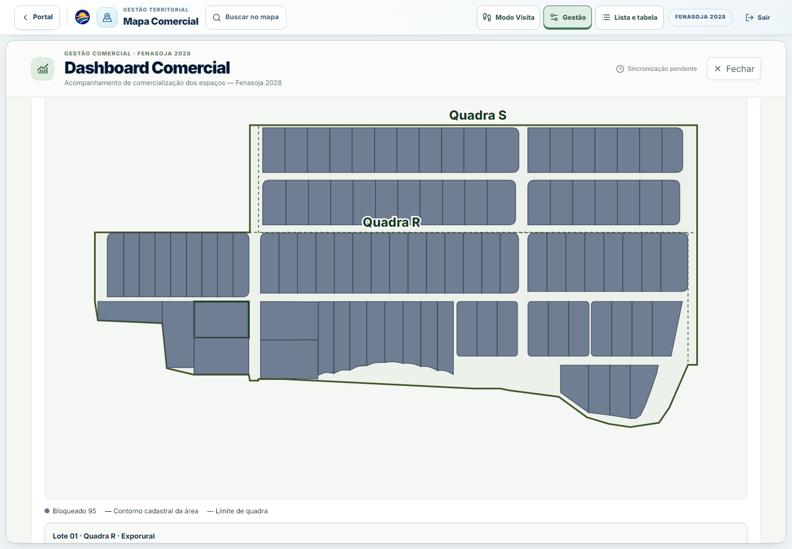
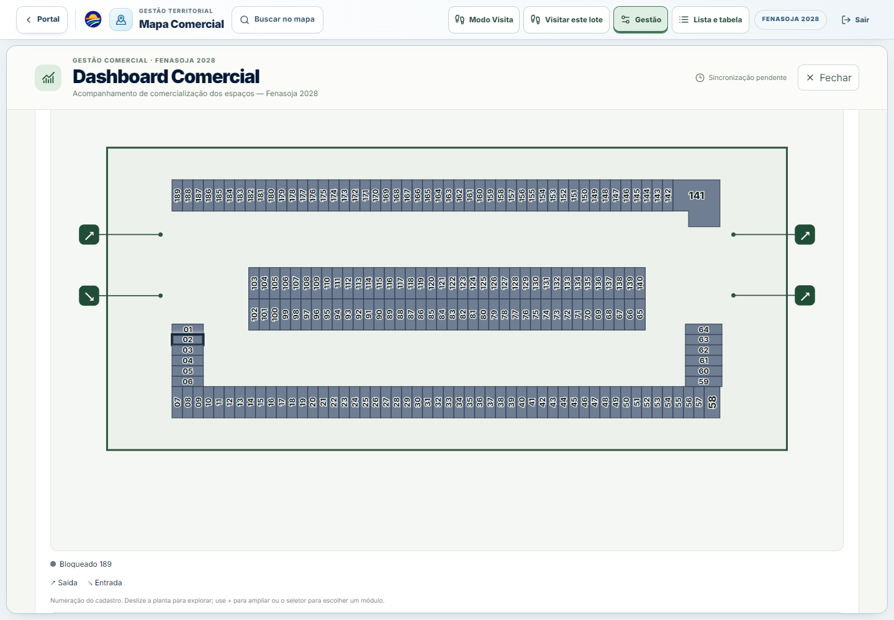
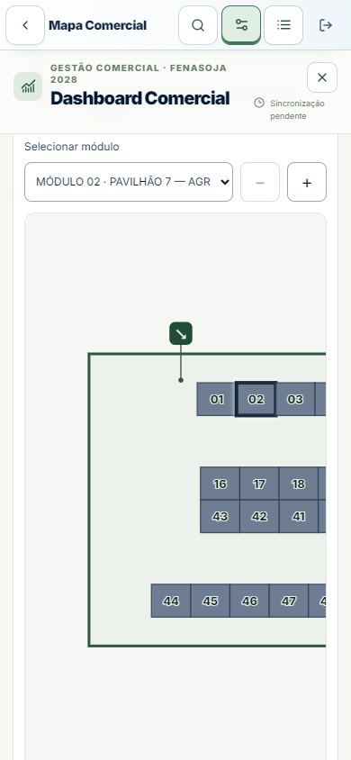

# Dashboard Comercial — áreas externas e pavilhões

Implementação de 27/09/2026, sobre `main` em `3a2daa8f`. A dashboard continua dentro do overlay do Mapa Comercial. Nenhuma rota, consulta, endpoint, migration, dado comercial ou permissão de produção foi alterado.

## Cadastro e classificação

- Cada `CommercialLot.id` ativo participa uma vez. Lotes arquivados e entidades arquivadas continuam excluídos. Lotes sem entidade carregada seguem a exclusão anterior e agora recebem aviso explícito, fora da reconciliação dos registros com entidade.
- O vínculo `MapEntity.parentEntityId` é percorrido antes de resolver o recorte externo. Um ancestral cadastrado em `COMMERCIAL_PAVILION_DEFINITIONS` determina o pavilhão interno, mesmo quando o módulo pertence a Indústria, Comércio e Serviços.
- Só depois dessa verificação, o índice canônico `buildCommercialMapSegmentIndex` determina a área externa. A quadra vem do pai cadastral/lot.block; divergências, ciclos, pais ausentes e módulos sem pavilhão confirmado ficam em pendências.
- O snapshot contém consolidado, externo, interno, pendências, três áreas externas e oito pavilhões. Os acumuladores reutilizam os mesmos registros e somam dinheiro em centavos e área em unidades de 0,0001 m².
- `UNAVAILABLE` permanece separado dos denominadores comerciais. Metragem ausente não usa área calculada. Preço ausente não vira zero. Valores conhecidos continuam preços comerciais, nunca receita recebida.

## Pavilhão 13 e escopo da referência

A referência local atual contém **103 módulos ativos do Pavilhão 13 (B5)**. Todos entram no consolidado interno, com aviso permanente e ação “Consultar Pavilhão 13”. Os sete ícones principais são 1, 3, 5, 7, 8, 12 e 14; nenhum cadastro foi alterado para eliminar a diferença.

Na referência local, a reconciliação é **1.465 = 252 externos + 1.201 internos + 12 pendentes**. Os pavilhões têm, respectivamente, 189, 214, 81, **57**, 114, 257, **103** e 186 registros (1, 3, 5, 7, 8, 12, 13, 14). Estes números são evidência de fixture, não constantes da interface nem confirmação do banco publicado. O conector de banco disponível estava sem sessão.

## Desenhos e interação

- Contorno externo: união exata dos polígonos cadastrais dos membros externos declarados. Sem retângulo envolvente nem convex hull. Os espaços entre polígonos ficam abertos.
- Quadras confirmadas: Exporural R/S; Automóvel U/P/T/O; Indústria M/G/L/F/J/E/I/D. O índice e a classificação QUADRA precisam confirmar o vínculo antes de desenhar o rótulo.
- Referências ausentes/inválidas exibem perímetro parcial/pendente. Geometrias de lote inválidas permanecem nos indicadores e no seletor.
- Plantas internas: usam os polígonos carregados dos módulos, ordem da chave oficial e número comercial persistido. A planta não cria módulos para completar a contagem da referência.
- Acessos: somente `wallAccesses` oficiais, projetados por `resolveCommercialPavilionWayfindingMarkers` no mesmo clear floor do mapa. Incluem acessos estruturais explicitamente referenciados; nunca usam entradas genéricas da fachada. Entrada, saída, bidirecional, conexão e emergência recebem símbolos/nomes distintos. Linhas-guia preservam a coordenada oficial enquanto o ícone fica fora dos módulos.
- Seletores nativos e botões permitem toque e teclado. SVG possui uma parada de Tab, setas/Home/End e Enter/Espaço. Dados selecionados ficam abaixo da planta. Números ajustam orientação/tamanho ao módulo. Mobile usa rolagem local da planta e zoom, sem expandir a página.
- Uma planta interna por vez, importada sob demanda. Seleção de área/pavilhão/módulo é preservada durante refetch. O callback `onViewLot(entityId)` permanece o original, entrando no pavilhão e selecionando seu módulo no mapa.
- `CommercialMapPage.tsx` e `useCommercialDashboardSync.ts` não têm alterações: mesma query, intervalo de 30 s, retorno de foco, timestamp e prevenção de refetch concorrente.

## Validação

Baseline antes da mudança: 30 testes passaram e 4 testes existentes do minimapa falharam porque a fixture omitia `MapEntity.metadata`. Foi corrigida apenas a fixture, sem afrouxar a função de identidade.

Suite focada final: **110 testes passaram em 13 arquivos**. Inclui reconciliação por todos os status, dinheiro, área, cobertura, duplicidade, módulo da Indústria, B13, B10=57, arquivamento, indisponíveis, ausência de segmento/área/preço, pai ausente/circular, quadras, geometrias, todos os pavilhões/acessos, seleção, callback e refetch real do hook em 30 s e foco propagando novos dados ao componente.

```powershell
npm test -- src/test/commercialDashboard src/test/commercialMapSegments.test.ts src/test/commercialLotIdentity.test.ts src/test/commercialMapPavilionWayfinding.test.ts src/test/commercialMapPavilion7OfficialLayout.test.ts src/test/commercialMapPavilionModules.test.ts src/test/commercialMapIrregularSalesSelection.test.ts src/test/commercialMapPanelSelection.test.tsx
npm run typecheck
npx eslint src/features/commercial-map/dashboard src/test/commercialDashboardScopes.test.ts src/test/commercialDashboardSpaces.test.tsx src/test/commercialDashboardMiniMap.test.tsx
npm run build -- --manifest
node scripts/commercial-map-performance/bundle-report.cjs dist --assert-independent
```

Navegador: `scripts/dashboard/browser-smoke.cjs`, Chrome headless/ANGLE D3D11 no Windows, desktop 1440×1000 e mobile emulado 390×844. Usa a rota DEV existente e habilita analytics **somente na resposta interceptada pelo navegador de teste**, pois a fixture é read-only e não oferece Gestão por padrão. Não muda permissões no código nem acessa dados de produção.

O script percorre três áreas, sete pavilhões e B13; compara seleção do store e módulo/interior após “Ver no mapa”; valida nomes, números, acessos, teclado, botões >=44 px, ausência de overflow da página, uma planta interna, um Canvas com a mesma identidade e ausência de erros JavaScript. Evidências JSON/screenhots ficam em `evidence/`.

Execução final concluída nas duas dimensões: nenhum erro JavaScript, mesma URL, mesmo Canvas, `status=ready`, `contextLosses=0` e `lastErrorCode=null`. Desktop: overlay 1.417/1.417 px de largura/scrollWidth; mobile: 390/390 px. Botões de pavilhão: 159×102 px e 84,5×92,5 px, respectivamente. TypeScript, ESLint focado, build e separação dos chunks passaram; permanecem os avisos de tamanho de chunks já presentes no build.





## Desempenho e limites da evidência

Comparação local aquecida de 100 amostras de analytics na mesma fixture: mediana **2,12 → 3,11 ms**, p95 **2,73 → 4,26 ms**. A classificação acrescenta agregações, mas os polígonos de lotes montados inicialmente caem de **2.780 → 252**. O maior pavilhão monta 257 módulos sob demanda.

Os tempos de navegador nos JSONs medem acionamento + dois frames locais, não startup frio, latência de rede de produção ou desempenho em aparelho físico. Acessibilidade por teclado/toque e medidas de layout foram verificadas; não equivalem a certificação completa de leitor de tela.

Não houve validação autenticada do banco publicado, deploy nem teste físico de Safari/iOS/Android. A atualização automática foi verificada pelos testes do hook e pela integração React; a rota DEV do navegador não consulta o banco. Não houve teste de injeção de perda WebGL nesta mudança de SVG/dashboard.

## Arquivos

- `CommercialDashboard.tsx`, `CommercialDashboardSpaces.tsx`, `CommercialDashboardPavilion.tsx`, `CommercialMiniMap.tsx` e `commercial-dashboard.css`: organização, interação, desenho e carregamento.
- `commercialDashboardAnalytics.ts`, `commercialDashboardTypes.ts`, `commercialDashboardClassification.ts`: classificação exclusiva e indicadores.
- `commercialDashboardGeometry.ts`, `commercialDashboardBoundaries.ts`, `commercialDashboardPavilionGeometry.ts`: projeção, perímetros e acessos.
- `commercialDashboardScopes.test.ts`, `commercialDashboardSpaces.test.tsx`, fixture do minimapa, script de navegador e workflow `Commercial Dashboard scopes`: testes e evidências.

Todos os arquivos de implementação acima ficam em `src/features/commercial-map/dashboard/`; testes em `src/test/`. O build gera incidentalmente `supabase/functions/mcp/index.ts`; essa alteração é restaurada e não faz parte da PR.
