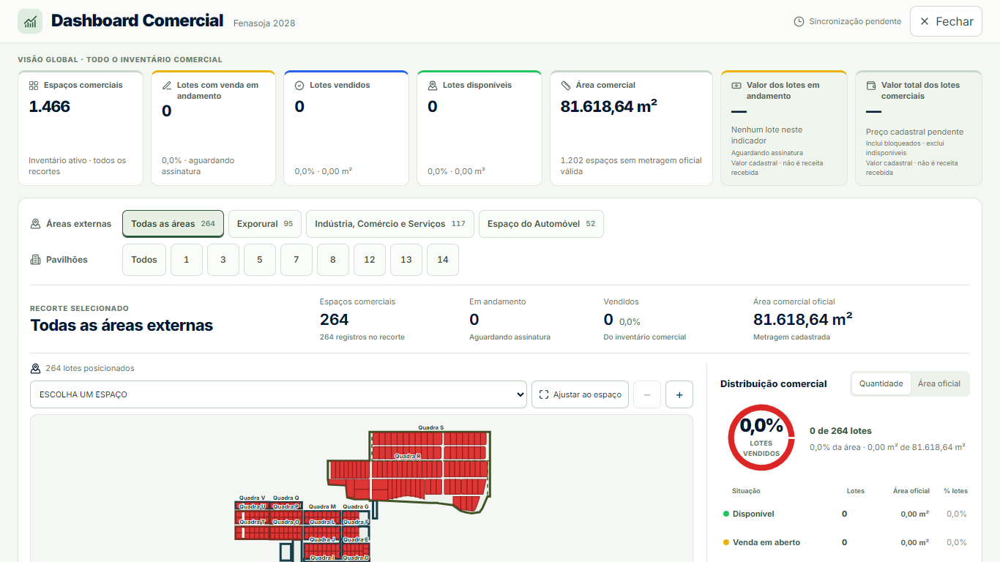
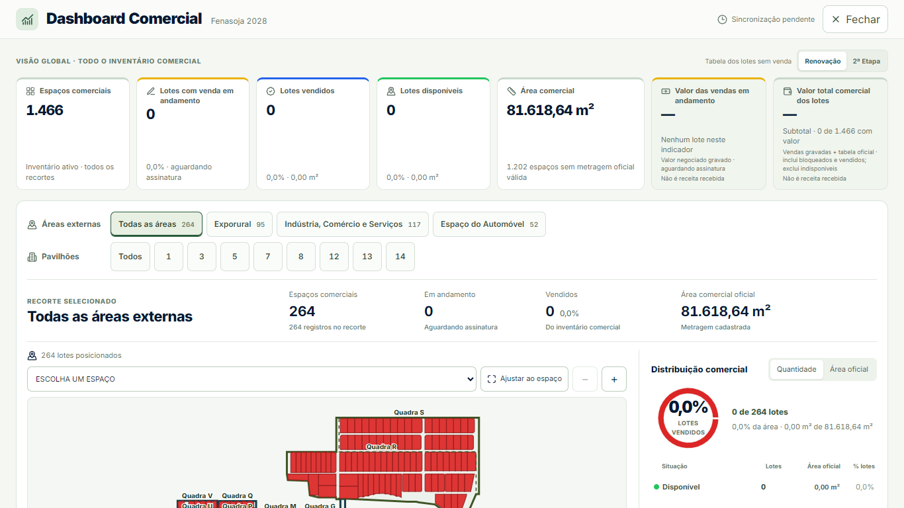
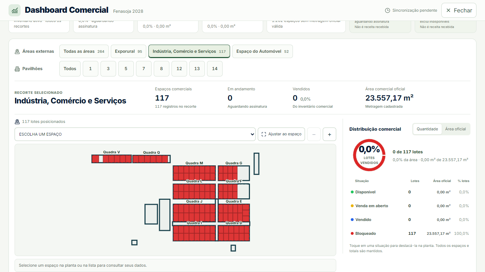
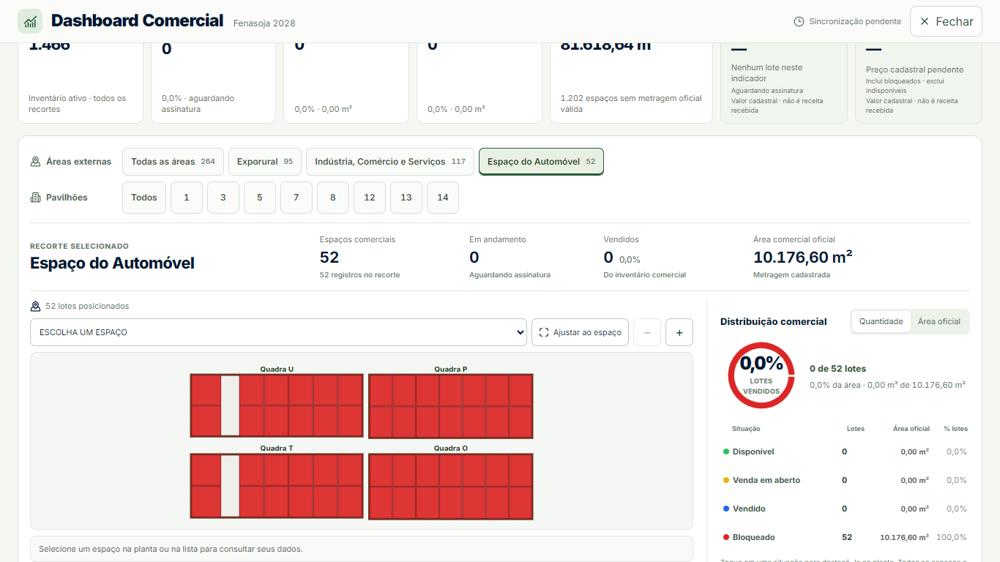
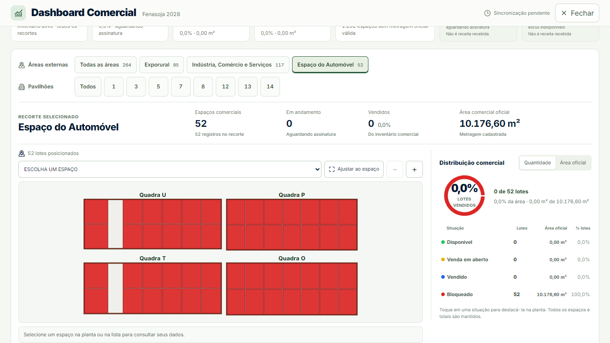
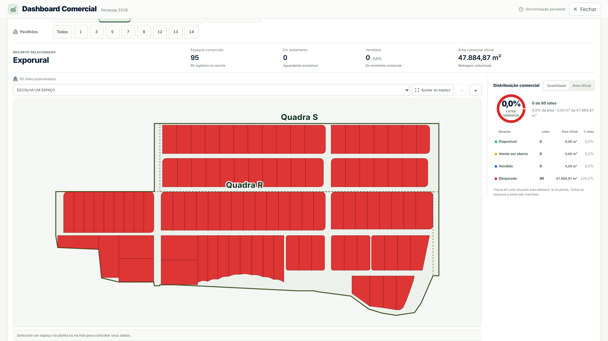
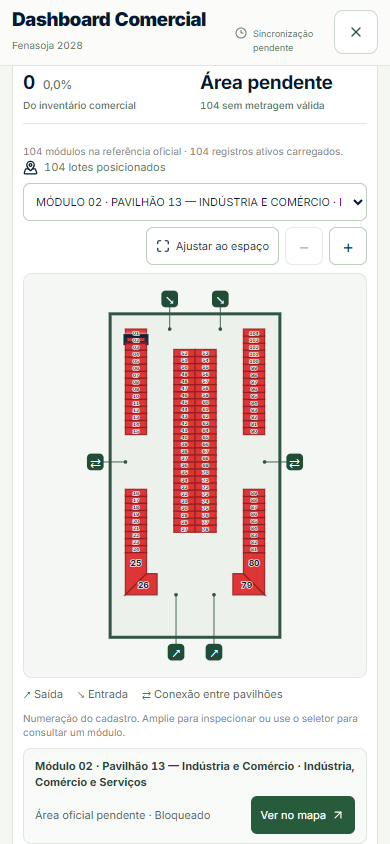
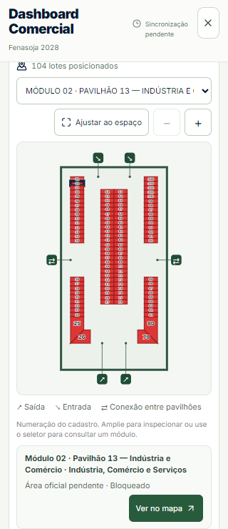

# Valores comerciais e ampliação do mapa ajustado

Mudança sobre `3c653eb8` (Dashboard Comercial integrada, PR #178). O comparativo usa o mesmo cadastro de referência oficial, os mesmos recortes e os mesmos tamanhos de viewport antes e depois.

## Origem dos valores

Os cards globais agora identificam a origem efetiva do dinheiro:

- “Valor das vendas em andamento”: valor negociado persistido de uma venda `OPEN` para cada lote `SALE_OPEN`.
- “Valor total comercial dos lotes”: soma dos valores conhecidos do inventário comercial. Para `SALE_OPEN` e `SOLD`, usa a venda persistida correspondente, respectivamente `OPEN` e `CONFIRMED`. Para os demais estados comerciais, usa o total da etapa escolhida na tabela oficial 2028, incluindo overrides já resolvidos pela view. Inclui bloqueados e vendidos; exclui `UNAVAILABLE`.
- Renovação e 2ª Etapa são escolhas explícitas de apresentação. Alterar a etapa não muda quantidade, área oficial, status, seleção, cadastros ou preços persistidos.
- Venda ausente, valor inválido, ambiguidade ou informação oculta por RLS continua pendente. Não se troca uma venda sem valor negociado pelo preço da tabela. Zero persistido permanece um valor válido.
- Cobertura parcial informa “Subtotal” e quantos lotes têm valor. Os cards avisam que não representam receita recebida.

A leitura financeira acompanha a consulta paginada já existente de lotes do Mapa Comercial, com os campos de vendas e preços oficiais no payload compartilhado. Não há consulta paralela de inventário na dashboard. A view existente recebe `entity_id` para permitir a associação explícita à entidade, mantendo `security_invoker` e suas fórmulas e overrides.

**A migration e a integração publicada permanecem pendentes de verificação no banco de produção.** A prévia DEV do browser não executa essa consulta nem comprova disponibilidade da view publicada. Os screenshots não recebem preços ou vendas artificiais.

## Comparativo visual e medição

O baseline foi gerado de `git archive 3c653eb8` em uma pasta temporária isolada, com a configuração local do ambiente e as dependências/assets existentes. Assim as capturas anteriores permanecem independentes dos edits do candidato. O código temporário e a configuração do ambiente ficam fora da PR.

O harness calcula o bounding box real do conteúdo SVG com `getBBox()` e converte sua largura e altura para pixels pela escala de `preserveAspectRatio="xMidYMid meet"`. A comparação exige fator linear mínimo de 1,30 em **ambas as dimensões** para a visão externa consolidada e os três segmentos em desktop e notebook. O aumento de área do bounding box é registrado separadamente e não se confunde com área oficial cadastral.

Pavilhões usam o mesmo modo ajustado e precisam conter lotes, perímetro, identificação e acessos. Plantas largas podem atingir o limite da largura do painel; por isso o ganho de 30% não é exigido para cada pavilhão. Em 390/320 px, o objetivo é preservar o enquadramento completo e a leitura responsiva.

| Recorte | Ganho linear mínimo, 1920×1080 | Ganho linear mínimo, 1366×768 |
| --- | ---: | ---: |
| Todas as áreas externas | +30,52% | +31,12% |
| Exporural | +30,56% | +31,12% |
| Indústria, Comércio e Serviços | +30,52% | +31,12% |
| Espaço do Automóvel | +30,49% | +31,07% |

“Ganho linear mínimo” é o menor ganho entre largura e altura do conteúdo desenhado. A área visual cresceu 70,35–70,52% no desktop e 71,86–72,42% no notebook, mantendo a geometria. Os valores sem arredondamento estão em `after/desktop-size-comparison.json` e `after/notebook-size-comparison.json`.

A medição preliminar encontrou 29,81% no eixo vertical do Automóvel em notebook, apesar de a escala do SVG crescer 30,29%. A variação da extensão do texto influenciou o bounding box real. A composição recebeu mais 2 px de altura nesse cálculo (`130dvh - 680.5px`) e as capturas finais passaram o mínimo de 30% sem flexibilizar a asserção.

Os screenshots da primeira tela mostram o cabeçalho, os indicadores e o início da análise. O painel ampliado pode exigir rolagem vertical da dashboard para ser visto inteiro; ele contém o SVG completo sem rolagem interna obrigatória. As capturas de segmentos e pavilhões usam essa rolagem vertical para inspecionar a planta completa. Em celular, mapa e distribuição ficam em sequência vertical.

| Antes, 1366×768 | Depois, 1366×768 |
| --- | --- |
|  |  |
|  |  |
|  |  |







## Reprodução

```powershell
npm run dev -- --host 127.0.0.1 --port 5191 --strictPort

# Outro terminal; ajuste o caminho do Playwright ao runtime disponível.
$env:PLAYWRIGHT_MODULE = 'C:/Users/Leonardo/.cache/codex-runtimes/codex-primary-runtime/dependencies/node/node_modules/playwright'
$env:DASHBOARD_BASE_URL = 'http://127.0.0.1:5191'
$env:DASHBOARD_EVIDENCE_DIR = 'docs/validation/dashboard-values-map-fit/after'
$env:DASHBOARD_EVIDENCE_LABEL = 'after'
$env:DASHBOARD_BASELINE_DIR = 'docs/validation/dashboard-values-map-fit/before'
$env:DASHBOARD_ASSERT_MAP_GROWTH = 'true'
node scripts/dashboard/browser-smoke.cjs
```

O script calcula os valores esperados de `OFFICIAL_REFERENCE_DATA` via `presentCommercialMapData` e `buildCommercialDashboardSnapshot`. Analytics é habilitado somente na resposta interceptada pelo browser, sem modificar a permissão read-only da prévia. Uma página sem interceptação confirma que essa permissão mantém a dashboard indisponível.

O script percorre a visão externa, três segmentos, oito pavilhões incluindo B5/Pavilhão 13 e o consolidado interno. Exercita primeira abertura, seleção de recorte, etapas de preço, quantidade/área, destaque ligado ao mapa, seleção por teclado, zoom/reset, mudança de recorte após zoom, resize, Escape, fechamento, foco e callbacks originais “Ver no mapa”. Os JSONs registram extensões SVG, dimensões reais, scroll, símbolos de acesso, contagens, integridade de Canvas e erros JavaScript.

Os resultados finais são registrados em `after/*-browser.json`, incluindo a checagem read-only em `after/permissions-browser.json`. Os mesmos arquivos de `before/` conservam o baseline de `3c653eb8`.

O browser final passou nos quatro tamanhos: **1920×1080, 1366×768, 390×844 e 320×740**, com 13 recortes por tamanho (**52 verificações espaciais**). Todos registraram zero erros JavaScript, zero overflow horizontal da dashboard e zero overflow interno horizontal/vertical do mapa ajustado. O Canvas original permaneceu único, e os seletores de pavilhões conservaram pelo menos 44×44 px. O resumo consolidado está em `browser-summary.json`.

Inspeção dos prints de 320/390 px confirmou fontes dos valores legíveis, controles sem corte e o perímetro completo do Pavilhão 13 com os acessos visíveis. Números pequenos da planta podem ser inspecionados com zoom ou pelo seletor existente. Os dois servidores locais de captura foram encerrados após a validação.

## Limites e baseline de testes

Browser local Chrome headless/ANGLE D3D11 em Windows, DPR 1. Mobile é emulação, sem validação de aparelho físico ou Safari. A fixture oficial não contém os novos relacionamentos financeiros persistidos; os cards mostram pendência real e não comprovam valores de produção. Os testes de domínio e integração cobrem valores positivos/zero, vendas revertidas/ambíguas, preços oficiais por etapa/override, subtotal e exclusões.

O baseline isolado também executou `npx vitest run --maxWorkers=2 src/test/lotPricing2028.test.ts`: **7 passaram e 1 falhou**, com `Expected: "Ainda não definido"` e `Received: "Valor ainda não definido"` em `src/test/lotPricing2028.test.ts:99`. A falha já existe em `3c653eb8`, conforme `baseline-lot-pricing.log`. O motor e esse teste não foram modificados nesta tarefa.

Não houve migração de produção, deploy, teste de latência de banco ou injeção de perda WebGL nesta validação. Os tempos de acionamento dos JSONs incluem verificações locais e não são um benchmark de desempenho.
