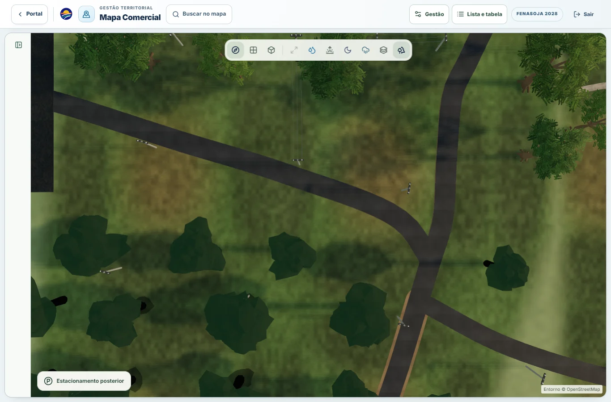
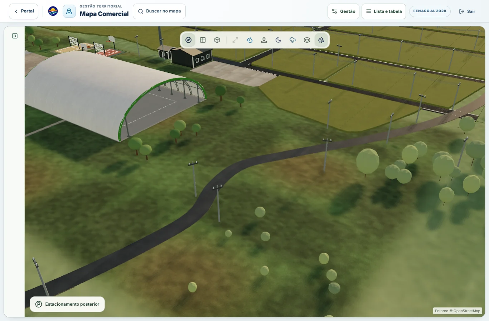

# Solo interno canônico — Mapa Comercial

## Diagnóstico e decisão

Base de comparação: `ee79665d` (main com a reconstrução do acesso rural da PR #155). A implementação preserva as geometrias, polígonos cadastrais, árvores, cotas, pavimentos e regras comerciais dessa base.

| Origem anterior | Consumidores | Tratamento |
|---|---|---|
| `QuadrasABEnvironmentLayer` / `QUADRAS_AB_GROUND_MATERIALS` / `applyPilotGroundMaterial` | Quadras A e B, referência visual indicada | Extração dos geradores existentes, mantendo os texels e coeficientes; atlas A/B compartilhado |
| `ParkAccessEnvironmentLayer` / `PARK_ACCESS_ENVIRONMENT_PALETTE` | Bosque, bordas gramadas dos caminhos, transições internas Costeiros/Benvenuto | Atributo de cobertura no batch existente; solo exposto, concreto e trilhas conservados |
| `NationsDistrict.GRASS_TEXTURE` | Etnias e ilhas gramadas | Remoção da textura paralela e da troca de cor por qualidade; material canônico |
| `CommercialMapEnvironment` / `continuousGroundMaterial` | Base compartilhada, estacionamento natural de visitantes/expositores e terreno externo | Máscara positiva nas regiões internas; shader externo preservado fora dela |
| `ArenaFrontInfrastructure` | Encosta e entorno Arena/BR-472 | Material da base contínua emprestado, remoção da paleta e textura de grama locais; UV externo alinhado, recortes/cotas conservados |
| `CommercialSiteEnvironmentLayer` (`grass-dry-mix`) | Faixas ambientais internas, inclusive lateral Exporural | Mesmo material e atlas; caminhos e perfis minerais conservados |
| `RestaurantFrontageLayer`, `CommercialMapCanvas` | Gramado do restaurante, área motorhome/áreas verdes cadastradas | Referência canônica com mesmas posições, opacidades e offsets |
| `AmusementPark`, `parkingMaterials` | Grama do parque de diversões e ilhas do estacionamento superior | Referência canônica; desgaste de terra, cascalho, transparência periférica e marcações preservados |

O tom 4 é o gerador orgânico já usado em A/B, não uma nova escolha RGB. `interiorGroundReference.ts` conserva a paleta verde/terra existente. `interiorGroundMaterial.ts` concentra textura, detalhe, normal, rugosidade e ciclo de vida. Os consumidores recebem a mesma fase em coordenadas de mundo; bordas entre meshes não reiniciam UVs.

## Correção da faixa entre estacionamentos

Os polígonos selecionáveis `EST-EXP-VIS` e `EST-VIS` são separados. Usá-los individualmente como máscara deixava a faixa intermediária com o material antigo, como na captura reportada durante a tarefa. `internalGroundCoverage.ts` calcula o envelope convexo dos vértices existentes para a cobertura ambiental. Os dois polígonos cadastrais continuam iguais. As bordas do envelope e do terreno Arena recebem suavização para dentro (1,1 unidade do mapa); nenhum fragmento externo é colorido por essa suavização. A encosta Arena empresta o mesmo material da base, com UVs alinhadas, para que seu término não produza uma borda retangular. Opacidades de foco mantêm uma variante própria sem duplicar texturas.

Nenhuma malha ou plano foi acrescentado para preencher o vão. A operação altera somente o material da superfície que já existia ali.

## Proteções e riscos tratados

- O retângulo de câmera/CORE não é usado como perímetro do parque. A cobertura positiva vem das áreas A/B, Etnias, bosque, terreno Arena e envelope dos estacionamentos.
- `TerritorialEnvironment`, `ExteriorGround`, rodovias/trevos e bairro lateral conservam seus materiais e dados. A base compartilhada mantém integralmente o shader anterior fora das regiões internas.
- Ruas, acessos, concreto, estacionamentos pavimentados, lotes e pavilhões conservam seus recortes, cotas e materiais. O material não desloca vértices.
- A/B usam os texels originais; a região B mantém seu padrão próprio dentro do mesmo atlas. A extensão usa espelhamento e coordenadas globais para não reiniciar textura em cada setor.
- As variantes de material só se separam quando opacidade, profundidade, mistura com solo ou transparência de borda exigem. Atlas e ruído são compartilhados e liberados após o último proprietário.
- A cor comercial dos lotes, folhagem das árvores, pavimentos e modo hidrológico não são tons de solo a serem substituídos.

## Reprodução da validação

Requer dependências do projeto e Playwright com Chrome instalado. `PLAYWRIGHT_MODULE` pode apontar para a instalação local de Playwright. Inicie `npm run dev -- --host 127.0.0.1 --port 4198 --strictPort`.

```powershell
node scripts/internal-ground/capture.cjs candidate-fixed --measure-only
node scripts/internal-ground/capture.cjs final --quick
node scripts/internal-ground/stress.cjs
node scripts/internal-ground/functional.cjs
```

Para a base, inicie o checkout `ee79665d` em 4199 com a mesma instrumentação DEV `groundQa` e execute o mesmo capturador com `QA_URL=http://127.0.0.1:4199`. Essa opção apenas disponibiliza os controles de diagnóstico já existentes na rota real em desenvolvimento; não habilita diagnóstico em produção.

Os scripts abrem `/mapa-comercial` com autenticação/organização sintéticas locais e inventário oficial do projeto. Não fazem escritas no backend. Isso valida a rota e a cena reais com dados de teste; não certifica a sessão ou os dados publicados em produção.

## Resultados

TypeScript, ESLint e build de produção passaram na revisão final (`checks.json`; os avisos do build são tamanho de chunks e catálogo Browserslist antigo). A rodada final dirigida tem **106/108 testes aprovados**: os dois testes restantes já falhavam em `ee79665d` (hash de entidades do contrato Arena e expectativa textual antiga da expansão das rodovias), reproduzidos em `baseline-contracts.json`. Não houve nova falha nessa rodada. O teste de máscaras do site também falha na base (8/9), registrado em `site-baseline.json`, e ficou separado da rodada final. Os testes do novo padrão validam cobertura do vão, exclusão de amostras externas, compartilhamento/descarte dos recursos, transparência e políticas de profundidade por consumidor.

A amostra exterior oeste em `external-comparison.json` tem diferença RGB média zero e zero pixels diferentes entre a captura anterior e a candidata (recorte de 700 x 620, mesmas coordenadas de câmera). Não extrapolamos essa amostra para uma certificação pixel a pixel de todo o entorno.

Na sessão de prévia que acumulava hot reloads houve `direct-shader-failed`, sem perda de contexto. Uma recarga completa restaurou `ready`/`post`, `contextLosses: 0`, `lastErrorCode: null`. As execuções isoladas de validação devem permanecer sem esse erro; a ocorrência durante desenvolvimento fica documentada.

As capturas cobrem 13 regiões em cinco perspectivas (superior, oblíqua, baixa, intermediária e afastada), além da vista geral e controle externo. As capturas usam `/mapa-comercial`; a inspeção interativa adicional usa a cena diagnóstica aberta no navegador do usuário. Árvores podem obstruir a vista baixa da Quadra B; as outras perspectivas complementam essa leitura.


## Ambiente das medições

Windows, Intel Core i5-1035G1, 8 GB de RAM, Chrome 153.0.8010.47, WebGL2/ANGLE Intel UHD Graphics D3D11, viewport 1366 x 900, DPR do dispositivo 1. A cena mantém o tier HIGH fixo para comparação. O mecanismo de navegação existente usa DPR efetivo 0,72 enquanto a câmera se move, igual em base e candidata; em repouso volta a 1. Os ensaios medem a cena local aquecida, não inicialização fria nem tráfego de produção. Outros processos do computador permanecem ativos. Não há certificação de FPS sustentado em celular físico, Safari ou iPhone.

A rodada `candidate-fixed` revelou custo extra na vista geral. O shader foi ajustado para não executar o antigo fBm/mapas regionais nos fragmentos totalmente internos que seriam substituídos pela referência. A execução do shader antigo continua completa fora da área interna e na transição. `candidate-optimized` registra essa investigação; a entrega usa a rodada final após a suavização da Arena.

## Estabilidade e funções

`stress/runtime.json`: 24 transições (seis ciclos de noite, economia, chuva e dia), sem erros JS, sem requisições de escrita, sem perda de contexto; recursos estáveis nos dois ciclos finais por modo. Ao final da navegação: `ready`, `post`, 4.845 quadros apresentados, `contextLosses: 0`, `lastErrorCode: null`. Zoom, pan e rotação alteraram a câmera mantendo o mesmo Canvas.

`functional/functional-desktop.json`: todos os nove critérios passaram — navegação, abertura/alternância de filtro, seleção, entrada/saída do pavilhão, ausência de overflow, Canvas persistente e renderer saudável. Zero erros JS e zero escritas no backend. O teste aguarda a visibilidade do painel, incluindo sua animação de abertura.

## Comparação quantitativa final

Mediana das médias por sequência de navegação: seis amostras da base (duas rodadas) e três da candidata por vista, seis segundos úteis por amostra. Todas as amostras, inclusive oscilações, estão em `summary.json`; não foram removidos outliers. A montagem das folhas de revisão coincidiu com o começo das amostras de vista geral da candidata, portanto essa linha não isola exclusivamente custo de GPU. As demais amostras finais foram coletadas depois desse processamento.

| Vista | Base (ms/quadro) | Candidata | Variação |
|---|---:|---:|---:|
| overview | 24.85 | 25.77 | +3.7% |
| quadraA-oblique | 20.75 | 21.57 | +4.0% |
| bosque-oblique | 16.73 | 17.07 | +2.0% |
| etnias-oblique | 17.96 | 18.53 | +3.2% |
| expositores-oblique | 20.45 | 19.42 | -5.0% |
| arena-oblique | 17.01 | 16.67 | -2.0% |

Os tempos ficaram comparáveis no computador utilizado, com variação de −5% a +4%. Isso não demonstra melhora universal de FPS nem equivalência estatística em todo hardware. A navegação observada permaneceu estável, sem perda perceptível de fluidez ou carregamento tardio de materiais.

- Inventário da cena: 930 meshes, 23.769 instâncias, 955.513 triângulos alocados e 564 geometrias em ambos os lados.
- Materiais da cena: 632 → 630. Buffers de geometria: 13.531.408 → 13.081.340 bytes (remoção das cores redundantes da Arena compensa os atributos de cobertura).
- Texturas residentes no fim da sequência: 143 → 130. Nenhum plano adicional ou draw call de cobertura foi criado.
- Programas residentes: 212 → 222; a máscara e as combinações com os shaders existentes requerem variantes. A candidata percorreu mais regiões antes da medição, aquecendo também 583 geometrias GPU contra 570 na sequência menor da base. Esses contadores de cache não são uma comparação isolada de alocação; o inventário da cena é igual e o teste de ciclos comprova estabilização por modo.

## Evidência visual

[Galeria de 67 vistas](index.html) · [Antes/depois de cinco regiões](before-after.jpg) · [Vista superior](review-top.jpg) · [Oblíqua](review-oblique.jpg) · [Baixa](review-low.jpg) · [Intermediária](review-medium.jpg) · [Afastada](review-far.jpg).





As folhas e imagens WebP são compactações para revisão; métricas e comparação de pixels externos usam as capturas PNG originais. `scripts/internal-ground/report.py` regenera a galeria com Pillow. O exame visual confirmou o padrão A/B, continuidade na faixa reportada, terra sutil, ruas/caminhos/concretos descobertos e estruturas/árvores preservadas nas vistas percorridas. Não foram observados z-fighting, superfícies piscando, buracos ou overlays novos nessas execuções.
