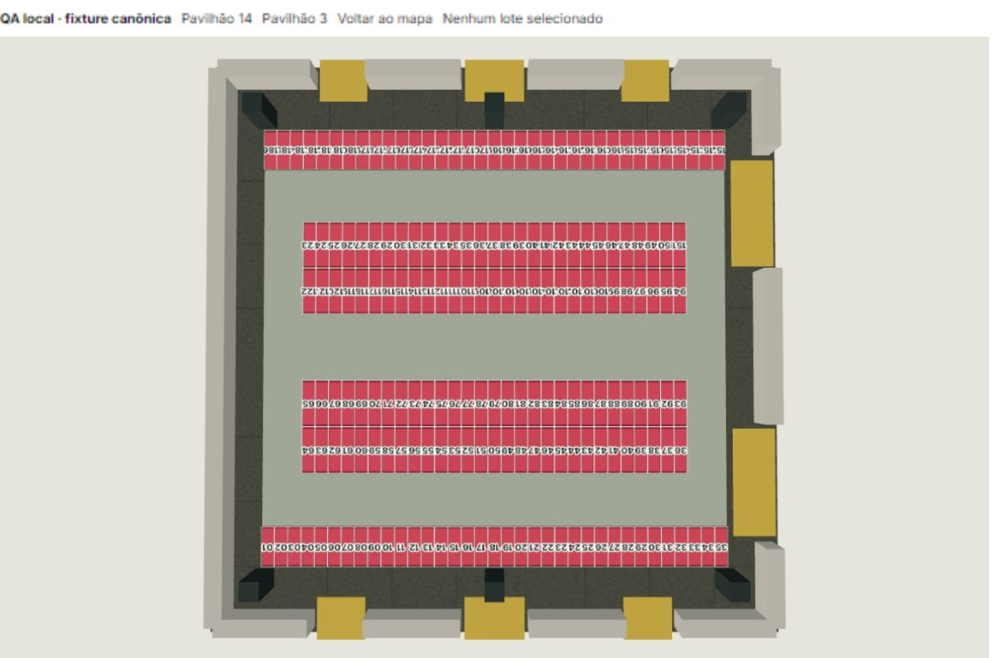
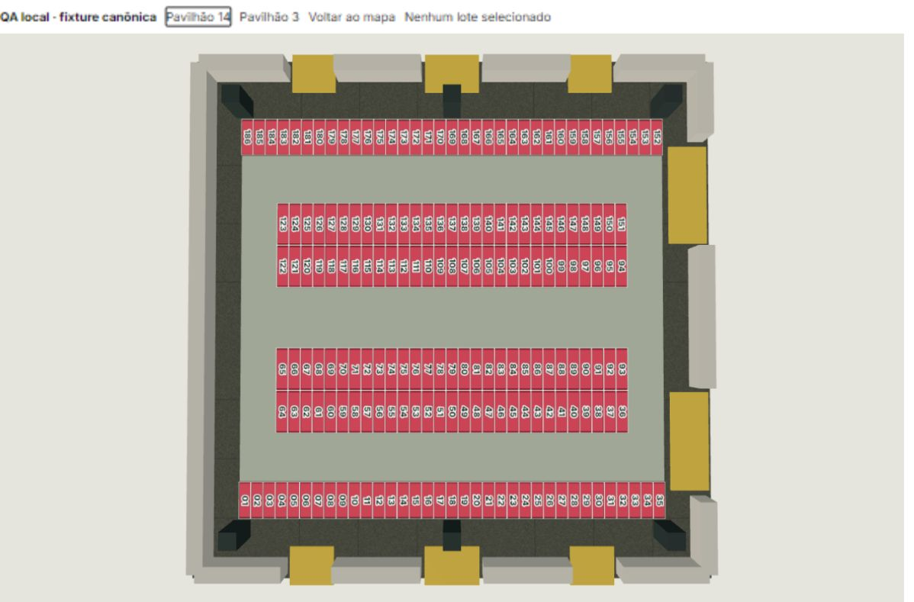
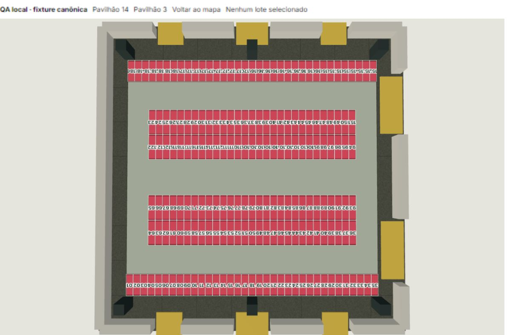
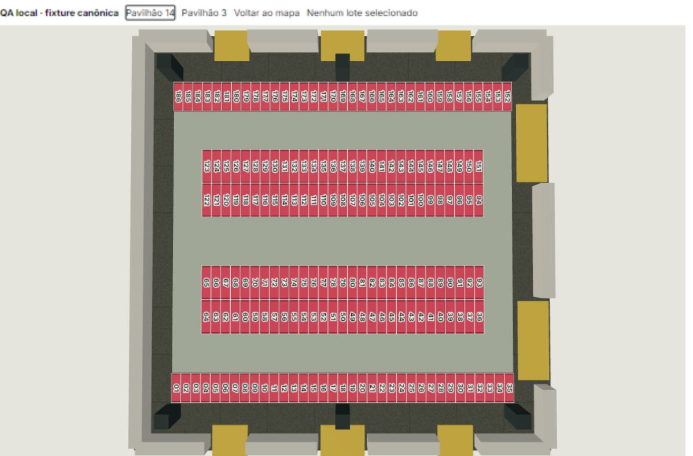
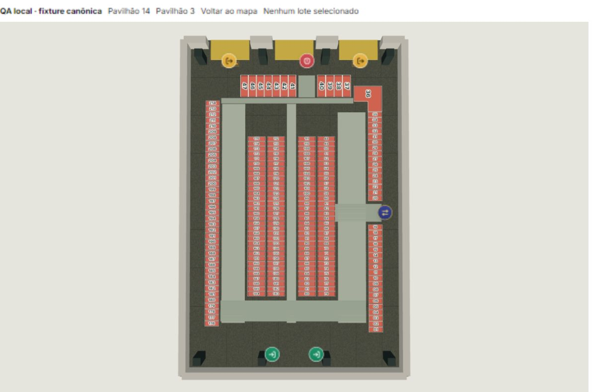
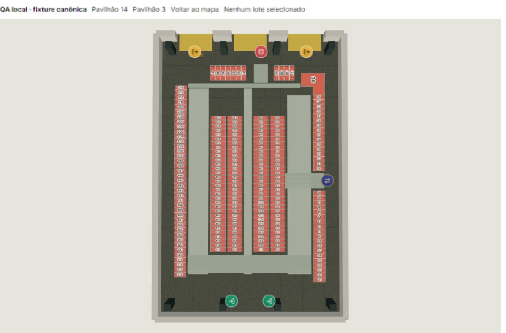
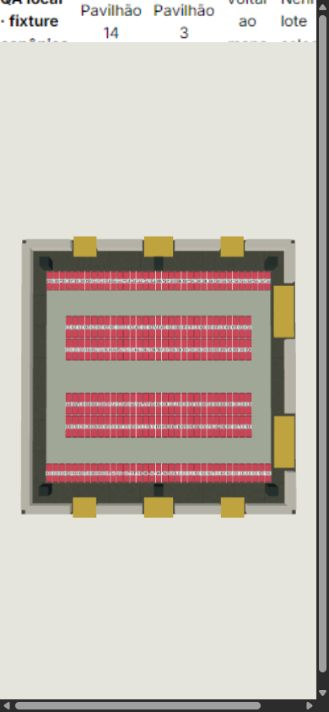
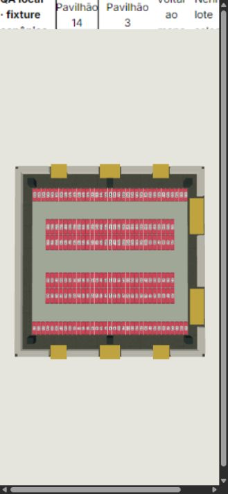
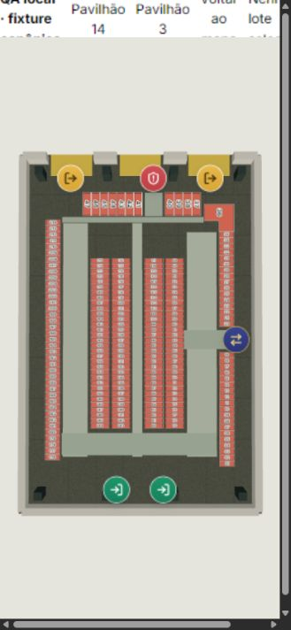
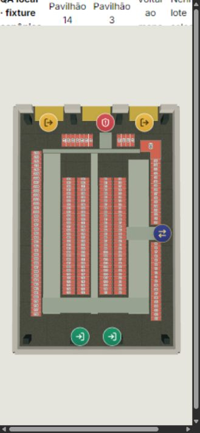

# Pavilhões 14 e 3 — correção localizada

Base: `853ce1e7` (main e origin/main iguais na inspeção). Plantas oficiais anexadas, desenho de setembro/2026, edição Fenasoja 2028. Os PDFs foram renderizados e conferidos integralmente; nenhuma instrução documental foi tratada como autorização de mudança.

## Diagnóstico e rastreamento

| Problema | Causa confirmada | Correção |
|---|---|---|
| Pavilhão 14: caracteres invertidos/sobrepostos | O atlas calculava o tamanho com o eixo longo da célula projetada, mas depois somava `interiorViewRotation = -π/2` ao texto. A célula já tinha passado pelo quarter-turn. O texto girava para o eixo curto sem recalcular o espaço disponível. As seis sequências espaciais já estavam corretas. | Ângulo absoluto de texto `π` no atlas, exclusivo do perfil B2, independente da câmera e da sequência. Dimensionamento pelo eixo final. Sem mudar edifício, câmera, módulos, acessos ou corredores. |
| Pavilhão 3: quatro colunas invertidas | As quatro `sequenceOrientation` eram contrárias à planta na câmera canônica, na qual o topo corresponde a maior Z de origem. | Inverter somente os quatro sentidos. Mover cada célula com sua chave, número e vínculo; não trocar textos isoladamente. |
| Pavilhão 3: 37–47 grandes | Faixas normalizadas de largura 0,18/0,30 e profundidade 0,075 eram subdivididas para preencher a largura disponível; não representavam 1 × 3 m. A projeção stretch ainda aplicava escalas distintas nos eixos. Não era somente perspectiva. | Faixas dimensionadas por quantidade × 1 m, mais o espaçamento existente, e profundidade 3 m. Contenção isotrópica optativa apenas nas onze células, usando `s = min(clearWidth / 32, clearDepth / 44.48)`. Polígono de referência, atlas e instâncias usam a mesma proporção. |

Identidades verificadas no registro canônico `officialReference2026.ts`, nas definições de pavilhões e no registro de áreas públicas: **B2 = Pavilhão 14**, **B6 = Pavilhão 3**. A aba autenticada do sistema também confirmou visualmente `Módulo 144 · B6 · Pavilhão 3`, disponível, 3,00 m². A conexão dessa aba foi interrompida posteriormente; não se realizou auditoria integral dos UUIDs e preços da produção, nem confirmação adicional do B2 no cadastro remoto.

Fluxo compartilhado: `pavilion*CommercialReference` → `COMMERCIAL_PAVILION_MODULE_PLANS` → projeção local → grupo do edifício → instâncias/atlas. B2 preserva facing +π/2, visão interna −π/2 e quarter-turn; B6 preserva facing π e visão interna π. Não há escala negativa nem espelhamento novo.

O clique resolve `instanceId → projectedModuleParts → cell.id`. `buildPavilionModuleCommercialIndex` resolve `pavilhão + número` por `pavilionModuleKey`, identificador e parentesco, chegando à entidade e ao lote. `PavilionModuleCard`, estado visual/comercial, legenda e `PublicAreaMapPage` consomem a referência compartilhada. O público continua a usar o inventário autorizado e seu índice de lotes. Nenhuma migração ou escrita cadastral foi executada.

O polígono em L do 36, seus seis vértices, duas partes, âncora, chave e 24 m² permanecem. A projeção legada das demais células do B6 permanece stretch; esta tarefa não recalibra a planta inteira. A escala isotrópica dos onze lotes corrigidos é a do envelope métrico já documentado (32 × 44,48 m), não uma inferência da área em pixels.

## Arquivos de implementação

- `data/pavilion3CommercialReference.ts`: sentidos das quatro colunas e dimensões/opt-in métrico de 37–47.
- `data/commercialPavilionReference.ts`: propriedades opcionais de proporção métrica e ângulo de rótulo; projeção contida preserva o padrão sem opt-in.
- `utils/commercialPavilionModules.ts`: ângulo de atlas exclusivo de B2 e propagação do tipo geométrico.
- `components/canvas/CommercialPavilionModuleLayer.tsx`: aplica o ângulo explícito e calcula o espaço para o texto no eixo correspondente. Mantém atlas único, instancing e atualização por memo; nenhum processamento por frame por rótulo.
- `data/officialReference2026.ts`: faz o polígono da referência dos onze lotes acompanhar a mesma contenção das instâncias. IDs, metadados comerciais e lotes não são renumerados.
- `src/test/commercialMapPavilion143Corrections.test.ts`: contratos independentes das plantas, dimensões, interseções, raycast e identidade comercial.
- `src/test/commercialMapPavilionModules.test.ts`: atualiza as expectativas que exigiam os antigos sentidos e a lista fechada de propriedades.
- `scripts/pavilion-plan-qa.{html,tsx}`: entrada exclusivamente local de testes, importando os componentes reais. Não integra o build, não registra rota no produto e não duplica layouts. Bloqueia requests Supabase com respostas locais; preços da fixture pública são fictícios.

## Resultados

- **74/74 testes focados**, incluindo 29 novos contratos (`focused-tests.json`).
- Prova contra a base: **9 dos 27 contratos iniciais falhavam antes** (`baseline-defects.json`); todos passaram após a mudança. Os dois testes adicionais verificam preços/status/identidade entre pavilhões e proporção dos polígonos da referência.
- Regressão ampliada de pavilhões e mapa público: **269 aprovados / 12 falhas preexistentes**, sem novas falhas (`baseline-tests.json`, `candidate-tests.json`). A base, incluindo os novos contratos inicialmente vermelhos, tinha 260 aprovados / 21 falhas.
- As 12 falhas preexistentes estão em `commercialMapPavilionFourSoyKitchen` (1), `commercialMapPavilionModuleCard` (9) e `commercialMapPavilionWayfinding` (2). Não foram corrigidas fora do escopo.
- **10/10 contratos adicionais de acesso público**: `public-contracts.json`.
- `npm run typecheck`: passou. ESLint dos arquivos de produção e testes: passou. Harness de QA: zero erros, um aviso de Fast Refresh por ser entrypoint.
- `npm run build`: passou; avisos existentes de tamanho de chunks/Browserslist. `git diff --check`: passou.

Os testes verificam 186/214 números únicos e completos, todas as sequências e extremos, 616/663 m² nominais, 1 × 3 m em três quadros de projeção distintos, ausência de interseções lote/lote e lote/corredor, preservação do 36, raycast de cada célula regular e vínculo correto com entidade/lote. Registros reordenados e números 144 iguais em B2/B6 conservam preços, status e IDs próprios.

## Evidências visuais

Capturas do mesmo renderer e da mesma fixture em Chromium integrado, WebGL2, ANGLE/Intel UHD Graphics, Windows. Viewports solicitados: desktop 1366 × 900 e mobile 390 × 844. O zoom/DPR do host produz dimensões CSS efetivas menores, registradas nos JSONs da câmera. Não são testes de telefone físico, Safari/iOS ou multitouch real.

Posição, target, FOV e viewport são **idênticos** nos pares B2 desktop, B6 desktop e B2 mobile; ver os JSONs `before/after-*-camera.json`. Fotografias de perspectiva não foram usadas para validar metragem.

| Vista | Antes | Depois |
|---|---|---|
| 14 desktop |  |  |
| 14 zoom |  |  |
| 3 desktop |  |  |
| 14 mobile |  |  |
| 3 mobile |  |  |

Seleção interna: [144/B6](after-b6-selection-144.png), [144 mantido durante pan/zoom](after-b6-pan-zoom-selection.png), [seleção mobile B6](after-b6-mobile-selection.png), [177/B2](after-b2-selection.png). Retorno ao mapa e reentrada foram exercitados no consumidor interno. Os rótulos do 14 seguem o eixo longo sem sobreposição, conforme a planta.

Público: [B6 desktop](public-b6-desktop.png), [ficha B6-M144](public-b6-selection-144.png), [B2 desktop](public-b2-desktop.png). A ficha do 144 mostra 3 m² e preços fictícios de R$300/R$600 da fixture. O acesso para B5/Pavilhão 13 aparece desabilitado. Nada desses preços representa consulta financeira de produção.

Público mobile: [B2](public-b2-mobile.png), [B6](public-b6-mobile.png), [B2-M065 / 3,50 m²](public-b2-mobile-selection-65.png) e [B6-M038 / 3,00 m²](public-b6-mobile-selection-38.png). Zoom e seleção exercitados por ponteiro em viewport estreito; a câmera inicial foi preservada, e o enquadramento público estreito do B2 demanda pan para alcançar as extremidades. Toque físico e pinch real não foram executados.

Saúde registrada após as interações: `status=ready`, `path=direct`, frames apresentados, `contextLosses=0`, `lastErrorCode=null`. `internal-final-health.json` e `public-b6-health.json`. Não foram feitas afirmações de FPS ou de certificação de desempenho.

### Limitações observadas

Durante a preparação do harness faltaram inicialmente o provider de autenticação e um import em um estado intermediário de HMR; ambos foram corrigidos antes das sessões finais. Não representam erros da candidata final. O mapa não está implantado em produção nesta entrega.

Ao fechar a ficha pública, o código já existente chama `setSelectedEntityId(null)`, que limpa `interiorEntityId`; o cenário sai do interior. Esse caminho e o controle de lista não foram modificados por esta PR. Portanto a navegação completa de fechar ficha/lista pública não é declarada aprovada. Essa limitação foi encontrada no teste local; sua causa está nos arquivos inalterados `PublicAreaMapPage.tsx` e `useCommercialMapStore.ts` da base.

Sem auditoria SQL autenticada de todos os registros e sem execução em dispositivo móvel físico. A produção foi observada somente antes da correção; a candidata foi exercitada em componentes reais com dados locais controlados.

## Preservação e divergência documental

Nenhuma alteração em rotas, URLs/slugs/tokens, permissões, auth, menus, preços, disponibilidade, contratos, históricos, vendas ou migrations. Nenhuma escrita remota. Os IDs de células continuam `B2:module:NNN` e `B6:module:NNN`; os IDs persistidos são resolvidos pelos consumidores existentes.

P14: a planta anexada e os módulos somam **616,00 m²**; a referência anterior ainda contém `modularAreaM2: 616.16` e ressalva histórica de 0,16 m². Mantida e registrada, sem rateio nem correção cadastral. P3: 213 × 3 + 24 = **663 m²**. As fixtures canônicas têm áreas cadastrais nulas; não foram convertidas em valores persistidos.

SHA-256 das fontes: P14 `62D2B2252BD6597EF0CB58646142DC22805094837EE03546F7AF33BD359D48D0`; P3 `6FC50B009D2B409110559F50A3C6994DD49982EDDFC614926582D4929C8373D3`.

## Reprodução local

```powershell
npx vite --config scripts/alvorada-qa.config.ts --port 4199
npm test -- src/test/commercialMapPavilion143Corrections.test.ts
npm test -- commercialMapPavilion pavilionModuleOfficialAreas publicMap
npm test -- src/test/publicCommercialMap.test.ts
npm run typecheck
npm run build
```

Abrir `/scripts/pavilion-plan-qa.html?pavilion=B6` ou `?pavilion=B2`; acrescentar `&consumer=public` para a página pública real com inventário local. Para reproduzir o antes, executar o mesmo harness e viewport com os cinco arquivos de implementação da base `853ce1e7`.
