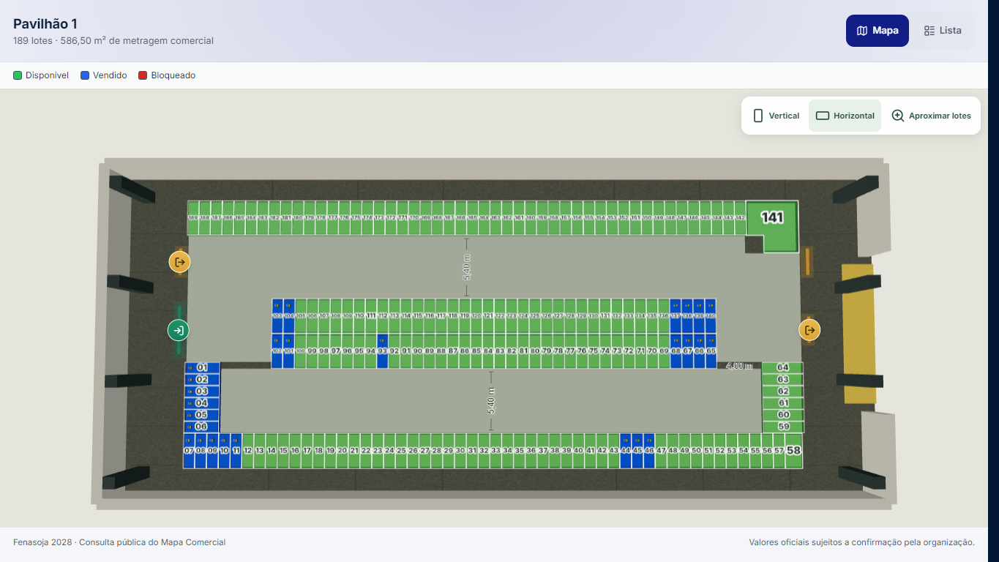
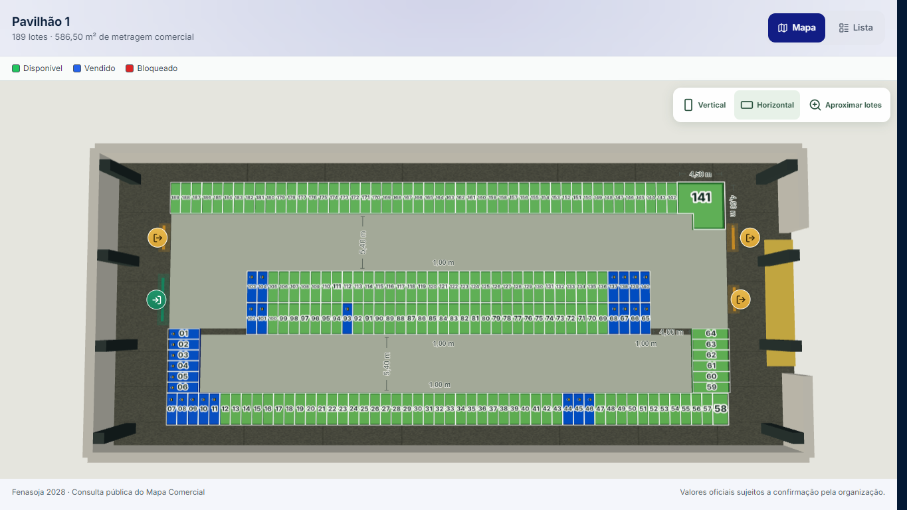
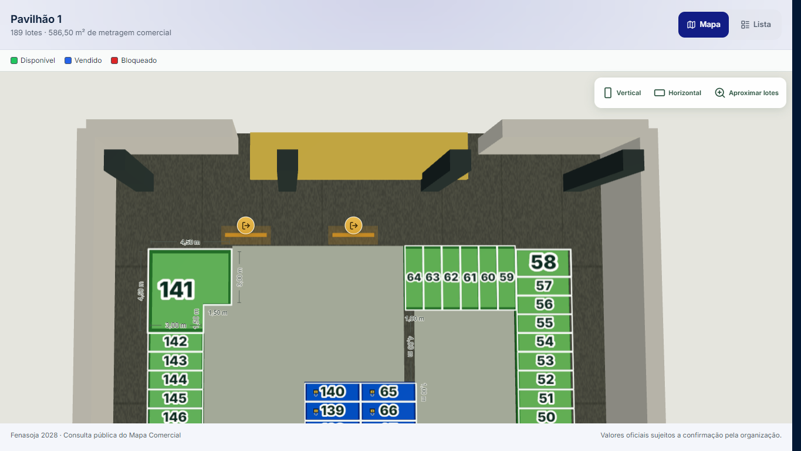
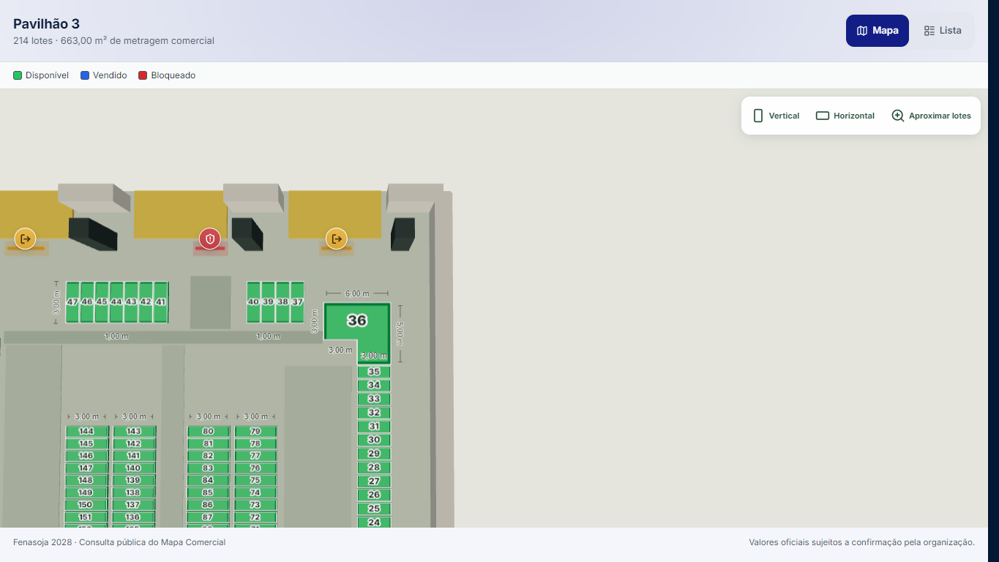
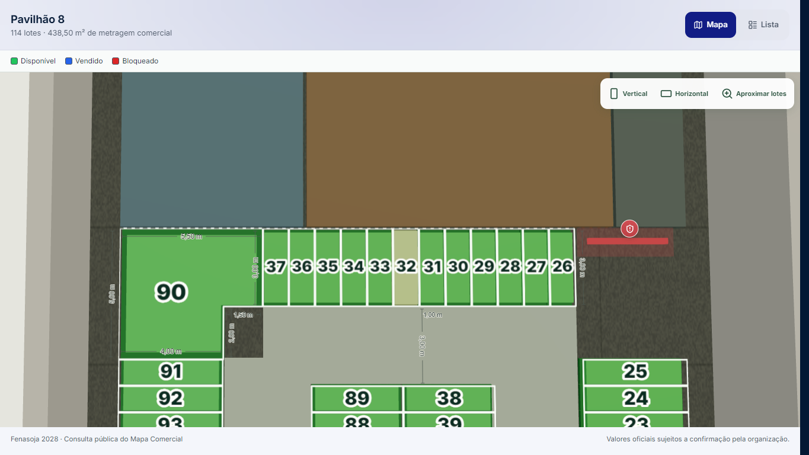
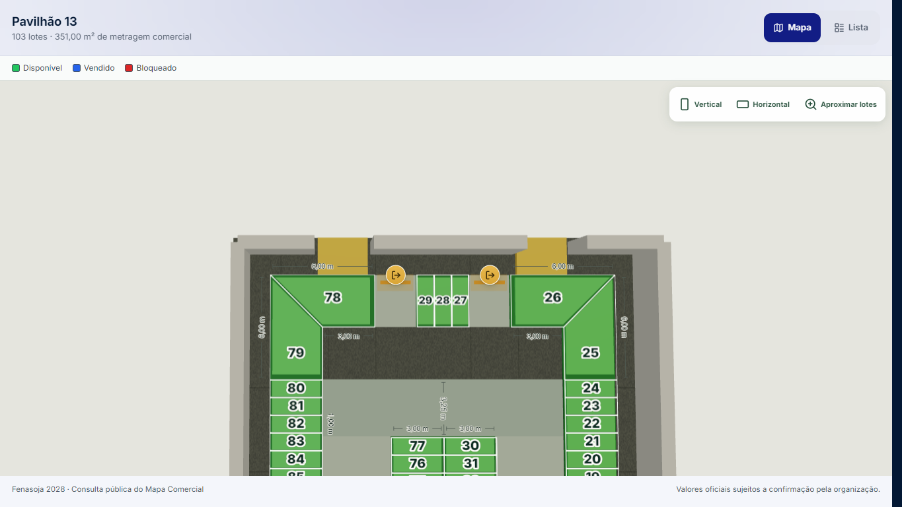
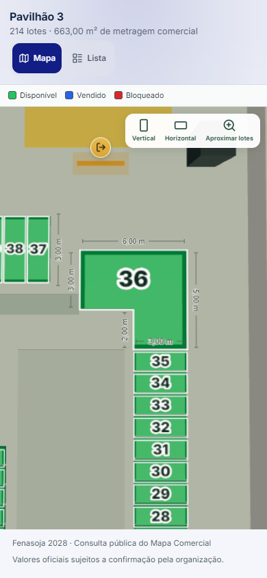

# Ícones e cotas lineares dos pavilhões

Revisão de 29/09/2026, sobre `main@a259b87e` (PR #170 integrada). A referência a “PR 760” na solicitação corresponde ao trabalho anterior desta conversa; não existe PR #760 neste repositório.

## Resultado

- Os mesmos componentes atendem aos links públicos e ao Mapa Comercial administrativo. Nenhum Canvas, controle de câmera ou loop de animação foi acrescentado.
- Cotas de **comprimento em metros**, incluindo recortes e divisões de 1 m: P1/141; P3/36 e ilhas; P8/90; P13/78, 79, 26 e 25. Os valores são transcritos dos anexos, sem calcular áreas ou inferir diagonais.
- A prioridade continua sendo o número do lote: detalhes aparecem conforme zoom, espaço e colisões com números, outros textos, ficha e controles. Os textos não recebem cliques. As bordas seguem a mesma transformação da planta, inclusive o quarto de volta do P1.
- O vazio junto ao 141 recebe o acabamento da circulação. Sua forma em L e os lotes vizinhos continuam intactos.

## Causas e correções

**Ícones:** a regra anterior ocultava todo o marcador quando seu alvo de 44 px cruzava um módulo. Além disso, conexões sem destino autorizado tinham opacidade de 0,62. Agora o símbolo mantém o contraste. Quando necessário, o alvo se acomoda na normal externa da parede, com um conector até o acesso; pode reduzir para 30 px antes de desaparecer. A posição não é presa às bordas da tela e o alvo continua fora dos lotes e painéis. Conexões não autorizadas continuam sem navegação.

Reprodução com os links publicados e o mesmo comando Vertical no desktop:

| Pavilhão | Ícones visíveis antes | Depois |
|---|---:|---:|
| 1 | 0 / 4 | 4 / 4 |
| 3 | 2 / 6 | 6 / 6 |
| 8 | 0 / 5 | 5 / 5 |
| 13 | 4 / 6 | 6 / 6 |

Fora do enquadramento, sob painel ou quando não houver espaço livre, o marcador ainda pode ser ocultado deliberadamente. O cache de projeção evita repetir os cálculos quando câmera e viewport estão paradas.

**Quadrado do 141:** era piso texturizado exposto no recorte, não módulo, apoio ou sombra. `pavilionCirculationInfill` deriva exclusivamente o complemento das partes já existentes desse lote. `CommercialPavilionModuleLayer` desenha esse único trecho com o material da circulação, no mesmo conjunto de instâncias. Não modifica `plan.corridors`, polígonos, cadastro, seleção nem áreas. O teste comprova ausência de interseção com todos os módulos do P1.

**Cotas:** o registro anterior se concentrava nos corredores e excluía P13. O novo tipo `lot-edge` referencia bordas dos polígonos existentes. As leituras ficam separadas dos contratos comerciais. Bordas encostadas em outros módulos ou apoios usam o lado interno quando há espaço, protegendo o número do próprio lote.

Os anexos 4–5 fornecem P1; o anexo 6 mostra P3, com **144** no topo da ilha (a mensagem cita 154); o anexo 7 fornece P8 e o 8, P13. A imagem 3 mostra o contexto externo, que não foi alterado nesta revisão. Os valores de área impressos nos desenhos não foram convertidos em cotas lineares nem usados para alterar metragens comerciais.

Referências fornecidas: [P1](reference-p1.png), [P3](reference-p3.png), [P8](reference-p8.png), [P13](reference-p13.png).

## Comparações visuais

Antes: site publicado, leitura autorizada. Depois: frontend local candidato, com as mesmas respostas públicas autorizadas. Não são comparações de pixels nem prova de deploy.

| P1 antes — ícones e recorte | P1 depois |
|---|---|
|  |  |

| Lote 141 — duas dobras de 1,50 m | Lote 36 e cotas da ilha |
|---|---|
|  |  |

| Lote 90 | Pavilhão 13 |
|---|---|
|  |  |

## Validação

- **183 testes / 15 arquivos** na seleção do workflow Public Map contracts, incluindo os novos testes de bordas, preservação, preenchimento, colisões e ícones. TypeScript e ESLint focado passaram; dois avisos de Fast Refresh já existentes em ModuleLayer permanecem.
- Build de produção e verificação de independência dos chunks. Sem nova dependência, textura de números, renderizador ou animação contínua.
- P1/P3/P8/P13: acesso público direto, Vertical/Horizontal, lista, seleção do lote especial, ficha, aproximação, fechamento e zoom. Cotas de detalhe verificadas em capturas.
- Mobile emulado 390 × 844, DPR 1, movimento reduzido: quatro pavilhões, zoom e pan para trazer o lote ao espaço útil. As cotas pequenas são ocultadas na vista geral e ficam legíveis na inspeção.
- Fixture administrativa completa: quatro pavilhões, mesmos componentes, seleção pelo estado da fixture e gestos reais. Apenas o console de benchmark da fixture foi ocultado para desobstruir os controles. Não equivale a testar uma conta administrativa autenticada em produção.
- Ciclos repetidos de orientação/aproximação: geometrias, texturas e programas aquecidos estáveis. Na primeira amostra administrativa de P3 houve 206 → 207 programas enquanto terminava a preparação adiada do parque; a repetição com seis ciclos de aquecimento e quatro de medição estabilizou. Não foi tratado como vazamento nem ocultado no resultado.
- Os arquivos de planta de P1/P3/P8/P13, o registro de links e o gerador de módulos foram comparados com a base e permanecem idênticos. Nenhuma migração SQL, alteração de preços/status, token ou escopo.

[Resumo sanitizado das passagens e recursos](evidence.json). Edge/Chromium no Windows, Intel UHD via ANGLE D3D11. A inspeção mobile é emulação; aparelhos físicos/Safari e operações comerciais autenticadas não foram certificados. Não houve deploy nesta entrega.

## Reproduzir

Usar `scripts/pavilion-edge-qa.cjs` com `QA_LINKS` apontando para um JSON local `{slug: token}` **fora do controle de versão**. Definir `PLAYWRIGHT_MODULE` quando Playwright estiver instalado fora do projeto. `QA_BASE` escolhe a URL local; `QA_BROWSER=msedge` seleciona o navegador utilizado nesta validação; `QA_ASSERT=1` ativa as verificações.

`QA_MOBILE=1` cobre o viewport móvel. `QA_ADMIN=1` usa a fixture administrativa do servidor de desenvolvimento. `QA_PAVILION=1,3` filtra pavilhões. Para diagnósticos e coordenadas de apoio ao pan, iniciar o servidor/build com `VITE_COMMERCIAL_MAP_DIAGNOSTICS=true`. Os resultados brutos ficam em `artifacts/`; somente as capturas sem URL/token e o resumo sanitizado desta pasta acompanham a PR.
