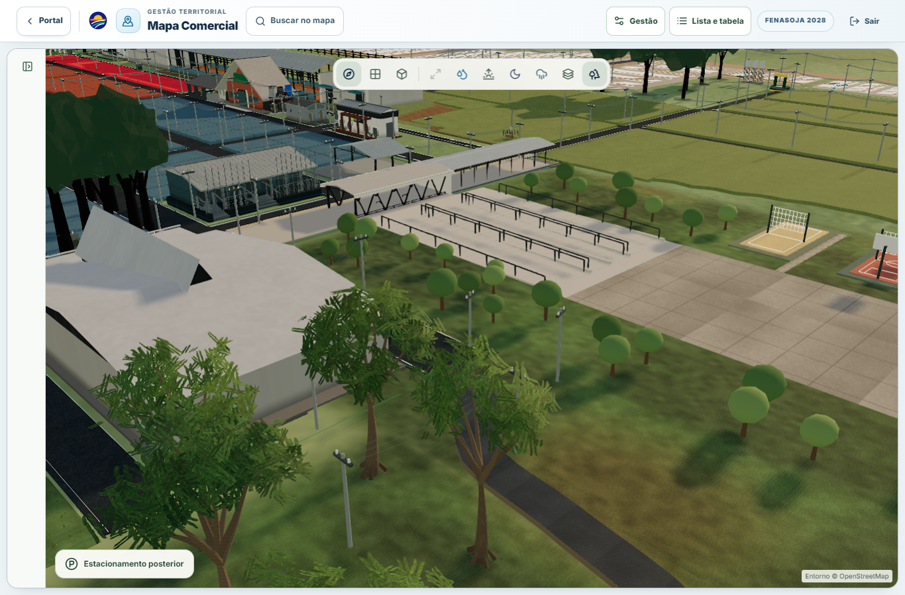
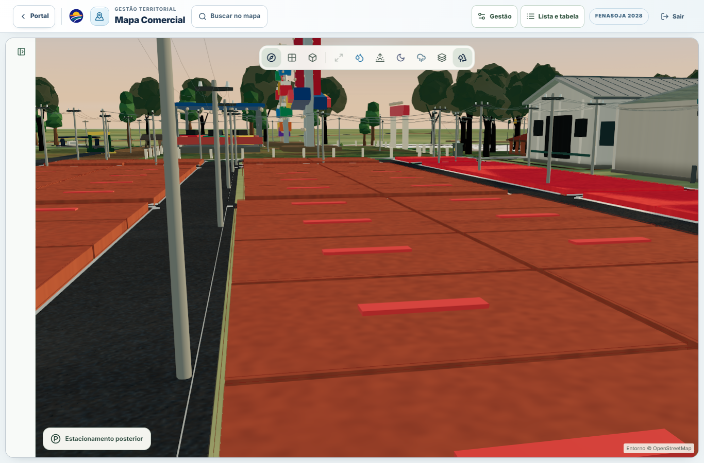
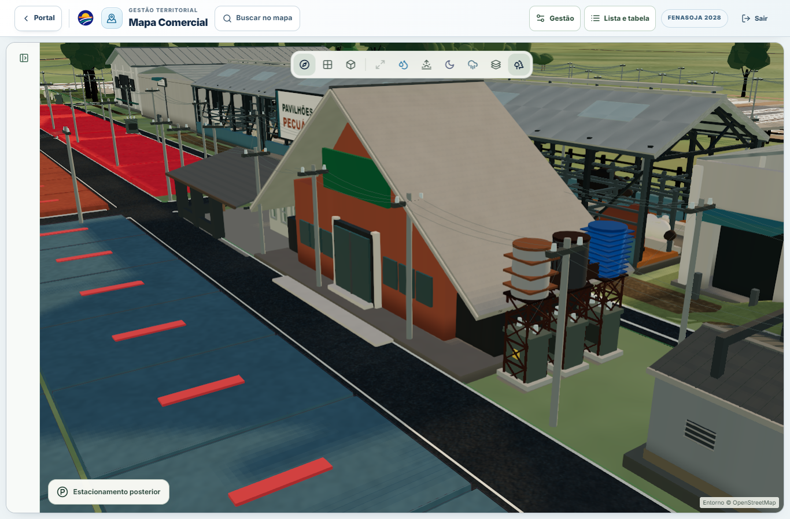

# Posição dos postes — 21/09/2026

Base: `071b0747` (PR #160 integrada). Alteração restrita à apresentação da infraestrutura elétrica.

## Diagnóstico e resultado

A planta fornecida é a mesma fonte vetorial dos 408 marcadores vermelhos cadastrados (SHA-256 `bbe9603392feb499fd0f2bc604f61e79dbf2a841504b92848253f9f9b9f679ce`). As coordenadas afins estavam preservadas, mas não acompanhavam todos os contornos locais da malha atual. Alguns recuos de fachada também ignoravam vias ou construções vizinhas. O afastamento antigo do poste 337, por exemplo, evitava B13 entrando no envelope de B12.

| Auditoria independente — Shapely | Antes | Depois |
| --- | ---: | ---: |
| Postes vermelhos | 408 | 408 |
| Postes com conflito de afastamento | 98 | 0 |
| Postes fora de seu lote identificado na planta | 51 | 0 |
| Vínculos com contornos de lotes extraídos do PDF | 121 | 121 |

Foram reposicionados **122 postes**. O maior deslocamento em relação à apresentação anterior é 2,208017 unidades do mapa. As 408 linhas de [audit.json](audit.json) e [pole-positions.csv](pole-positions.csv) registram fonte, antes/depois, lote identificado, conflitos e deslocamento. As unidades são locais do mapa; não representam uma medição topográfica nova.

Inventário comercial, nós de origem, 325 conexões inferidas e posições dos 20 transformadores: igualdade integral antes/depois, verificada pelo script independente. IDs, preços, áreas, classificações, geometria cadastral, vias, acessos, links e integração comercial não foram editados.

## Regras de posicionamento

- Os contornos pretos do PDF são poligonizados com precisão de 0,1 ponto. Células são associadas por sobreposição aos lotes atuais (IoU > 0,55); o marcador deve estar dentro da célula ou a até 1 ponto de sua borda. A associação não cria ou modifica lotes. A posição original e a evidência da extração continuam disponíveis.
- Mantém-se o lote identificado na planta; nos demais casos, mantém-se o lote cadastral que já contém a âncora, quando houver. Os outros pontos conservam a referência original e recebem somente afastamento local quando necessário.
- A base completa do poste deve ficar fora do pavimento e das estruturas. Margens adicionais: 0,025 nas vias e 0,045 nas estruturas, além do raio 0,035. As coberturas reconstruídas B12/B13 têm envelope próprio com margem 0,24.
- Ruas oficiais, acessos, rotatórias e corredores traseiros com acostamento são considerados juntos. Áreas abertas de lazer e edificações retiradas do mapa não viram obstáculos fictícios.
- Quando a âncora está fora das vias, a correção não pode atravessá-las. Quando está sobre uma via, vale o lote identificado ou a margem livre mais próxima da união dos pavimentos. A busca é limitada a 3 unidades e informa conflitos não resolvidos; a validação exige zero pendências no inventário atual.
- Os postes 212/217 permanecem no lado original da Rua Bolívia. O poste 084 foi para a margem oeste da Ubiretama, afastando-se da RS-472. As bases usam superfícies de piso, sem herdar a altura de uma construção próxima.

## Arena / Centro de Eventos

No trecho consultado, 293, 295 e 296 saíram do pavimento para a faixa verde. O 297 foi afastado da esquina. 260, 266, 281, 299 e 301 mantiveram suas posições, já livres dos obstáculos verificados.



## Comparação visual

Quadra P, mesma câmera:

| Antes | Depois |
| --- | --- |
|  |  |

Cooperativismo / Tenda da Pecuária:

| Antes | Depois |
| --- | --- |
|  |  |

## Desempenho e limites da evidência

A camada conserva 8 malhas instanciadas + 1 linha agrupada, 465 cruzetas e 11.340 vértices de cabos no perfil completo; nenhum detalhe ou condutor foi removido. Posições e cruzetas são calculadas uma vez e compartilhadas por postes, cabos e iluminação noturna. As máscaras usam cache por snapshot imutável com chaves fracas. A transição elétrica deixa de reescrever materiais a cada frame depois de estabilizada.

Benchmark de CPU aquecida, Node/Vite SSR, 20 amostras intercaladas após 5 aquecimentos: mediana **103,44 → 102,07 ms**, p95 **135,03 → 118,81 ms**. Mede preparação de posições/cruzetas/cabos, não FPS, carregamento de produção ou rede. A diferença mediana é pequena; o ganho estrutural é eliminar cálculos duplicados e trabalho ocioso sem reduzir os modelos. Dados completos: [cpu.json](cpu.json).

O ensaio visual usa Chrome headless/Windows, Intel UHD via ANGLE/D3D11, viewport 1366×900, DPR 1, qualidade fixa, fixture local e zero gravações no backend. Inclui vistas médias/próximas, seleção de Q-P-10, Q-M-08, B28 e D1, painel, zoom, pan, rotação, identidade do Canvas e viewport 390×844. A última é emulação de viewport; não é validação de iPhone/Safari ou Android físico.

## Verificações

- TypeScript, ESLint dos arquivos alterados e build de produção executados.
- Suite de localização + modo noturno: 17 testes aprovados.
- Conjunto com a suite elétrica legada: 30/32 aprovados. A base já apresentava cinco falhas nessa suite. Permanecem a recepção do transformador 007 (posição idêntica à base, fora deste escopo) e a folga de cabos contra prismas aproximados das construções. A contagem de amostras dessa segunda verificação mudou de 918 para 996 após corrigir posições e apoio no solo. Esse teste não equivale a uma validação completa de afastamento elétrico da rede, que continua pendente. Os fios mantêm o grafo inferido existente; a planta dos marcadores não fornece levantamento de alturas/vãos.
- A primeira repetição longa registrou dois programas de shader adicionais tardiamente, sem crescimento de geometrias/texturas. O registro foi preservado em `runtime-late-shaders.json`. A repetição final passou com **21 transições**, recursos estabilizados nos três modos, zero perdas de contexto/erros, Canvas preservado, quatro seleções corretas e sem overflow no viewport móvel. Resultados: [after/runtime.json](after/runtime.json).

## Reprodução

Com as dependências do projeto e Python com `pdfplumber` e `shapely`:

```sh
node scripts/poles/export.cjs docs/validation/pole-location/baseline-inventory.json
python scripts/poles/extract-parcels.py "CAMINHO/A3 - Fenasoja - Indicação dos Postes (1).pdf"
node scripts/poles/export.cjs docs/validation/pole-location/candidate-inventory.json
python scripts/poles/audit.py
node scripts/poles/benchmark.cjs
```

Para comparar versões, exporte o primeiro inventário na base e o segundo no candidato. O benchmark carrega a implementação de `071b0747` sem modificar o checkout. O ensaio visual requer Vite em `127.0.0.1:4201`, Chrome e Playwright; rode `node scripts/poles/capture.cjs after --verify`. O PDF e os inventários grandes ficam locais; o hash, as associações e o relatório auditável estão versionados.
