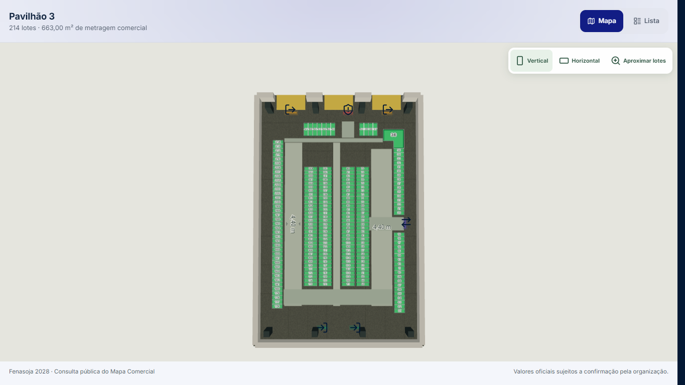
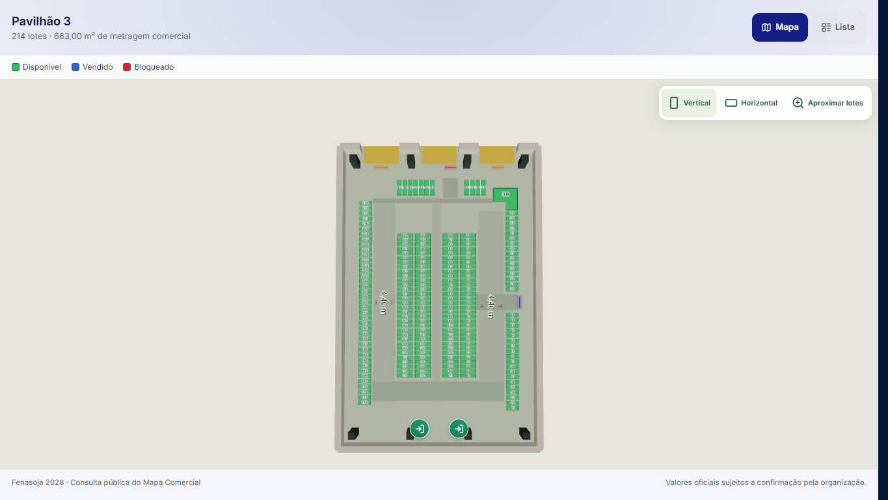
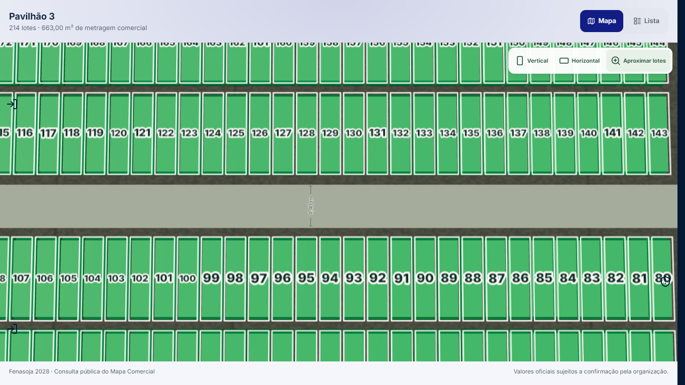
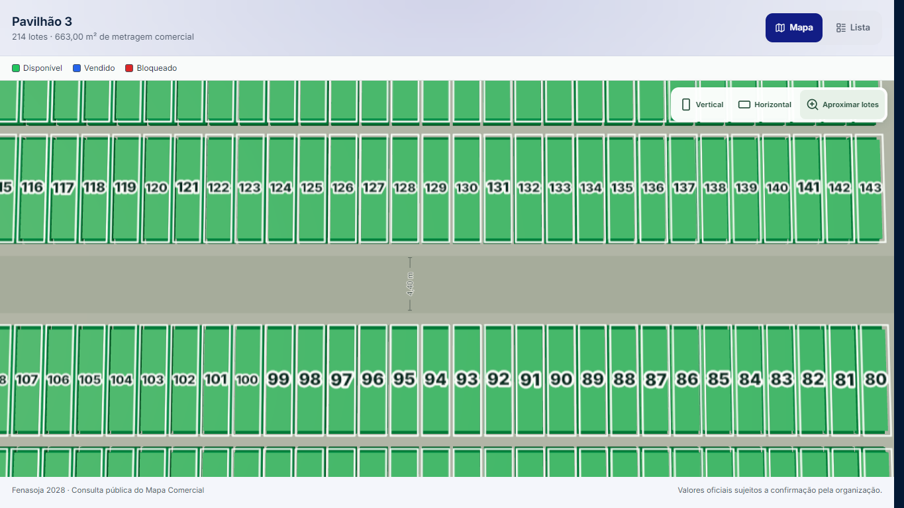
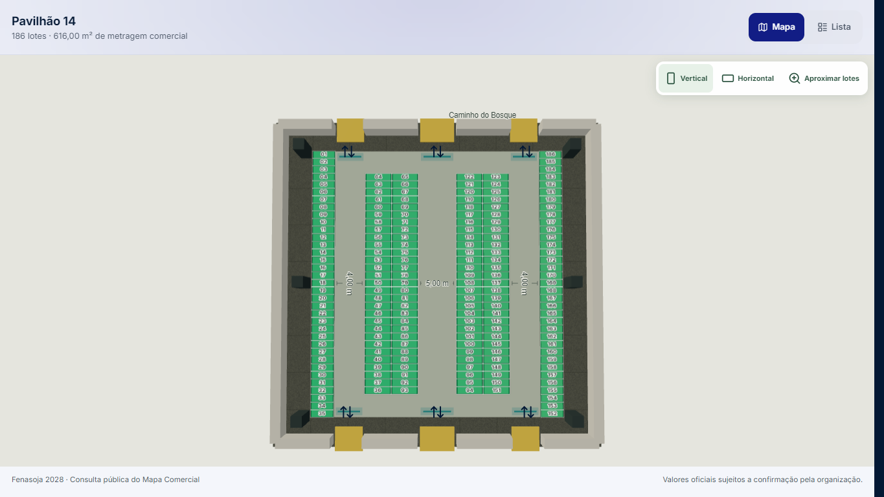
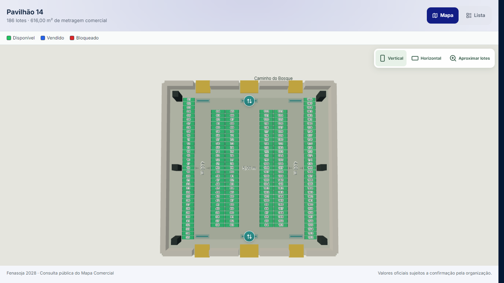
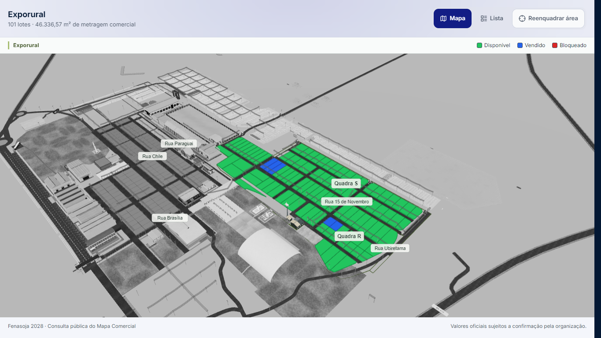
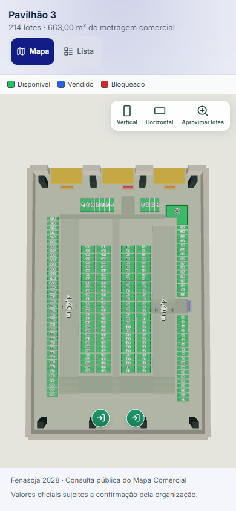
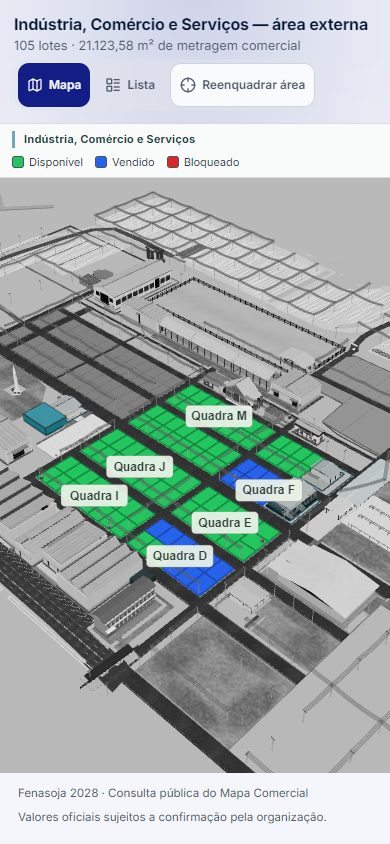

# Links públicos — Fenasoja 2028

Validação de 28–29/09/2026, base `24bd261e`. Frontend local em build de produção com diagnósticos habilitados; inventários/contextos lidos das RPCs reais, com os dez tokens fornecidos pelo responsável. Nenhuma escrita comercial, contrato, preço ou geometria foi enviada ao banco. A telemetria foi interceptada nos testes automatizados.

## Resultado e limites

- Dez links publicados chegaram a `ready` no primeiro acesso, sem retry manual, erros JavaScript/console ou perda de contexto. Lista, duas seleções, X/Escape e identidade de Canvas/renderizador/controles passaram em cada link.
- Pavilhões 1, 3 e 14 e os três segmentos externos também passaram em viewport mobile 390 × 844, DPR 1 e movimento reduzido. Isso é emulação Chromium, não certificação de aparelhos Android/iOS/Safari.
- O registro contém onze áreas. O responsável informou que **Pavilhão 7 ainda não tem link**: foi coberto pelos contratos/componentes dos oito pavilhões; acesso público real não foi testado e nenhum token foi criado.
- A migração SQL da projeção de disponibilidade acompanha a PR. **Não foi aplicada em produção**; o frontend também trata a resposta anterior durante o rollout.
- O site publicado não foi atualizado por este trabalho. A validação do código candidato usa o frontend local e dados autorizados reais.

## Primeiro acesso: causa comprovada

O link de pavilhão montava, além do interior, o parque externo oculto. A preparação capturava programas de shader desse cenário. Efeitos posteriores trocavam materiais e descartavam programas já capturados. Em Three r170, `destroy()` retira o handle `program`; aguardar indefinidamente `isReady()` desse objeto descartado não conclui a barreira de preparação.

A instrumentação da base registrou `program-links-pending`, 57 programas capturados e **2 descartados**, com `essentialPrepared=false`, zero quadros apresentados e contexto WebGL saudável. A sondagem de chamadas WebGL também registrou consultas a programas deletados. O bloqueio foi reproduzido em P1, P3 e P14; na passagem inicial do P3 persistiu por mais de 45 s. A matriz comparativa esperou 25 s e então acionou o retry antigo, que criou outro Canvas/renderizador/controles. Uma nova medição do P3 cronometrou **2.528 ms entre retry manual e ready**.

A correção:

1. O link público de pavilhão monta o interior e o mesmo proprietário de renderização direta, sem preparar o parque oculto, pós-processamento opcional ou física de visita.
2. A preparação detecta um programa descartado antes de consultá-lo. Refaz uma vez a captura da cena atual, usando o mesmo renderer/câmera/controles/dados. Um limite de preparação transforma uma falha persistente em erro visível; tempo decorrido nunca concede `ready`.
3. O retry explícito de preparação usa um evento no Canvas existente. Só uma falha de importação/montagem pode exigir uma nova instância, com uma tentativa automática limitada. Dados válidos não são buscados novamente.
4. Inventário, importação do Canvas e contexto externo continuam independentes. Cada RPC conserva uma única repetição transitória e timeout. A lista funciona sem WebGL ou enquanto falta contexto; um dispositivo sem WebGL 2 recebe mensagem e lista.

No candidato, os dez acessos normais não precisaram da recuperação automática. Todos registraram um Canvas, um renderer e um conjunto de controles, com `ready` baseado na preparação atual e em quadros válidos.

## Medições

Windows, Chrome 154, Intel UHD Graphics via ANGLE/Direct3D11, desktop 1365 × 768, DPR 1. Contexto de navegador novo por link, cache HTTP desabilitado e `--disable-gpu-shader-disk-cache`; caches do sistema/driver não foram apagados. Uma amostra por link, sem promessa de percentil ou equivalência com rede móvel.

Os pavilhões ficaram prontos em **2,7–4,0 s**, contra o bloqueio reproduzido da base. As áreas externas ficaram prontas em **7,6–7,9 s**; Exporural mediu 7,883 s na base e 7,859 s no candidato, sem ganho significativo demonstrado nessa classe.

[Tabela completa em milissegundos](timing-table.md) e [dados sanitizados](measurements.json). Inventário/contexto/importação/WebGL/cena/shader são durações independentes, que se sobrepõem; primeiro quadro e ready são tempos desde a navegação. Não somar as colunas.

## Fechamento de ficha

`setSelectedEntityId(null)` também limpava o interior. A nova ação `clearLotInspection` limpa módulo/hover/ficha e mantém o pavilhão pai selecionado, sem emitir comando de câmera. A semântica administrativa de `setSelectedEntityId` e a ação explícita de sair permanecem intactas.

Havia um segundo caminho de deslocamento: o evento de redimensionamento do painel reenquadrava a câmera. A ficha pública agora é tratada como sobreposição de inspeção, sem reenquadramento ao abrir/fechar. Resize real do viewport e comandos explícitos de orientação/reenquadramento continuam disponíveis.

A regressão cobre os oito pavilhões em componentes, inclusive atualização de inventário e retorno de aba. No navegador, os sete links de pavilhão existentes passaram na seleção pela lista; P1 e P3 passaram também em **cliques reais no Canvas em dois lotes distintos**, fechando por X e Escape e comparando posição, alvo, quaternion, zoom, interior e controles.

## Piso e sobreposições

A superfície escura dos anexos 4–5 é o **piso texturizado exposto de CommercialPavilionInteriorScene**, nos espaços deixados pelas ilhas e corredores. O mapa de textura multiplicava o material cinza, produzindo a faixa escura. Não era um lote adicional nem uma cota SVG.

Somente os pisos de **B6/P3 e B2/P14** recebem a cor clara sem essa textura. `CommercialPavilionModuleLayer`, corredores oficiais, bases dos módulos, apoios, paredes, portas, coordenadas, metragens e dados de planta permanecem sem alteração. A comparação de Git desses arquivos/dados contra a base passou.

As cotas atualizam a matriz da câmera no mesmo quadro do movimento. Os ícones deixam de ser presos artificialmente às bordas da tela, ficam ancorados perto do piso e desaparecem quando seu alvo de toque cobrir um módulo/controle/ficha. O CSS compartilhado de acessos passou a ser importado pelo próprio componente — o link público antes não carregava esse estilo. Não foi criado outro loop de animação, Canvas ou OrbitControls.

Comparações usam os mesmos comandos de orientação/inspeção; a nova legenda reduz a altura útil do mapa em cerca de 37 px, portanto não são comparações pixel a pixel.

| Pavilhão 3 — antes | Depois |
|---|---|
|  |  |
|  |  |

| Pavilhão 14 — antes | Depois |
|---|---|
|  |  |

## Disponibilidade e contexto externo

A legenda, lista, ficha e Canvas públicos mostram Disponível/verde, Vendido/azul e Bloqueado/vermelho. SALE_OPEN recebe a projeção pública de Vendido. O status comercial real e o amarelo administrativo não mudam. A função SQL altera apenas a projeção pública; as RPCs existentes continuam restringindo comprador/logo a vendas efetivamente confirmadas. O frontend antigo/nova API e a API antiga/novo frontend continuam compatíveis, sem publicar interessado, contrato ou logo de venda pendente.

Ruas e quadras são obtidas somente das entidades autorizadas e sua geometria/nome cadastrados. Quadras de outros segmentos não ganham identificação comercial; o restante do parque continua contexto cinza e não selecionável. Rótulos são inertes, têm limite de densidade, evitam ficha/seleção e recuam em zoom próximo. Identidades cromáticas vêm das paletas existentes; entrada CSS breve respeita movimento reduzido.



| P3 mobile | Indústria, Comércio e Serviços mobile |
|---|---|
|  |  |

## Verificação executada

- **173 testes / 14 arquivos passaram** na seleção usada pelo novo workflow `Public Map contracts`: escopo, projeção pública, ficha, revisão, cena, cotas, acessos, câmera, boot e recuperação.
- TypeScript, ESLint dos arquivos TypeScript alterados e build de produção passaram. O relatório do bundle confirma renderer/Three, física e PDF fora da importação estática obrigatória da página administrativa.
- Matriz desktop dos dez links e matriz mobile de seis links: primeiro ready, lista, seleção, X/Escape, ausência de overflow/erros, identidade 1/1/1. Inspeção visual específica de P1/P3/P14 e Exporural.
- Quatro ciclos Vertical → Horizontal → Aproximar em cada um dos sete pavilhões publicados; pan, zoom, rotação, cancelamento de ponteiro e retorno. Recursos aquecidos não cresceram nos ciclos verificados. Gestos também executados nos três segmentos externos.
- Falha 503 no primeiro inventário e no primeiro contexto: uma repetição, ready automático; contexto não força refetch do inventário válido. Sem WebGL: lista e ficha disponíveis.
- `WEBGL_lose_context` real após abrir ficha e durante carregamento: recuperação com o mesmo Canvas/renderer/controles; câmera preservada após a ficha.
- Revisões locais de preço/status/geometria sobre cópias de respostas autorizadas: atualização sem perder seleção/interior; SALE_OPEN azul sem interessado. Nenhuma revisão de teste foi enviada ao banco.
- Ativação de outra aba e retorno executados. Como o navegador automatizado manteve `visibilityState=visible`, o ciclo hidden/visible foi **injetado explicitamente** para testar os listeners. A ocultação nativa em dispositivos físicos permanece sem certificação.
- Fixture administrativa de cena completa chegou a ready com quadros normais e com rAF atrasado em 240 ms, sem erros de página/contexto. Isso não substitui um teste autenticado de operação comercial em produção.

### Falhas preexistentes

A bateria ampliada encontrou 24 falhas reproduzidas sem alterações em `main@24bd261e`, em 11 arquivos: LoadingPipeline (6), PavilionModuleCard (9), planos P3/P5/P8/P12/P13 (1 cada), PavilionFourSoyKitchen (1), PavilionRendering (1), Pavilions135Migration (1) e RuntimeStability (1). São contratos/mocks antigos e ficam separados desta entrega. Dois testes de CSS/âncora foram atualizados para o novo comportamento solicitado; um timeout de importação passou isoladamente. A bateria completa do repositório não é declarada verde.

## Reproduzir

Criar um arquivo **local, fora do controle de versão**, com `{ "slug": "token" }`, apontar `QA_LINKS` para ele e definir `PLAYWRIGHT_MODULE` se Playwright não estiver no projeto.

```powershell
$env:VITE_COMMERCIAL_MAP_DIAGNOSTICS='true'
npm run build -- --manifest
npm run preview -- --host 127.0.0.1 --port 5188
# Em outro terminal:
$env:QA_BASE='http://127.0.0.1:5188'
$env:QA_PHASE='after'
node scripts/public-map-matrix-qa.cjs
node scripts/public-map-resilience-qa.cjs
node scripts/public-map-gestures-qa.cjs
```

Os scripts gravam inventários autorizados e evidências em `artifacts/` para replay local. **Não publicar esses payloads nem o arquivo de tokens**. Apenas as capturas sem endereço/token e os resumos sanitizados desta pasta acompanham a PR.
