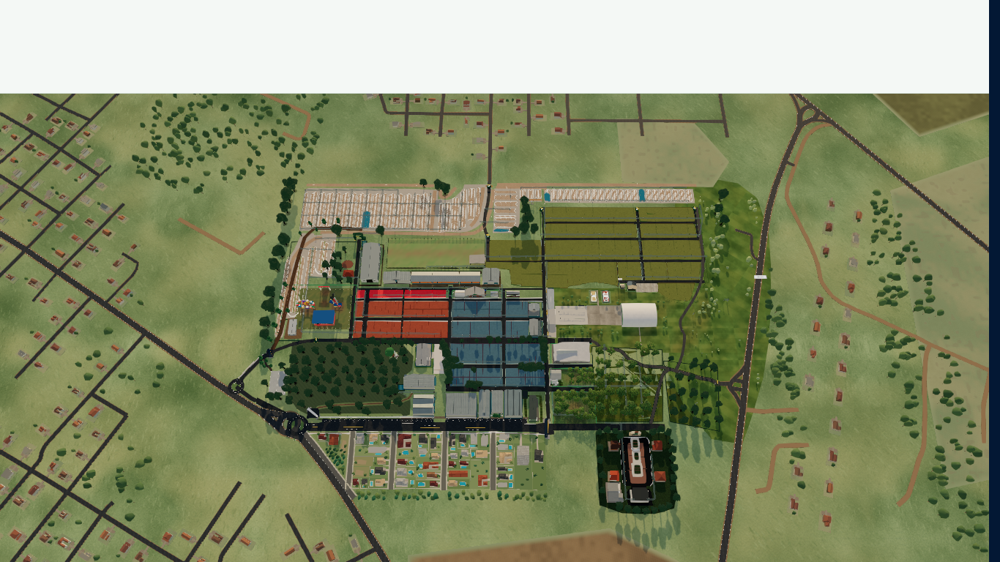
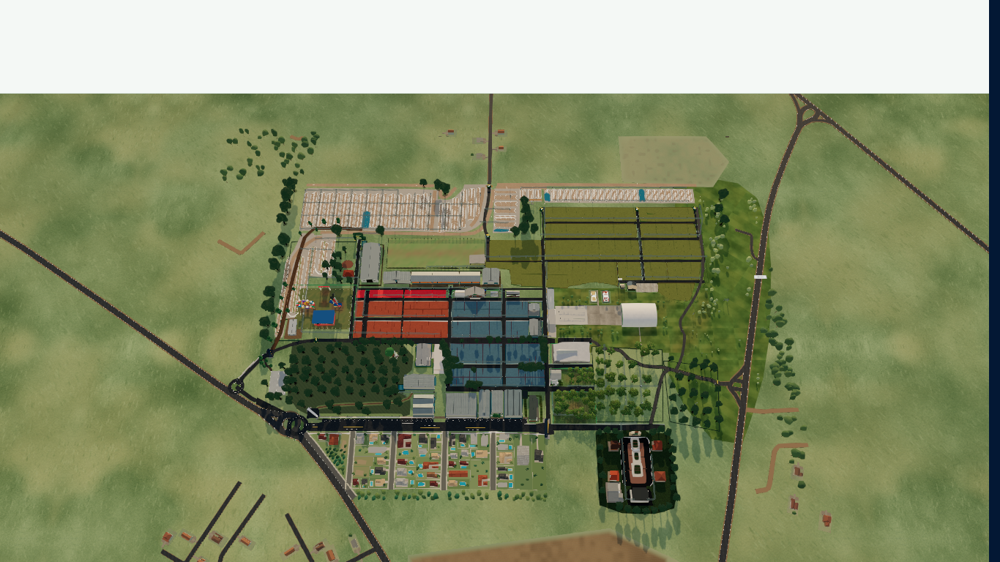
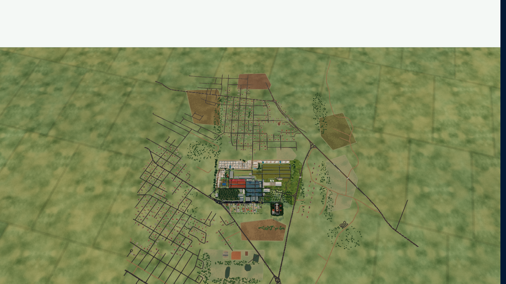
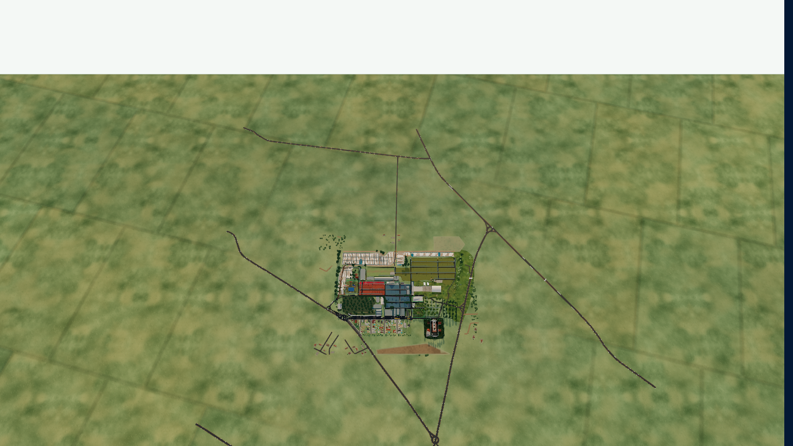
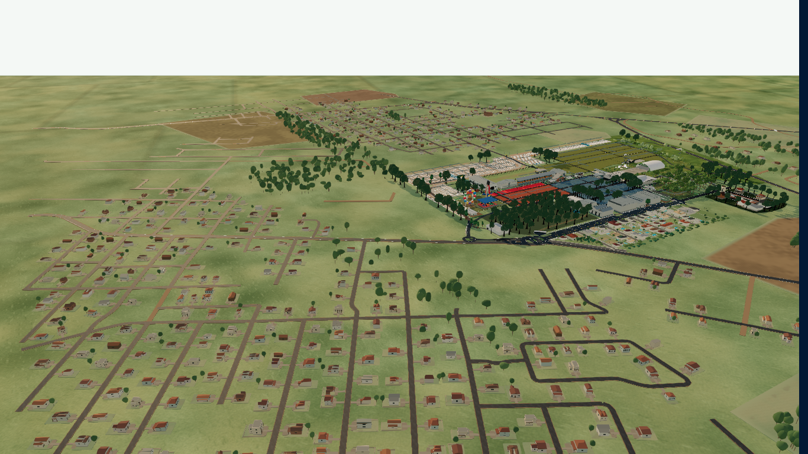
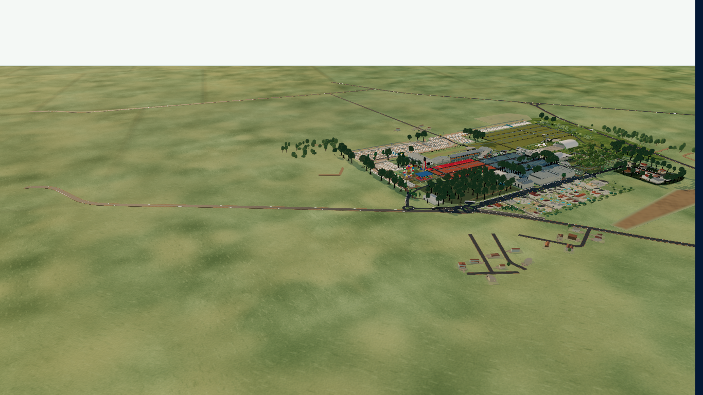
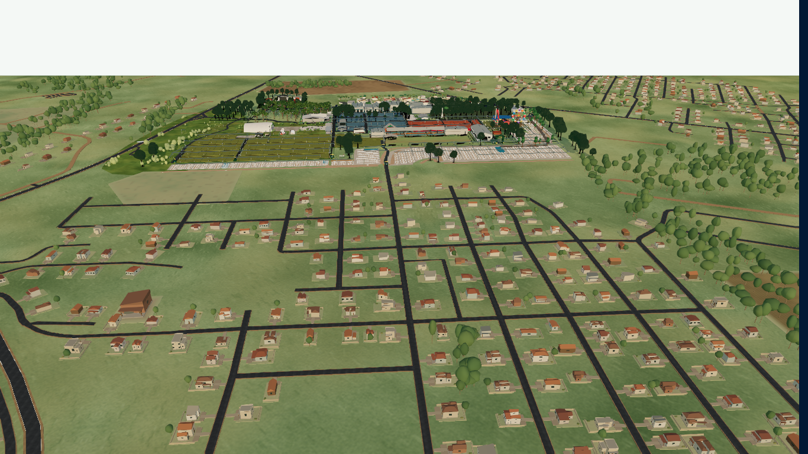
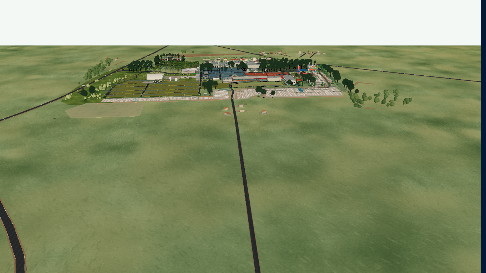
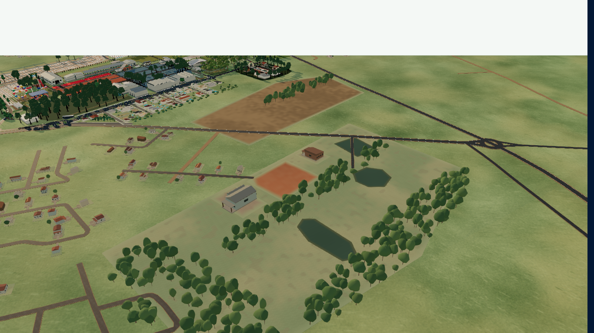
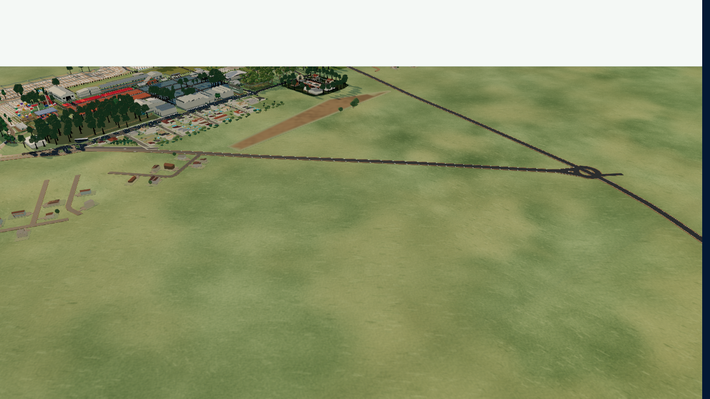

# Limpeza espacial do Mapa Comercial

Base auditada: `42e89d1b` (main, Arena Sicredi Icatu). Os dados comerciais e os modelos internos não foram reconstruídos nem simplificados. Os 1.692 registros oficiais, os lotes e a calibração são comparados por SHA-256 com essa base em `commercialMapSpatialBounds.test.ts`.

## Auditoria e classificação

| Origem / consumidor | Classificação | Tratamento |
| --- | --- | --- |
| `officialReference2026`, EntityMesh, Arena, Mirante, Restaurante Central, sede/palco, estruturas comerciais | CORE | Dados, geometria, qualidade, IDs e seleção preservados. |
| `rearParking`, `parkAccess`, `quadrasABEnvironment`, `lateralResidentialDistrict`, `nationsDistrict`, vegetação interna/piloto | CORE / infraestrutura protegida | Geradores completos, incorporados à preparação inicial. O bairro lateral modelado imediatamente junto ao parque é preservado. |
| `territoryRoadSource.json` / antigos geradores em `territorialEnvironment.ts` | NEAR_CONTEXT / REMOVABLE_FAR_CONTEXT | Inventário anterior congelado; seleção espacial feita offline. O navegador recebe somente o catálogo retido. |
| `territorialRoads.ts` / `RegionalHighwayNetwork` / união de vias | NEAR_CONTEXT / PROTECTED_INFRASTRUCTURE | Vias locais recortadas ao buffer; rodovias, alças e acessos listados preservados integralmente. |
| `TerritorialEnvironment` / `exteriorArchitecture` | NEAR_CONTEXT | Edificações retidas usam as mesmas posições, dimensões e modelos da base. Casas, piscinas, cercas e vegetação associadas a registros descartados deixam de gerar geometria. |
| `TERRITORY_TREES` / vegetação territorial instanciada | NEAR_CONTEXT | Filtrada antes da criação de instâncias. Modelos compartilhados e LOD existentes preservados. |
| `TERRITORY_PATCHES` / `exteriorFishing` | NEAR_CONTEXT / REMOVABLE_FAR_CONTEXT | Polígonos recortados antes da triangulação. As três lagoas distantes somem do catálogo; nenhum material de água, pesca ou vegetação de margem é criado. |
| `rearParkEnvironment` / `RearParkEnvironmentLayer` | NEAR_CONTEXT | Árvores externas filtradas e terreno detalhado recortado pelo mesmo limite. Sequência aleatória original preservada. |
| Terreno base | Superfície territorial simples | Mantido para evitar vazio; nenhum preenchimento de horizonte com novas casas/árvores. |

## Política espacial e manutenção

`COMMERCIAL_MAP_SPATIAL_BOUNDS`, em `data/commercialMapSpatialBounds.ts`, é a configuração canônica. O core usa o recorte oficial mais uma costura de 2 unidades que inclui A5, estacionamento posterior e bairro lateral completo. O buffer próximo acrescenta 15 unidades (aproximadamente 100 m na escala do modelo). As coordenadas são estimativas de projeto, não cadastro topográfico.

- Core: X `[-62, 62]`, Z `[-47.2727275, 47.2727275]`.
- Contexto próximo: X `[-77, 77]`, Z `[-62.2727275, 62.2727275]`.
- Envelope distante da fonte: X `[-175, 230]`, Z `[-225, 240]`; não governa a navegação.
- `protectedRoads` lista IDs exatos de BR-472, ERS-344, Tuparendi, coletores principais, alças, Rua Alfredo Albino Meinertz e conexão corrigida A5/Arena. As continuações viárias autorais (`project-continuation`) também são preservadas.
- `protectedLandmarks` e `protectedEntrances` documentam os conjuntos protegidos. Os geradores autorais do core permanecem completos; o filtro só é aplicado aos geradores externos.

Edificações e copas que intersectam o buffer são mantidas inteiras. Segmentos são recortados por Liang–Barsky: uma rua com os dois extremos fora ainda é mantida se atravessar o buffer. Saídas/reentradas geram fragmentos separados, sem inventar conexões. Polígonos são recortados antes da geometria. Vias protegidas não são recortadas.

A revisão de renderização mantém o batching de terreno, a união de vias, os materiais compartilhados e os modelos instanciados existentes. Bounding spheres são recalculadas após atualizar matrizes/contagens; o descarte dos InstancedMesh continua usando o helper de lifecycle existente. Os perfis de qualidade reutilizam recursos residentes. Não foi introduzido `visible=false` para armazenar o contexto rejeitado, nem novo LOD que simplifique o parque.

`node scripts/spatial-cleanup/generate.cjs` regenera `territoryContext.generated.json` a partir do inventário auditado e da política. `--check` impede divergência. OSM integral, inventário e licenciamento permanecem no repositório, fora do grafo de importação do aplicativo. Para atualizar a fonte, auditar primeiro o novo inventário e suas correções de acesso; não substituir silenciosamente a base histórica.

## Apresentação integral e câmera

As camadas visíveis antes adiadas participam do primeiro commit do Canvas por `EssentialSceneLayer`, incluindo vegetação, estacionamento, bairro lateral, Arena e parque de diversões. Suspense e a preparação de shaders abrangem o conjunto. `commercialMapReady` só é verdadeiro após a preparação essencial, controles disponíveis e frames apresentados responsivos. Falha ou perda de contexto reseta a barreira. O loader não desaparece no primeiro draw isolado.

A fila posterior contém apenas recursos dos modos opcionais (chuva, hidrologia, interiores e física), sem montagem tardia de estruturas da vista padrão. A captura verifica igualdade dos grupos essenciais no primeiro ready e após a fila; nenhuma camada estrutural pode surgir depois.

Zoom máximo deriva do enquadramento do bounding box real do parque com o contexto próximo e do aspecto da viewport. O mínimo de exploração anterior é preservado. Pan usa o mesmo envelope, mantendo os comportamentos específicos de seleção/interiores. Os extremos das rodovias não ampliam mais os limites. As vistas territoriais equivalentes aos anexos usam uma câmera QA fixa para comparar o que foi removido; essas distâncias não são permitidas pela câmera normal nova.

## Evidências e reprodução

- `before/after-inventory.json`: entradas de geração, sem confundir casas com meshes.
- `before/after-runtime.json`: três visitas independentes por versão, primeiro ready, cena aquecida, poses e tempos de frame.
- `comparison.json`: medianas produzidas por `node scripts/spatial-cleanup/summarize.cjs`.
- `before/after-annex-*.png`: cinco poses iguais entre versões, correspondentes às regiões dos anexos.
- `responsive.json` e `responsive-*.png`: zoom por roda e pan por arraste reais nos cinco tamanhos de viewport.
- `environment-stress.json`: transições repetidas de ambientes e recursos aquecidos. As listas repetidas de UUIDs de materiais são representadas por SHA-256; o relatório integral está em `environment-stress.raw.json.gz`.
- `focused-final.json`: contratos dirigidos; `map-tests.json`, `map-baseline-failures.json` e relatórios de vias registram as falhas legadas separadamente.

Execução local: `npm run dev -- --host 127.0.0.1 --port 4186`, então `node scripts/spatial-cleanup/capture.cjs after`, `node scripts/spatial-cleanup/responsive.cjs` e `node scripts/spatial-cleanup/stress.cjs`. Playwright deve estar instalado ou indicado por `PLAYWRIGHT_MODULE`. Para baseline, usar worktree no commit indicado, copiar somente o instrumento `TerritoryQa.tsx` e executar a mesma captura com `before`.

Ambiente: Chrome headless acelerado, Windows, Intel UHD / ANGLE D3D11, fixture local com dados oficiais, sem autenticação de produção. O perfil adaptativo é registrado em cada amostra; comparar resoluções/perfis junto aos números. Cada medição de frame tem 800 ms de aquecimento e 6 s de amostragem. FPS é `1000 / média de frame`, não certificação de 60 FPS contínuos. Viewports mobile/tablet são simulação, sem certificação de dispositivo físico, Safari ou multitouch.

Objetos/meshes/instâncias contam também os residentes invisíveis. Memória de buffers é uma estimativa dos ArrayBuffers únicos de geometria/instâncias; não representa VRAM total. Heap JS inclui ruído de GC. Long tasks são limitadas a 500 eventos pelo diagnóstico existente: saturação deve ser explicitada, sem inferir totais exatos quando ocorre. Tempos de Vite local não são promessa de inicialização em produção nem prova da meta de 2–4 s.

## Resultado quantitativo

Medianas de três visitas em cada versão; inventário determinístico e alocações da cena completa:

| Métrica | Antes | Depois | Variação |
| --- | ---: | ---: | ---: |
| Construções territoriais | 614 | 22 | -96,4% |
| Árvores territoriais | 1.509 | 111 | -92,6% |
| Vias territoriais (inclui fragmentos) | 216 | 57 | -73,6% |
| Polígonos territoriais detalhados | 14 | 2 | -85,7% |
| Lagoas externas | 3 | 0 | -100% |
| Objetos residentes na scene | 1.548 | 1.305 | -15,7% |
| Meshes residentes | 1.158 | 929 | -19,8% |
| Instâncias residentes | 28.738 | 23.215 | -19,2% |
| Triângulos alocados (ponderados por instâncias) | 1.252.439 | 908.544 | -27,5% |
| Buffers únicos de geometria/instâncias | 24.729.460 B | 13.144.154 B | -46,8% |
| Materiais residentes | 637 | 634 | -0,5% |
| Texturas no renderer | 148 | 148 | estável |
| Programas no renderer | 240 | 209 | -12,9% |
| Heap JS amostrado | 207,7 MB | 216,3 MB | +4,1%; sem evidência de redução de heap |
| Draw calls, vista core | 849 | 781 | -8,0% |
| Triângulos desenhados, vista core | 806.260 | 644.375 | -20,1% |
| Frame médio, vista core | 35,65 ms | 20,42 ms | -42,7% |
| Frame P95, vista core | 57,40 ms | 24,90 ms | -56,6% |
| FPS derivado da média, vista core | 28,0 | 49,0 | +74,6% |
| Draw calls, vista territorial | 879 | 779 | -11,4% |
| Frame médio, vista territorial | 30,88 ms | 17,86 ms | -42,2% |
| FPS derivado da média, vista territorial | 32,4 | 56,0 | +72,9% |

O DPR durante as amostras foi 0,72 em ambas as versões. O controle adaptativo antigo caiu para MEDIUM no core e LOW na vista territorial; o novo permaneceu em MEDIUM/HIGH. Portanto os tempos descrevem a experiência adaptativa observada, com perfil novo igual ou superior; não são um microbenchmark com qualidade travada. O núcleo detalhado ainda domina materiais e draw calls. Nenhuma redução de detalhe do core foi implementada para produzir esses resultados.

| Inicialização observada em Vite local | Antes | Depois |
| --- | ---: | ---: |
| Primeiro estado interativo | 17,20 s (parcial) | 16,77 s (essencial completo) |
| Última camada estrutural pronta / essencial pronto | 167,35 s | 16,77 s |
| Fila posterior totalmente encerrada | 170,50 s | 73,72 s |
| Long tasks registradas durante toda a captura, mediana | 465 | 76 |
| Duração acumulada dessas long tasks | 46,53 s | 10,17 s |

O baseline demorava a admitir cada camada por sua fila progressiva e compilações sucessivas. O novo ready já contém todas as camadas estruturais da vista padrão, com contagens estáveis até o fim da fila opcional em todas as três visitas. A fila opcional ainda demora e pode competir por CPU; não é contada como mapa incompleto. O buffer de long tasks saturou em uma visita do baseline e as janelas totais têm durações diferentes: os valores são observações limitadas, sem alegação de redução percentual causal. A meta de 2–4 s **não foi atingida** neste ambiente.

## Testes e limites conhecidos

`focused-final.json`: **111/111 testes dirigidos passaram**, incluindo core completo, contexto próximo, vias protegidas exatas, ausência de casas/árvores/lagoas distantes, cruzamentos e fragmentação, enquadramento responsivo, readiness, recuperação do loader e persistência de recursos.

A execução ampla inicial teve 1.145 testes: 1.087 passaram e 58 falharam. **54 falhas foram reproduzidas no commit base sem alterações**; quatro expectativas antigas do loader foram corrigidas e passaram na execução dirigida final. `test-comparison.json` identifica cada caso e não registra falhas novas pendentes. A suíte ampla não é declarada integralmente verde. O checksum legado do Mirante em `commercialMapRoadPrecision.test.ts` também falha na base; os seis outros contratos do arquivo passaram. Não foram atualizados snapshots internos para esconder essa divergência pré-existente.

As dez imagens `before/after-annex-*` confirmam o parque completo, bairro lateral e estacionamentos preservados, continuação das rodovias e remoção dos bairros/lagoas distantes. Ausência de erros e perda de contexto também foi verificada nas seis amostras de navegação de cada versão. Produção autenticada e dispositivos físicos permanecem fora desta evidência local.

Limites exercitados por entrada de mouse real: 1920×1080, 1366×768, 1024×768, 390×844 e 844×390. Todos alcançaram e respeitaram o zoom máximo, contiveram pan nas quatro direções, mantiveram `ready`, zero erro/context loss e zero overflow horizontal. A distância máxima efetiva foi 328,67 unidades nas quatro viewports largas e 529,69 no retrato; antes era 804,93 no notebook. Os valores vêm da área útil do Canvas (o cabeçalho da fixture ocupa parte da viewport) e do enquadramento, não de constantes por dispositivo.

TypeScript e build de produção passaram. ESLint dos arquivos TypeScript modificados: zero erro, um warning já existente de export auxiliar no arquivo do loader. O build mantém o aviso de chunks maiores que 500 kB; isso não foi convertido em alegação de carregamento de rede. O workflow `Commercial Map spatial contracts` verifica catálogo, os 111 contratos, TypeScript, build e independência dos chunks.

Teste prolongado: **20 ciclos medidos + 2 de aquecimento, 264 transições, status `passed`**. Oito combinações de dia/noite/chuva/hidrologia mantiveram contagens estáveis por configuração: exterior 567 geometrias, 150 texturas, 226 programas e 689 materiais; hidrologia 566/150/226/688. Zero erros de JS, perda de contexto, troca de Canvas/renderer/controles ou mudança indevida de câmera/estado. Alguns IDs de materiais mudam nas alternâncias, mas as contagens não crescem; isto não demonstra ausência de toda alocação transitória. A cobertura de listeners limita-se aos objetos Three e OrbitControls. O teste de transições não é usado como comparação de FPS (um build local ocorreu durante seu aquecimento).

Build com manifesto: `npm run build -- --manifest`; `bundle.json` confirma `rendererRequiredBeforeQuery=false`, `physicsRequiredBeforeQuery=false` e `pdfRequiredBeforeQuery=false`. Logs finais estão em `build.txt`, `typecheck.txt` e `eslint.txt`.

## Comparação visual

| Região equivalente ao anexo | Antes | Depois |
| --- | --- | --- |
| Parque e entorno imediato |  |  |
| Extensão territorial |  |  |
| Bairro distante oeste |  |  |
| Bairro distante norte |  |  |
| Lagoas e terreno externo |  |  |
